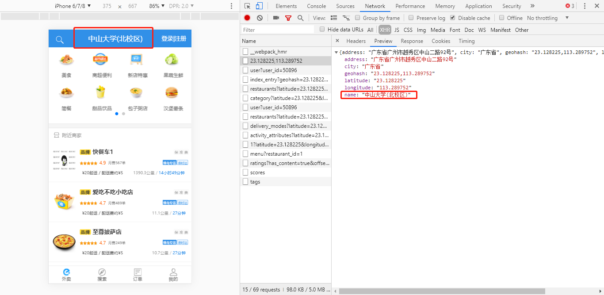
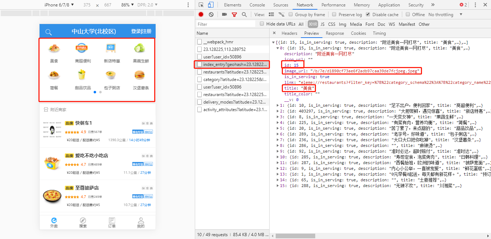
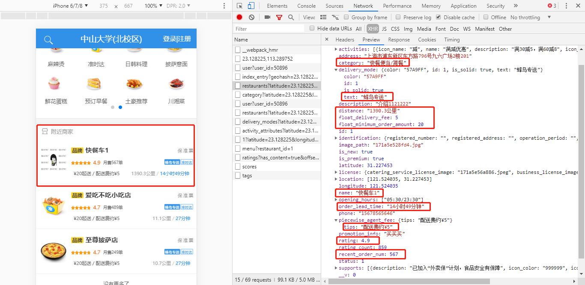

## 首页

> 考试需求：
>
> 1. 完成外卖首页底部导航，能够实现切换
> 2. 请求接口需要简单的封装
> 3. 实现首页分类展示区实现切换（可以使用第三方库）
> 4. 实现首页商家列表
>
> 注意点：
>
> 1. 分类图片前缀是**`https://fuss10.elemecdn.com`**，例如`https://fuss10.elemecdn.com/b/7e/d1890cf73ae6f2adb97caa39de7fcjpeg.jpeg`
> 2. 商家图片路径加上前缀**/img/**， 例如：`http://localhost:8080/img/171a5e528fd4.jpg`

**截图：**


### 1. 根据经纬度详细定位



#### 请求URL：

```
http://kumanxuan1.f3322.net:8001/v2/pois/:geohash
```

#### 示例：

http://kumanxuan1.f3322.net:8001/v2/pois/23.128225,113.289752

#### 请求方式：

```
GET
```

#### 参数类型：param

| 参数    | 是否必选 | 类型   | 说明   |
| ------- | -------- | ------ | ------ |
| geohash | Y        | string | 经纬度 |

#### 返回示例：

```json
{
    address: "广东省广州市越秀区中山二路92号",
    city: "广东省",
    geohash: "23.128225,113.289752",
    latitude: "23.128225",
    longitude: "113.289752",
    name: "中山大学(北校区)"
}
```


### 2. 食品分类列表



#### 请求URL：

```
http://kumanxuan1.f3322.net:8001/v2/index_entry
```

#### 示例：

<http://kumanxuan1.f3322.net:8001/v2/index_entry>

#### 请求方式：

```
GET
```

#### 参数类型：

| 参数 | 是否必选 | 类型 | 说明 |
| ---- | -------- | ---- | ---- |
|      |          |      |      |

#### 返回示例：

```
[
  {
    id: 1,
    is_in_serving: true,
    description: "0元早餐0起送，每天都有新花样。",
    title: "预订早餐",
    link: "",
    image_url: "/d/49/7757ff22e8ab28e7dfa5f7e2c2692jpeg.jpeg",
    icon_url: "",
    title_color: "",
    __v: 0
  },
  {
    id: 65,
    is_in_serving: true,
    description: "",
    title: "土豪推荐",
    image_url: "/d/49/7757ff22e8ab28e7dfa5f7e2c2692jpeg.jpeg",
    link: "",
    icon_url: "",
    title_color: "",
    __v: 0
  },
  ... 共n条数据
]
```

### 3. 获取商铺列表



#### 请求URL：

```
http://kumanxuan1.f3322.net:8001/shopping/restaurants
```

#### 示例：

<http://kumanxuan1.f3322.net:8001/shopping/restaurants?latitude=23.128225&longitude=113.289752>

#### 请求方式：

```
GET
```

#### 参数类型：query

| 参数                    | 是否必选 | 类型   | 说明                                                         |
| ----------------------- | -------- | ------ | ------------------------------------------------------------ |
| latitude                | Y        | string | 纬度                                                         |
| longitude               | Y        | string | 经度                                                         |
| offset                  | N        | int    | 跳过多少条数据，默认0                                        |
| limit                   | N        | int    | 请求数据的数量，默认20                                       |
| restaurant_category_id  | N        | int    | 餐馆分类id                                                   |
| order_by                | N        | int    | 排序方式id： 1：起送价、2：配送速度、3:评分、4: 智能排序(默认)、5:距离最近、6:销量最高 |
| delivery_mode           | N        | array  | 配送方式id                                                   |
| support_ids             | N        | array  | 餐馆支持特权的id                                             |
| restaurant_category_ids | N        | array  | 餐馆分类id                                                   |

**注意：图片路径加上前缀/img/**

