# s02-小程序基础二

## 1. swiper-400

swiper是一个**滑块视图容器**。即: **轮播图**组件或者**焦点图**组件。swiper这个组件封装的已经比较完善，使用起来非常方便。

### 1. swiper组件常用属性

https://developers.weixin.qq.com/miniprogram/dev/component/swiper.html

### 2. swiper组件的使用

> **注意**：swiper只中可放置swiper-item组件，否则会导致未定义的行为。swiper-item的宽度自定设计为100%。

#### 1.引入准备数据

```
 banners:[
      'https://images.unsplash.com/photo-1551334787-21e6bd3ab135?w=640',
      'https://images.unsplash.com/photo-1551214012-84f95e060dee?w=640',
      'https://images.unsplash.com/photo-1551446591-142875a901a1?w=640'
    ],
  
```

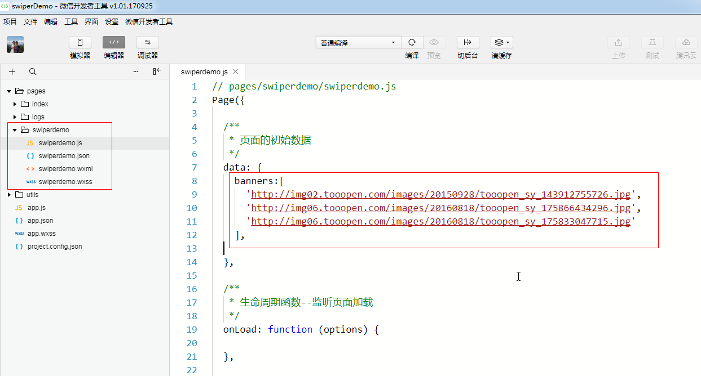

#### 2.引入swiper组件-400

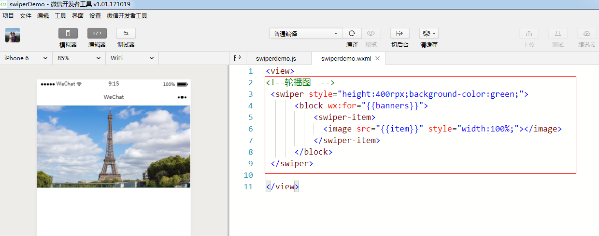

#### 3.添加分页器-点-indicator

1.添加点

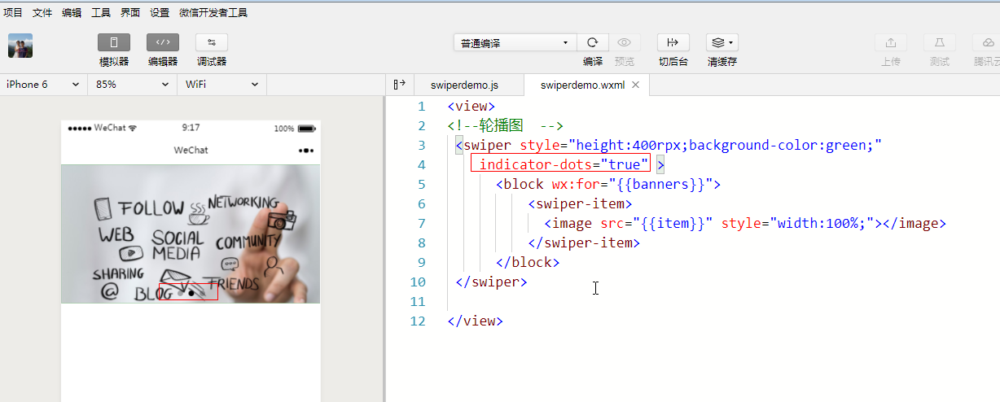


2.修改点的颜色

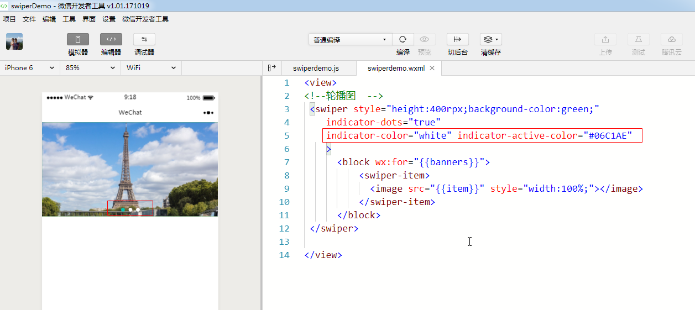

#### 4.自动轮播-auto-intervel

自动轮播和自定轮播切换的时间

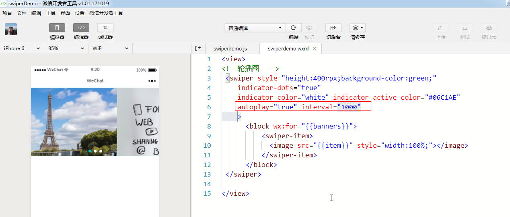


#### 5.循环轮播-circular

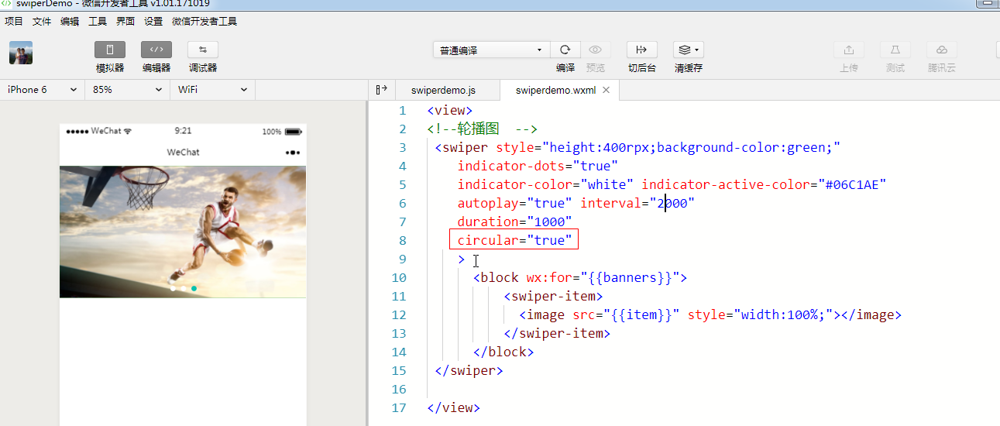

#### 6.纵向轮播-vertical

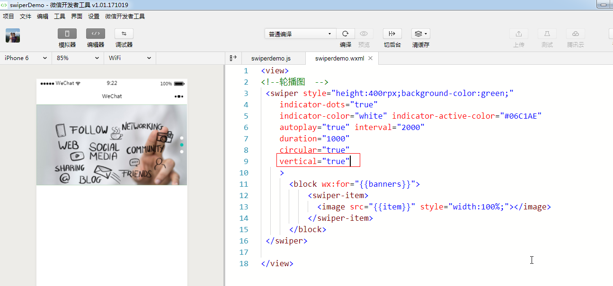


## 2. 事件处理

<https://developers.weixin.qq.com/miniprogram/dev/framework/view/wxml/event.html>

### 1. 什么是事件

> 点击事件 ， 长按事件  ， 滚动事件  ， 触摸事件 , 表单提交事件.....

- 事件是**视图层到逻辑层**的通讯方式。
- 事件可以将**用户的行为**反馈到**逻辑层**进行处理。
- 事件可以**绑定**在**组件**上，当达到触发事件，就会执行逻辑层中对应的**事件处理函数**。
- 事件对象event可以携带额外信息，如 id, dataset, touches。

### 2. 事件的使用方式

#### 1. 给组件添加点击Tap事件

> bindtap  :  bind ： 是绑定事件的意思， tap ： 是说绑定的事件是一个点击事件

1.绑定tap事件

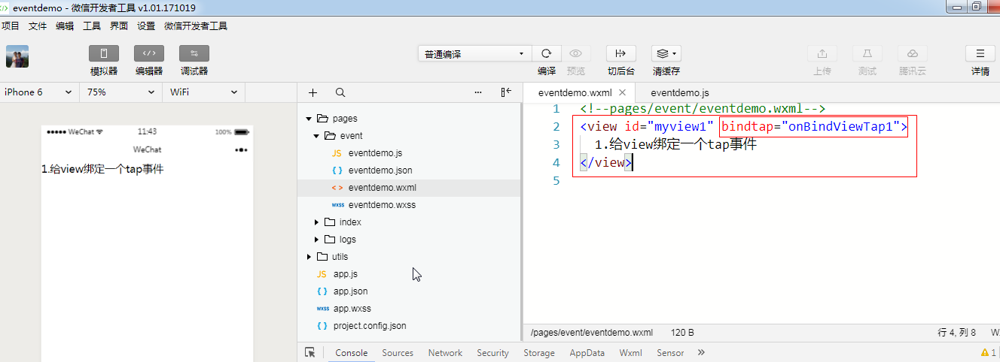

```
<view id="myView1" bindtap="onBindViewTap1" data-msg="xmg"> 
 1.给view绑定一个tap事件
</view>
```


2.处理点击事件, 并查看控制台的输出

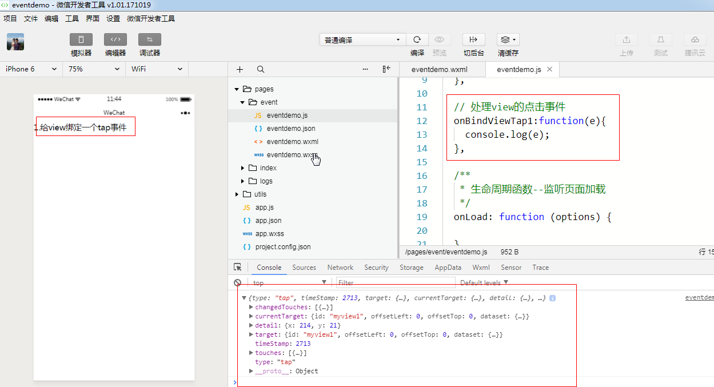

> 注意： currentTarget   和  target  代表的实例
>
> currentTarget : 设计监听事件的目标
>
> target ： 第一个发生事件的目标（事件源）

```
这个是事件对象e :

{
"type":"tap",  // 事件类型
"timeStamp":895, //时间戳
"target": {    //发生点击事件的目标（事件源）
  "id": "myView1",   //组件的id
  "dataset":  {  
    "msg":"xmg"   //组件data-xxx绑定的数据
  }
},
"currentTarget":  {  //当前 设计了监听事件 的目标
  "id": "myview1",  //组件的id
  "dataset": {
    "msg":"xmg"   //组件data-xxx绑定的数据
  }
},
"detail": {   //点击的 x y 轴坐标
  "x":53,
  "y":14
},
"touches":[{   //点击的坐标
  "identifier":0,
  "pageX":53,
  "pageY":14,
  "clientX":53,
  "clientY":14
}],
"changedTouches":[{   //点击的坐标
  "identifier":0,
  "pageX":53,
  "pageY":14,
  "clientX":53,
  "clientY":14
}]
}
```

### 3. 事件分类

事件分为冒泡( bubble )事件和非冒泡事件：

1. 冒泡事件：当一个组件上的事件被触发后，该事件会**向父节点传递**。
2. 非冒泡事件：当一个组件上的事件被触发后，该事件不会向父节点传递。


**注：除上表之外的其他组件自定义事件如无特殊申明都是非冒泡事件，如的submit事件，的input事件，的scroll事件，(详见各个组件)**


### 4. 冒泡事件-bind

> 注意：冒泡事件一般以bind开头, 例如：bindtap

#### 1.写布局

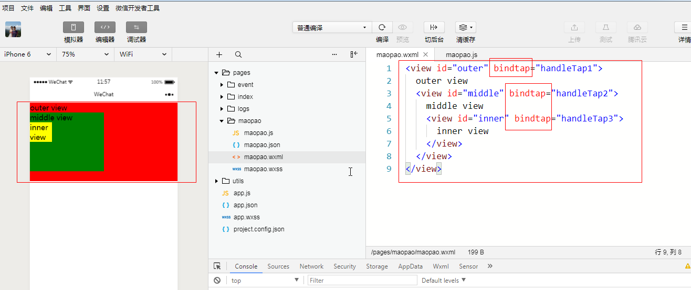

```
布局：
<view id="outer" bindtap="handleTap1">
  outer view
  <view id="middle" bindtap="handleTap2">
    middle view
    <view id="inner" bindtap="handleTap3">
      inner view
    </view>
  </view>
</view>

样式：
#outer{
  background: red;
  height: 400rpx;
  width: 100%;
}

#middle{
  background: green;
  width: 50%;
  height: 300rpx;
}

#inner{
  background: yellow;
  height: 100rpx;
  width: 30%;
}
```

#### 2.监听冒泡事件

冒泡事件：当一个组件上的事件被触发后，该事件会**向父节点传递**。

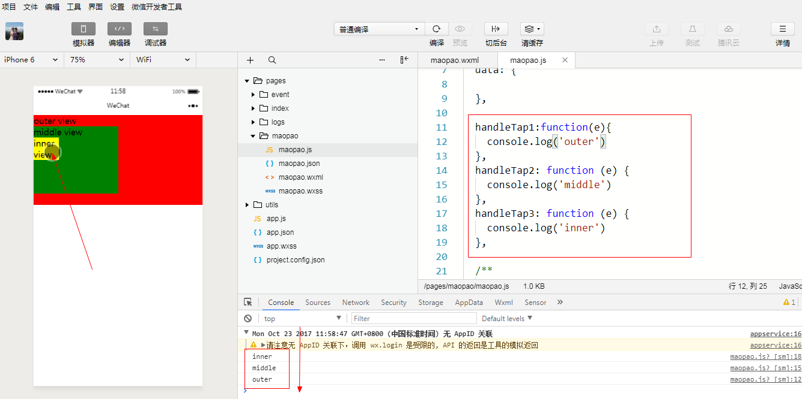


### 5. 阻止冒泡事件-catch

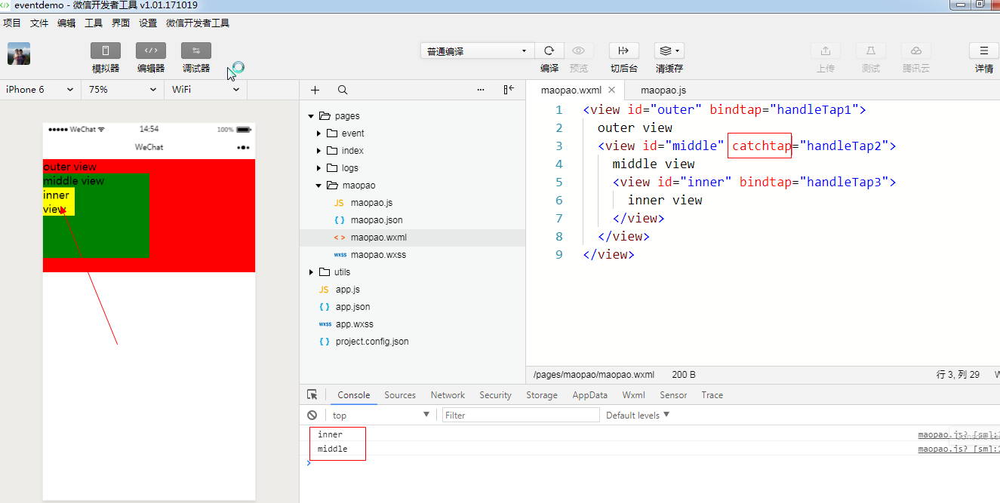


## 3. 模板

https://developers.weixin.qq.com/miniprogram/dev/reference/wxml/template.html

WXML提供模板（template），可以在模板中定义代码片段，然后在不同的地方调用。

### 1.定义模板和使用

> 1.在wxml页面中定义模版  <template name="abc"> xxxx <template>
>
> 2.使用模版 <template is="abc"   data="{{   }}"> <template>

```html
<!-- 1.定义模板 -->
<template name="tempName">
  <view> 
      <text>我是一个模板</text>
  </view>
</template>

<!-- 2.使用模板 -->
<template is="tempName"/>
```

### 2.动态渲染模板

> <template is="{{2>4?'tempName1':'tempName2'}}"/>

```html
<!-- 1.定义模板 -->
<template name="tempName1">
  <view> 
      <text>我是第1个模板</text>
  </view>
</template>

<template name="tempName2">
  <view> 
      <text>我是第2个模板</text>
  </view>
</template>

<!-- 2.使用模板 -->
<template is="{{2>4?'tempName1':'tempName2'}}"/>
```

### 3.模板接收参数

布局代码

```html
<!-- 1.定义模板 -->
<template name="tempName1">
  <view> 
      <text>我是第1个模板\n</text>
      <!-- 3.接收参数  -->
      <text>{{msg}}-->{{time}}</text>
  </view>
</template>

<template name="tempName2">
  <view> 
      <text>我是第2个模板\n</text>
    	<!-- 3.接收参数  -->
      <text>{{msg}}-->{{time}}</text>
  </view>
</template>

<!-- 2.使用模板 data传递参数  -->
<template is="{{2>4?'tempName1':'tempName2'}}" data="{{...item}}"/>
```

js代码：

```js
 /**
   * 页面的初始数据
   * 可以在item中定义一个事件的名称传递到模版中 
   */
  data: {
    item: {
      msg: 'this is a template',
      time: '2018-12-16'
    }
  },
```

### 4.模板的抽取

> 1.定义外部模版<template name=""> xxxx </template>
>
> 2.导入外部模版 <import src="" ></import>
>
> 3.使用模版：<template is=""  data="{{}}"></template>

1.定义外部的模板

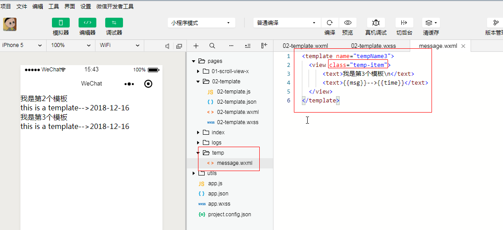


> 模板中的样式一般写在app.wxss文件中或者直接写在组件上（ 也可以写在使用模板的页面上，例如：template.wxss上）

**2.引用外部的模板**

https://developers.weixin.qq.com/miniprogram/dev/framework/view/wxml/import.html


```html
<!-- 3.使用外部的模板 -->
<import src="../temp/message.wxml" />
<template is="tempName3" data="{{...item}}"/>
```

### 5.import VS include

**import 有作用域的概念**，即只会 import 目标文件中定义的 template，而不会 import 目标文件 import 的 template。

**如：B import A，C import B，在C中可以使用B定义的template，在B中可以使用A定义的template，但是C不能使用A定义的template**。

```html
<!-- A.wxml -->
<template name="A">
  <text> A template </text>
</template>

<!-- B.wxml -->
<import src="a.wxml" /> <!-- B import A, B可以使用A中的模板 -->
<template name="B">
  <template is="A" />
  <text> B template </text>
</template>

<!-- C.wxml -->
<import src="b.wxml" />
<template is="A" />  <!-- C import B, C可用B中的模板,而不能用A中的模板。这种是错误的-->
<template is="B" />  <!-- 对的 -->
```


**include** 可以将目标文件**除了**  < template/>   < wxs /> 外的整个代码引入，相当于是拷贝到 `include` 位置，如下面案例：

```html
<!-- header.wxml -->
<view> header </view>

<!-- footer.wxml -->
<view> footer </view>
```

```html
<!-- index.wxml -->
<include src="header.wxml" /> 
    <view> body </view> 
<include src="footer.wxml" />
```

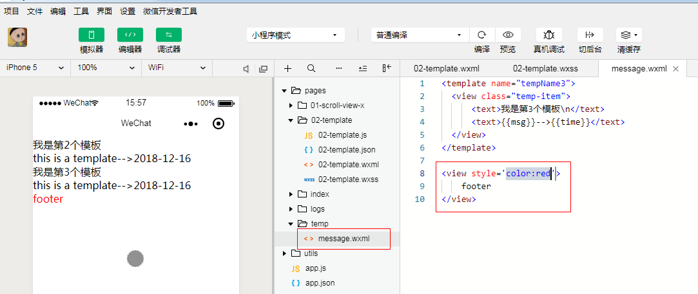

```html
<!-- 4.在template.wxml中include外部的文件 -->
<include src="../temp/message.wxml" />
```


## 4. WXS

### 1. 小程序脚本语言简介

WXS（WeiXin Script）是**小程序的一套脚本语言**，结合 `WXML`，可以构建出页面的结构。

注意：

1. wxs **不依赖**于运行时的基础库版本，可以在所有版本的小程序中运行。
2. wxs 与 javascript 是**不同**的语言，有自己的语法，并不和 javascript 一致。
3. wxs 的运行环境和其他 javascript 代码是**隔离**的，wxs 中不能调用其他 javascript 文件中定义的函数，也不能调用小程序提供的API。
4. 由于运行环境的差异，在 iOS 设备上小程序内的 wxs 会比 javascript 代码**快 2 ~ 20 倍**。在 android 设备上二者运行效率无差异。

> 1. 小程序脚本语言 主要是用来增强页面的表达能力
>
> 2. 对es6的支持不友好。比如，const  let 箭头函数不支持。


小程序原理架构图：

微信小程序的框架包含两部分View视图层(可能存在多个)、App Service逻辑层(一个)，View层用来渲染页面结构，AppService层用来逻辑处理、数据请求、接口调用，它们在两个进程（webview）里运行。

视图层使用WebView渲染，逻辑层使用JSCore运行。

视图层和逻辑层通过系统层的WeixinJsBridage进行通信，逻辑层把数据变化通知到视图层，触发视图层页面更新，视图层把触发的事件通知到逻辑层进行业务处理。

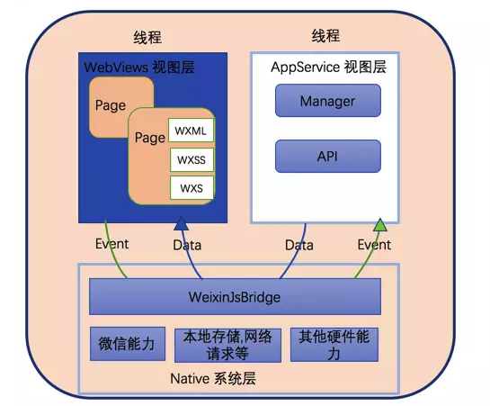


**讲一下wxs :**

**由于view 与 App Service**是不同线程,之前是传递数据。现在当遇到一些数据需要在view中处理时, 就可以用wxs来处理。


### 2. WXS 的简单示例

> 1.在wxml中定义wxs模版  <wxs module="msg" >  xxxxx  </wxs>
>
> 2.使用：<text> {{  msg.xxx }} </text>

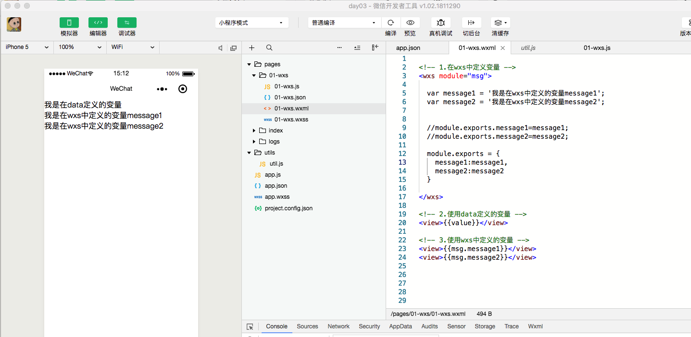

```html
<!-- 1.在wxs中定义变量 -->
<wxs module="msg">

  var message1 = '我是在wxs中定义的变量message1';
  var message2 = '我是在wxs中定义的变量message2';


  //module.exports.message1=message1;
  //module.exports.message2=message2;

  <!-- 导出定义的变量 -->
  module.exports = {
    message1:message1, //这里不能简写
    message2:message2
  }

</wxs>

<!-- 2.使用data定义的变量 -->
<view>{{value}}</view>

<!-- 3.使用wxs中定义的变量 -->
<view>{{msg.message1}}</view>
<view>{{msg.message2}}</view>

```

#### 1. 变量

- WXS 中的变量均为**值的引用**。
- **没有声明**的变量直接赋值使用，会被定义为**全局变量**。
- 如果只声明变量而不赋值，则默认值为 `undefined`。
- var表现与javascript一致，会有变量提升。

```js
var foo = 1
var bar = 'hello world'
var i // i === undefined
```

上面代码，分别声明了 `foo`、 `bar`、 `i` 三个变量。然后，`foo` 赋值为数值 `1` ，`bar` 赋值为字符串 `"hello world"`。


变量命名必须符合下面两个规则：

- 首字符必须是：字母（a-zA-Z），下划线（_）
- 剩余字符可以是：字母（a-zA-Z），下划线（_）， 数字（0-9）

#### 2. 注释

WXS 主要有 3 种注释的方法。

**示例代码：**

```html
<!-- wxml -->
<wxs module="sample">

  // 方法一：单行注释 
  /* 方法二：多行注释 */ 
  
  /* 方法三：结尾注释。即从 /* 开始往后的所有 WXS 代码均被注释 var a = 1; var b = 2; var c = "fake";
  
</wxs>
```

上述例子中，所有 WXS 代码均被注释掉了。

> 方法三 和 方法二 的唯一区别是，没有 `*/` 结束符。


### 3. wxs数据处理-时间格式化

获取时间戳：https://tool.lu/timestamp

1545117587000   ----->   2018-12-18 15:19:47

下面的案例是将data中的时间戳 , 格式化后输出到界面

1.wxml  查看数据类型的api

```html
<!-- 1.在wxs中定义变量 -->
<wxs module="msg">
  
  var formTime = function(time){
    //1.查看数据类型的api, 注意获取date不是通过new Date()
    var date=getDate(time) //只接受number类型
    var formTime = date.getFullYear() +'-'+ ( date.getMonth()+1 ) +'-'+date.getDate();
    return formTime;
  }

  module.exports = {
    formTime:formTime  //这里不能简写
  }

</wxs>

<!-- 3.使用wxs中定义的变量 -->
<view>{{ msg.formTime(time) }}</view>
```


2.js

```js
  /**
   * 页面的初始数据
   */
  data: {
    value:'我是在data定义的变量',
    time:1545117587000
  },
```


### 4. wxs工具类-价格格式

> 1.第一编写wxs文件，不用指定module
>
> 2.<wxs  src=""   module="tools" >  xxxxx  </wxs>
>
> 3.使用：<text> {{  tools.xxx }} </text>

#### 1. 在wxs文件中编写函数

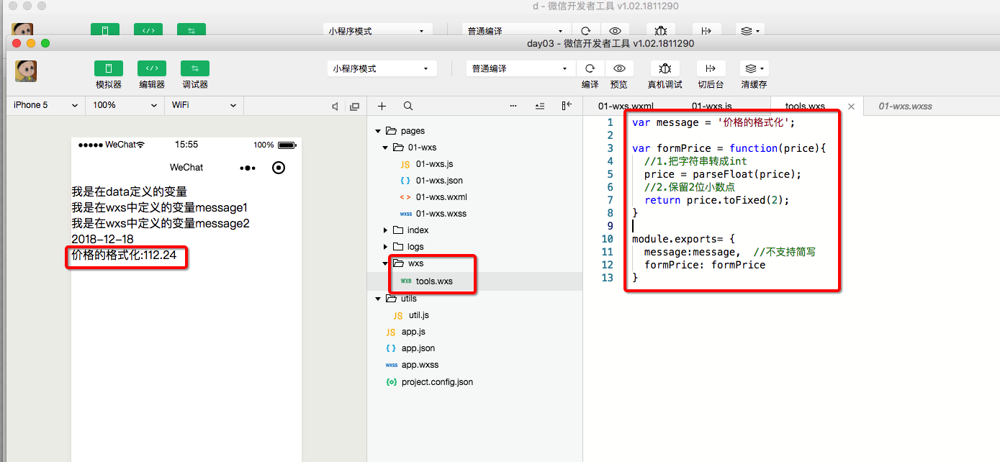


```js
var message = '价格的格式化';

var formPrice = function(price){
  //1.把字符串转成int
  price = parseFloat(price);
  //2.保留2位小数点
  return price.toFixed(2);
}

module.exports= {
  message:message,  //不支持简写
  formPrice: formPrice
}

```


#### 2. 导入编写好的工具函数

> <wxs src="../wxs/tools.wxs" module="tools"></wxs>

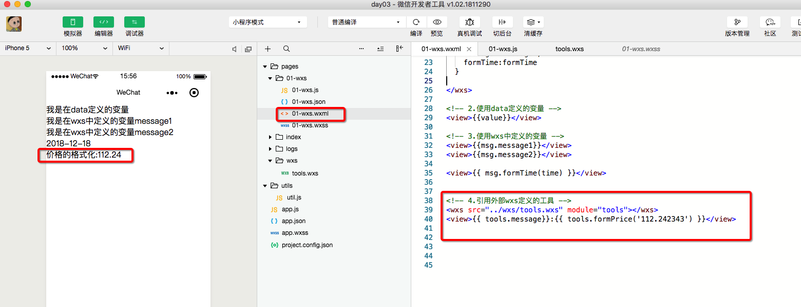


```html
<!-- 4.引用外部wxs定义的工具 -->
<wxs src="../wxs/tools.wxs" module="tools"></wxs>
<view>{{ tools.message}}:{{ tools.formPrice('112.242343') }}</view>
```


## 5. open-data组件

https://developers.weixin.qq.com/miniprogram/dev/component/open-data.html

用于展示微信**开放的数据**(  不需要授权也可以获取部分的用户数据  )

```html
<open-data type="userNickName"></open-data>
<view style='width:200rpx;height:200rpx;'>
    <open-data type="userAvatarUrl"></open-data>
</view>
<open-data type="userNickName" lang="en"></open-data>
```

> 注意：open-data组件圆头像如何实现？ overflow : hidde

## 6. picker

从**底部弹起**的滚动选择器，现支持五种选择器，通过mode来区分，分别是普通选择器，多列选择器，时间选择器，日期选择器，省市区选择器，默认是普通选择器。

### 1. 普通选择器-selector

> array: ['美国', '中国', '巴西', '日本','韩国','巴西','印度','泰国'],

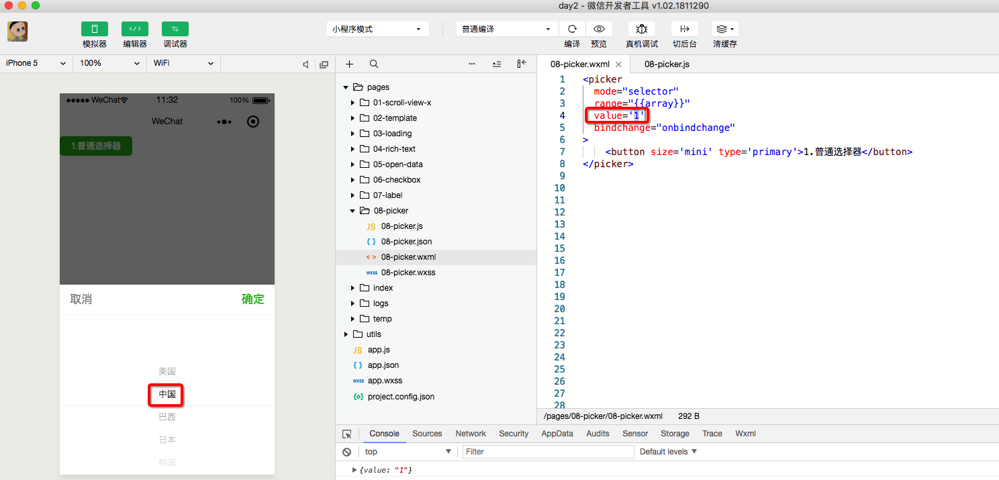

1.wxml

```html
<picker
  mode="selector"
  range="{{array}}"
  value='1'
  bindchange="onbindchange"
>
    <button size='mini' type='primary'>1.普通选择器</button>
</picker>
```


2.js

```js
  /**
   * 页面的初始数据
   */
  data: {
    array: ['美国', '中国', '巴西', '日本','韩国','巴西','印度','泰国'],
  },
    
  /**点击确认时回调 */
  onbindchange:function(event){
     console.log(event.detail)

  },
  
```


### 2. 多列选择器-multiSelector

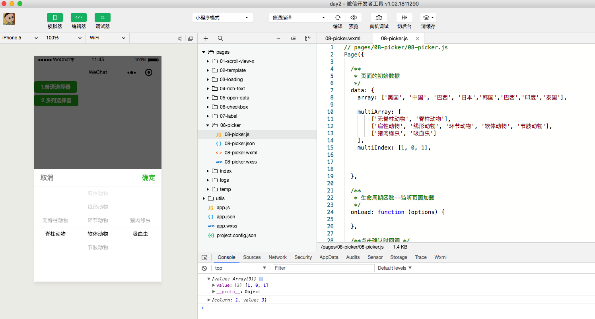


1.wxml

```html
<picker
  mode="multiSelector"
  range="{{multiArray}}"
  value='{{multiIndex}}' 
  bindcolumnchange="onbindcolumnchange"
  bindchange="onbindchange"
>
    <button size='mini' type='primary'>2.多列选择器</button>
</picker>
```

2.js

```js
  /**
   * 页面的初始数据
   */
  data: {
    array: ['美国', '中国', '巴西', '日本','韩国','巴西','印度','泰国'],

    multiArray: [
        ['无脊柱动物', '脊柱动物'], 
        ['扁性动物', '线形动物', '环节动物', '软体动物', '节肢动物'], 
        ['猪肉绦虫', '吸血虫']
    ],
    multiIndex: [1, 0, 1], 
      
  },


  /**点击确认时回调 */
  onbindchange:function(event){
     console.log(event.detail)

  },

  /** 当滚动的时候会回调*/
  onbindcolumnchange:function(event){
    console.log(event.detail) // {column:0,value:0}  代表是滚动第0列的第0个值
  },
```


### 3. 时间选择器-time

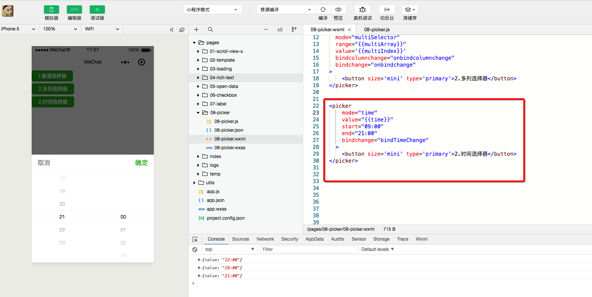

1.wxml

```html
<picker
    mode="time"
    value="{{time}}"
    start="09:00"
    end="21:00"
    bindchange="bindTimeChange"
  >
    <button size='mini' type='primary'>2.时间选择器</button>
</picker>
```


2.js

```js
  /**
   * 页面的初始数据
   */
  data: {
    ....
    ....

    time: '12:01',

  },

  bindTimeChange:function(event){
    console.log(event.detail)
  },
```


### 4. 日期选择器-date


1.wxml

```html

<picker
    mode="date"
    value="{{date}}"
    start="2015-09-01"
    end="2017-09-01"
    bindchange="bindDateChange"
  >
    <button size='mini' type='primary'>4.日期选择器</button>
</picker>
```


2.js

```js
 data: {
    ....
    date:'2016-01-01'

  },
  
  bindDateChange:function(event){
    console.log(event.detail)
  },
  
```


### 5. 省市区选择器-region

region  [ˈri:dʒən]  区域

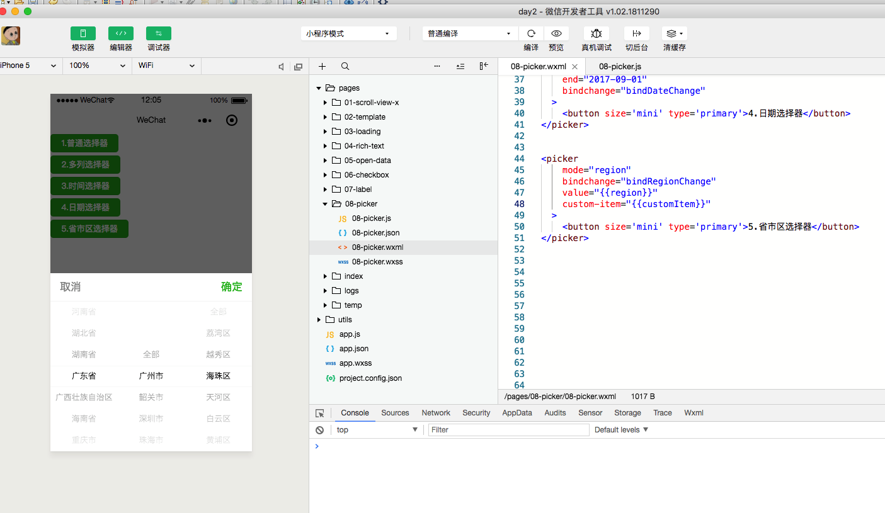


1.wxml

```html
<picker
    mode="region"
    bindchange="bindRegionChange"
    value="{{region}}"
    custom-item="{{customItem}}"
  >
    <button size='mini' type='primary'>5.省市区选择器</button>
</picker>
```


2.js

```js
  /**
   * 页面的初始数据
   */
  data: {
    ....
    
    region: ['广东省', '广州市', '海珠区'],
    customItem: '全部'

  },

  bindRegionChange: function (event) {
    console.log(event.detail)
  },
```

> 注意：很多属性不是必须的
