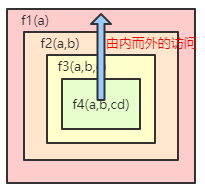

# 				**JavaScript基础**

------

今日学习内容

- 内置对象
  - 使用MDN文档
  - Math对象
  - Date对象

今日学习目标

- 内置对象
  - 熟悉使用MDN文档
  - **掌握Math对象的常用方法和属性**
  - **掌握Date对象常用方法**

4、定义一个函数，输入某年某月某日，判断这一天是这一年的第几天？

需求分析：
	（1） 循环累加当前月份的天数, 1,3,5,7,8,10,12月，每月31天, 4,6,10,11月，每个月30天；

```javascript
function getDays(year, month, day) {
     //定义变量存储对应的天数
     var days = day;
     //如果用户输入的是一月份,没必要向后算天数,直接返回天数 假设 1月31
     if(month == 1){//这说明用户输入的是1月份
         return days;//函数里面遇到return后面代码就不执行了
     }
     /*
     *代码执行到这里---说明用户输入的不是1月份 就是用户输入的是任意的某个月份
     *  如果用户输入的是8月15 --- 1月+2月+3月...+8月+15天
     *  1,3,5,7,8,10,12 --- 是31天； 2月是---28天； 4,6,9,11 ---是30天
     * */
     //下面就要开始定义一个数组，存储每个月份的天数
     var months = [31, 28, 31, 30, 31, 30, 31, 31, 30, 31, 30, 31];
     //用户输入的不是1月份，就要开始循环数组，把每个月的天数加起来
     for(var i = 0; i < month -1; i++){//i小于的是输入的月份减1，不是数组months
                days += months[i];//假设输入的是8月15---就等于前7个月加上15天
                // i < month 不用用数组，因为用数组.length就直接跑到最后12月了
     }
     //最后返回这个天数的总和
     return days;

}
var result = getDays(2019,8,15);
console.log(result);
```

5、定义一个函数，输入某年某月某日，判断这一天是这一年的第几天并且判断该年份是否是闰年（练习）

什么是闰年？满足以下两点中的任何一点的年份，就是闰年！
（1）能被4整数并且不能被100整数
（2）能被400整数

```javascript
function isLeapYear(year) {//返回的结果就是true或者false，true是闰年
     return year % 4 == 0 && year % 100 != 0 || year%400 ==0;
}
function getDays(year, month, day) {
    //定义变量存储对应的天数
    var days = day;
   //如果用户输入的是一月份,没必要向后算天数,直接返回天数 假设 1月31
   if(month == 1){//这说明用户输入的是1月份
      return days;//函数里面遇到return后面代码就不执行了
   }
   /*
   *代码执行到这里---说明用户输入的不是1月份 就是用户输入的是任意的某个月份
   *  如果用户输入的是8月15 --- 1月+2月+3月...+8月+15天
   *  1,3,5,7,8,10,12 --- 是31天； 2月是---28天； 4,6,9,11 ---是30天
   * */
   //下面就要开始定义一个数组，存储每个月份的天数
   var months = [31, 28, 31, 30, 31, 30, 31, 31, 30, 31, 30, 31];
   //用户输入的不是1月份，就要开始循环数组，把每个月的天数加起来
   for(var i = 0; i < month -1; i++){//i小于的是输入的月份减1，不是数组months
       days += months[i];//假设输入的是8月15---就等于前7个月加上15天
       // i < month 不用用数组，因为用数组.length就直接跑到最后12月了
   }
   //需要判断这个年份是不是闰年(如果是2月份不用考虑闰年了，只有超过2月份才考虑闰年)
	if(isLeapYear(year) && month > 2){//如果是2月就直接加天数了，所以要大于2月
       days++;
    }
    //返回这个天数的总和
    return days;
}
var result = getDays(2000,3,2);//2000年是闰年所以---62天
console.log(result);
```

## 作用域介绍

作用域：分为全局作用域和局部作用域；

全局作用域：网页一打开就形成了全局作用；

全局变量：在全局作用域下形成的变量都叫做全局变量（除了函数里面定义的变量都可以叫做全局变量）；

局部作用域：函数的执行形成了一个局部作用域；

局部变量：在局部作用域下形成的变量叫做局部变量（局部变量是在函数里面定义的，函数里面通过var或者形参都叫做局部变量）

```javascript
var num = 1;            //声明一个全局变量
function fun() {
　  var num = 2;        //声明一个局部变量
    return num;
}
console.log(fun());    //输出：2
```

### 块级作用域（了解-扩展）

```javascript
//块级作用域:一对大括号就可以看成是一块,在这块区域中定义的变量,只能在这个区域中使用,但是在js中在这个块级作用域中定义的变量,外面也能使用;说明:js没有块级作用域,只有函数除外
{
  var num = 10;
   console.log(num);
}
console.log(num);//10

for(var i=0;i<5;i++){
   var number=20;
}
console.log(number);
function f1() {
   var num=10;
}
f1();
//console.log(num); 这句话会报错；
```

### this关键字讲解

在JS编程的过程中发现，我们会使用到this关键字，用好了this，能让我们的代码更加优雅。this所指向的对象跟 **函数的调用方式** 有关

```javascript
// this所指向的对象跟 函数的调用方式 有关
console.log(this);// this --> window
//普通函数调用---this也是指向window
function demo() {
   console.log(this);
}
demo();// this --> window
```

综上案例，可总结出this关键的意义，如下

1. 函数外部

   函数外部的作用域是全局作用域（window），所以，在全局作用域中使用的this指向window

2. 普通函调用 例如直接调用 fn()，那么  this指向window

## 预解析（变量提升）

JavaScript代码的执行是由浏览器中的JavaScript解析器来执行的。JavaScript解析器执行JavaScript代码的时候，分为两个阶段，预解析阶段(预处理、预编译)与执行阶段。

这个小节我们主要学习JavaScript的预解析的过程。

### 预解析的作用（掌握）

1. 提升变量声明：把变量的声明提升到当前作用域的最前面，只会提升声明，不会提升赋值。
2. 提升函数声明：把函数的声明提升到当前作用域的最前面，只会提升声明，不会提升调用。

在JS中存在一个很重要的特性，函数和变量声明的提升，理解这一点对于理解我们编写的代码非常有帮助，那么声明是声明的提升呢？我们通过下面的代码来分析。

```js
console.log(a);//①
var a = 123;
console.log(a);//②

console.log(f);//③
f();//④
function f() {
    console.log("函数声明提升");
}
```

①处的代码如果按照我们以前的理解，代码从上而下执行，那么在执行这行代码的时候，a还没有被声明，所以直接访问一个没有被声明的变量，程序应该报错。

但是结果却大出所料，这里得到的结果是undefined。

③处的结果也和我们最初的认识是不一样的，结果为f对应的函数对象。

造成这个结果是因为变量和函数的作用域提升的原因，什么意思呢？

JS是解释性语言，JS引擎对代码的处理分为两步：

​	**预解析处理：**在代码执行之前，对代码做全局扫描，对代码中出现的变量或者函数提前声明处理；

​	解析之后我们的代码：

```js
var a;//提前声明，但不初始化
console.log(a);//undefined
a = 123;
console.log(a);//123

//提前声明
function f() {
    console.log("函数声明提升");
}
console.log(f);//函数对象
f();//函数声明提升
```

​	**调用执行：**自上而下的执行代码

## 变量提升和作用域的关系

下面给出两个练习帮助大家理解变量提升和作用域的关系。

**题1：**

```js
f();
function f() {
    console.log("1");
}
f();
function f() {
    console.log("2");
}
f();
function f() {
    console.log("3");
}
```

根据前面对函数声明提升的认识，相信大家能够得出这里三个打印的正确结果，对的，三次都是 “3”。

预解析之后的代码：

```js
function f() {
        console.log("3");
}
f();
f();
f();
```

为什么解析之后只剩下一个函数，而且是最后那一个？

因为三个函数的名称一样，后面的函数会将前面的覆盖，所以最后只剩下最后一个函数了。

**题2：**

```js
console.log(a);
var a = 123;
console.log(a);
function f1() {
    console.log(a);
    var a = 456;
    console.log(a);
}
f1();
console.log(a);
```

不废话，直接先对代码做预解析，然后再做分析。

```js
var a;//变量声明提升
function f1() {//函数声明提升
	var a;//变量声明提升
    console.log(a);
    a = 456;
    console.log(a);
}
console.log(a);
a = 123;
console.log(a);
f1();
console.log(a);
```

解析得到上面的代码结果就非常明显了，分别是：undefined	 123  undefined  456  123

由于在函数内部有变量a，所以在函数中访问到的是这个局部变量，如果在函数作用域中没有变量a，那么就会跳出函数作用域来到全局作用域来查找。

## 声明提升的规则

声明提升是将变量或者函数的声明提升到当前作用域的最顶端。在具体使用的过程中存在以下需要注意的细节。

1. 变量和变量同名，解析之后只存在一个当前变量的声明

```js
console.log(a);
var a = 123;
console.log(a);
var a = 456;
console.log(a);
```

解析之后：

```js
var a;
console.log(a);//undefined
a = 123;
console.log(a);//123
a = 456;
console.log(a);//456
```

2. 函数和函数同名，后面的声明将前面的覆盖

```js
f();
function f() {
    console.log("1");
}
f();
function f() {
    console.log("2");
}
f();
function f() {
    console.log("3");
}
```

解析之后：

```js
function f() {
    console.log("3");
}
f();//3
f();//3
f();//3
```

3. 函数和变量同名，函数声明提升，忽略变量的声明

```js
console.log(a);
var a = 123;
console.log(a);
function a() {}
console.log(a);
function a() {}
console.log(a);
```

解析之后：

```js
function a() {}
console.log(a);//函数a
var a = 123;//将前面的函数覆盖，a的值变为123
console.log(a);//123
console.log(a);//123
console.log(a);//123
```

4. 如果是命名函数，则只将前面的变量声明提升，函数不动。

```js
console.log(fn1);
function fn1() {
}
console.log(fn1);
console.log(fn2);
var fn2 = function () {
}；
console.log(fn2);
```

解析之后：

```js
function fn1() {
}
var fn2;
console.log(fn1);//fn1函数
console.log(fn2);//undefined
fn2 = function () {
}
console.log(fn2);//fn2函数

```

练习题1：

```
console.log(a,b); //undefined undefined
var a=12;
var b=13;

sum(); //1
function sum(){
    console.log(1);
}
```

练习题2：

```
console.log(a); //undefined
var a=12;
function fn(){
    console.log(a); //undefined
    var a=13;

}
fn();
console.log(a); //12
```

练习题3:

```
console.log(a); //undefined
var a=12;
function fn(){
    console.log(a);//12
    a=13;
}
fn();
console.log(a)//13
```

练习题4:

```
console.log(a);//这个就直接报错了，因为没有变量提升 a is not defined
a=12;
function fn(){
    console.log(a);
    var a = 13;
}
fn();
console.log(a)
```

练习题5：

```
console.log(a);//undefined
var a=12;
function fn(a){
    console.log(a);// 12
    a = 13;

}
fn(a);
console.log(a);//12 
```

练习题6：

```
var foo=1;
   function bar(){
       //不管条件是否成立，都要进行变量提升
       //这时的foo属于私有变量 给的默认值是undefined,undefined取反就为真
       if(!foo){
           var foo=10;
       }
       console.log(foo);
   }
   bar();//10
```

练习题7：

```
var n=13;
function fn(n) {
    alert(n); // 13
    var n=14;//有形参赋值了，就不在走变量提升了
    alert(n); // 14
}
fn(n);
console.log(n);//13
```

练习题8：

```
console.log(a);// undefined
a=12;
function fn(a) {
    console.log(a); //undefined
    a=13;
}
fn();//注意这里没有传值
var a;
console.log(a); //12
```

练习题9：

```
console.log(a, b, c);// undefined undefined undefined
var a=10,b=20,c=30;
function f(a) {
    console.log(a, b, c);// 10 undefined 30
    var b=a=c=100;
    console.log(a, b, c);//100 100 100
}
f(10,20);
console.log(a, b, c);// 10,20,100
```

练习题10：

```
console.log(num, str); //undefined undefined
var num=18;
var str="lily";
function fn2() {
    console.log(str, num); //lily undefined
    num=19;
    str="candy";
    var num=14;
    console.log(str, num);  // candy 14
}
fn2();
console.log(str, num);// candy 18
```

## 作用域链和访问规则

## 作用域链

作用域链：从局部作用域往上级一级一级查找------这种查找的机制我们称之为作用域链。

那么在作用域链中的成员访问规则是怎么样的呢？

```js
var num = 10;
function f1() {
   //var num = 20;
   function f2() {
     //var num = 30;
     function f3() {
       //var num = 50;
       console.log(num);
     }
     f3();
   }
   f2();
}
f1();
```

函数中定义的变量称为局部变量，它只属于当前函数的作用域及其嵌套函数的作用域中，外界无法访问。也就是一种由内而外的访问，反之则不行。



## 内置对象

### 什么是内置对象（了解）

内置对象是指内部已经定义好的对象。在JavaScript中，存在许多已经定义好的对象，这些对象共同组成了JavaScript的内置对象。

在学习内置对象之前，我们先做一个关于数据类型、对象的回顾和总结，如下

```javascript
1、数据类型
	基本数据类型：String，Number，Boolean，Undefined，Null
2、对象
	（1）JavaScript中的对象分为3种：内置对象、浏览器对象（BOM里面的内容）、自定义对象（构造函数创建的对象）
	（2）JavaScript提供了很多内置对象，其中我们要学习的有 Math，Date，Array，String，Number，Boolean...
```

### MDN文档的使用（熟悉）

**什么是MDN文档**

**MDN**是Mozilla 开发者网络的简称。Mozilla 开发者网络（MDN）提供有关开放网络技术（Open Web）的信息，包括 HTML、CSS 和万维网及 HTML5 应用的 API。

MDN网址：https://developer.mozilla.org/zh-CN/

**查看MDN文档**

通过查询MDN文档，学习Math对象的random()方法的使用


方法.png)


### Math对象（掌握）

​	Math对象不是构造函数，它封装了常用的数学属性和方法，以静态成员的方式提供跟数学相关的运算，如 取绝对值，取随机数，取最大、最小值等等。

[Math](https://developer.mozilla.org/zh-CN/docs/Web/JavaScript/Reference/Global_Objects/Math)

演示：Math.PI、Math.random()、Math.floor()/Math.ceil()、Math.round()、Math.abs()	、Math.max()

Math.E					 //欧拉常数e（基数）

Math.PI				        // 圆周率

Math.abs()			         // 取指定数的绝对值

Math.random()			    // 生成 [0, 1) 的随机浮点数

Math.floor()/Math.ceil()	       // 向下取整/向上取整

Math.round()			      // 四舍五入取整

Math.max()/Math.min()	      // 取最大和最小值

Math.power()/Math.sqrt()	 // 求指数次幂/求平方根

以下通过查找MDN文档，编写相应代码来学习Math中的常用属性和方法

#### Math.E	

Math.E：获取欧拉常数e（基数）

```javascript
console.log(Math.E);//2.71828...
```

#### Math.PI

Math.PI：圆周率，一个圆的周长和直径之比，约等于 3.14159.

```javascript
Math.PI 	// 圆周率
console.log(Math.PI)
```

#### Math.abs()

```javascript
console.log(Math.abs('-1'));//1
console.log(Math.abs('-2'));//2
console.log(Math.abs(null));//0  重点
console.log(Math.abs("string"));//NaN
console.log(Math.abs());//NaN
```

#### Math.random()

Math.random()：获取一个 0 到 1之间的随机数浮点数，包括0不包括1，可以用 [0, 1) 表示。

```javascript
//生成随机数	Math.random()	// 生成随机数
console.log(Math.random());
console.log(parseInt(Math.random()*5)+1);
console.log(parseInt(Math.random()*100)+1);
```

#### Math的其他常用方法

以下是Math对象中各个方法的演示代码，要求大家自己查找文档来学习。

```javascript
//Math.ceil() 向上取整
console.log(Math.ceil(12.3));
console.log(Math.ceil(12.9));
console.log(Math.ceil(12.09));
console.log(Math.ceil(12.03));
console.log(Math.ceil(12.92));

// Math.floor() 向下取整
console.log(Math.floor(12.3));
console.log(Math.floor(12.9));
console.log(Math.floor(12.09));
console.log(Math.floor(12.03));
console.log(Math.floor(12.92));

// Math.max()/Math.min() // 取最大和最小值
console.log(Math.max(10,1,9,100,200,45,78));
console.log(Math.min(10,1,9,100,200,45,78));

// Math.abs()	// 绝对值
console.log(Math.abs(-2));

//Math.power()、Math.sqrt() 求指数次幂/求平方根
console.log(Math.pow(2,4));
console.log(Math.sqrt(16));

//Math.round()四舍五入
console.log(Math.round(20.49));
console.log(Math.round(20.5));
```
