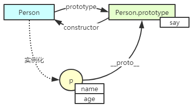

[TOC]

## 构造函数的调用和命名

在学习了构造函数之后，有的同学对于它和普通函数的区别还是不太清楚，这里我们就再对构造函数做一个说明。

1. 构造函数和普通函数在定义语法上没有任何区别

   function  函数名（参数列表）{代码块；}

2. 为了和普通函数区分开，我们约定将构造函数的名称首字母大写

3. 构造函数一样可以直接调用，此时内部的this执行window，这种方式不太安全，有可能会在函数内部修改当前的全局变量，不建议使用，而且这样做也不能创建对象

4. 想要创建对象，必须使用new和构造函数一起使用

## 函数上下文和this指针

在JS编程的过程中发现，我们大量使用到this关键字，用好了this，能让我们的代码更加优雅。

this总是执行一个对象（引用类型），但是具体执行谁，需要根据我们在哪里使用this有关。这里主要分为下面几种情况：

1. 函数外部

   函数外部的作用域是全局作用域（window），所以，在全局作用域中使用的this指向window

2. 普通函调用 例如直接调用 fn()，那么  this指向window

3. 对象方法的调用 例如：obj.fn()

   函数内部的作用域是局部的，属于调用当前函数的对象，所以this执向调用当前函数的对象

4. 构造函数内部

   在构造函数中，this直接执行当前创建出来的新对象

在开发中，我们也可以使用call或者apply函数修改this的指向，这一点我们在后面继续说明。

## 自定义构造函数存在的问题

自定义构造函数可以解决工厂函数带来的对象类型不确定的问题，在开发中用得非常多，那么目前我们的自定义构造函数又是否存在问题呢？先来看看下面的对象内存结构分析。

```javascript
function Person(name, age, say) {
    this.name = name;
    this.age = age;
    this.say = function(){
        console.log("say hello");
    }
}
var p = new Person("zs", 10, say);
console.log(p);
```

上面创建的p对象的内存结构图：


可以看出，我们每创建一个Person对象，都会在内存中分配如0x22和0x33这样的内存来存储数据，但是通过观察发现，0x33中存储的是一个函数，而这个函数在每个对象中都是相同


所以从内存资源分配考虑，我们无需为每个对象创建并分配一份新的函数对象（完全相同），这种函数大家最好共享同一份。

如何实现多个对象共享同一份数据呢，这就需要使用到原型相关的知识点了。

## 原型对象释义

每一个构造函数都有一个与之相关联的对象，该对象称之为原型对象。

每个实例对象都能共享其原型对象上的属性和方法。

原型对象的作用主要用来实现属性的继承，让实例对象能共享原型对象的属性，减少内存分配。

所以，在上一节中，我们想在每个Person对象中共享同一个say方法，可以这样来实现。

```javascript
function Person(name, age) {
    this.name = name;
    this.age = age;
}
//在原型对象上添加say函数，实例对象共享该函数
Person.prototype.say = function(){
    console.log("say hello");
};
var p = new Person("zs", 10, say);
p.say();
var p2 = new Person("zs", 10, say);
p2.say();
```

在原型对象上添加成员的方法：

​	构造函数.prototype.成员名 = 成员值；

为Person原型对象添加say方法后，实现了在多个实例对象上共享该方法的功能。

获取原型对象的方法：

​	构造函数.prototype

​	实例对象.__ proto __

在每个实例对象上都有一个__ proto __的属性，也是用来获取该对象的原型对象。

Person.prototype == p.__ proto __；//true

下图详细说明了各对象之间的关系：




## 面向对象中的核心概念

**构造函数：**Person，和new关键字一起创建对象

**构造函数的原型对象：**Person.prototype，

**原型对象：**和创建实例对象的构造函数相互关联的对象

**实例对象：**由构造器创建出来的对象称之为实例对象

**实例化：**由构造器创建实例对象的过程称之为实例化

**对象的成员：**属性+方法

**实例成员：**实例对象上的属性和方法，name,age，只能当前实例对象才能访问

**原型成员：**原型对象上的属性和方法，say()，使用该原型对象对应构造器创建出来的所有实例对象都能访问

**静态成员：**直接添加在构造函数上的属性和方法，只能使用构造函数才能访问


## __ proto __属性介绍

该属性是在ES6之后才纳入规范，在这之前，只有部分浏览器实现。

该属性可以获取指定实例对象的原型对象，p.__ proto __，和Person.prototype获取的一样

我们也可以使用Object构造器上的getPrototypeOf(实例对象)方法获取指定实例对象的原型对象

以上提到的三种获取原型对象的方法所得到的结果是一样的。即：

Object.getPrototypeOf(p) == Person.prototype == p.__ proto __

## 原型对象的设置和访问

前面课程中我们说到，构造函数创建实例对象存在一个内存资源浪费的问题，这个问题其实也可以使用下面的方式来解决，这里我们简单的提一下。

```javascript
function Person(name, age) {
    this.name = name;
    this.age = age;
    this.say = say;
}
function say() {
    console.log("say hello");
}
```

如果我们将构造函数中需要使用到的函数定义成一个全局函数，此时的say函数在内存中只创建一份，那么问题也就迎刃而解。但是这种方式我们并不推荐在开发中使用，因为如果大量使用这种方式，那么会造成全局变量混乱的问题。所以，这种情况下，建议大家使用原型对象来解决。

```javascript
//构造函数
function Person(name, age) {
    this.name = name;
    this.age = age;
}
//在原型对象中添加方法
Person.prototype.study = function () {
    console.log(this.name,this.age);
}
//创建实例对象
var p = new Person("zs",10);
var p2 = new Person("ls",12);
p.study();
p2.study();
```

如果需要在原型对象上添加多个成员可以使用下面这种方式：

```javascript
Person.prototype = {
    study:function () {
        console.log(this.name,this.age);
    },
    say:function () {
        console.log(this.name," say hello");
    }
}
```

相对于之前的方式，这种方式能够更统一、更方便的在Person原型对象上添加成员。

但，问题也随之而来，上面这段代码必须写在创建实例对象之前，否则添加的成员不可用。

```javascript
function Person(name, age) {
    this.name = name;
    this.age = age;
}
var p = new Person("zs",10);
Person.prototype = {
    study:function () {
        console.log(this.name,this.age);
    }
}
p.study();//p.study is not a function
```

为什么会有这样的问题？

其实也不难理解，在创建p对象的时候，Person及Person的原型对象中都没有study函数，所以创建出来的p对象中自然也不会有该函数，所以出现这个问题是必然的。下面画图分析一下：


可以看到，在创建p对象的时候，Person机器原型上都没有study方法，该方法是在创建p对象之后出现在Person新的原型对象中的。所以我们需要在创建p对象之前，先修改Person的原型对象，才能访问对应的方法。

```javascript
function Person(name, age) {
    this.name = name;
    this.age = age;
}
Person.prototype = {
    study:function () {
        console.log(this.name,this.age);
    },
    say:function () {
        console.log(this.name," say hello");
    }
}
var p = new Person("zs",10);
var p2 = new Person("ls",12);
p.study();//zs 10
p2.study();//ls 12
```

继续讨论下一个问题，对象已经创建好，并且也能使用到原型对象中的方法，此时p对象的constructor属性还是指向之前的Person构造函数吗？答案是否定的。此时指向了Object的构造函数。(**注意Object的constructor指向画反了，后面修改过来就可以**)


由于p对象中没有constructor属性，那么沿着这条链往上找，最终找到新的原型对象的类型是Object，在Object中有constructor属性，所以p.constructor属性最终返回的是Object的构造函数。

但是如果是这样的话，那我们都无法再判断实例对象的类型了，因为最终都成了Object。如何解决这个问题呢？

很简单，在新的原型对象上添加一个constructor属性指向Person构造器，从而改变p.constructor的指向，最终得到其真实类型。


## 构造函数创建实例对象补充

在对原型相关的知识有了一定的认识之后，我们再回过头来看看构造函数创建实例对象中的细节问题。

```javascript
function Person(name) {
    //默认创建一个Object对象 var obj = new Object();
    //将obj对象赋值给this   this = obj;
    this.name = name;
    //返回封装好的this对象，return this;
}
```

这是我们前面分析出来的步骤，现在再来看问题就很明显了。

在函数中，默认为我们创建的是一个Object类型的对象，该对象和当前的Person构造器没有任何关系。

那么想让最终创建出来的对象拥有具体的类型的话，应该还有下面一个步骤：

```javascript
//设置obj的__proto__属性指向Person构造函数的原型对象
//obj.__proto__ = Person.prototype;
```


## hasOwnProperty和in属性操作

in关键字用来检查对象中是否存在某个指定的属性(不区分实例属性和原型属性)，如下：

```javascript
function Person(name, age) {
    this.name = name;
    this.age = age;
}
Person.prototype = {
    constructor:Person,
    study:function () {
        console.log(this.name,this.age);
    },
    say:function () {
        console.log(this.name," say hello");
    }
}
var p = new Person("zs",10);
console.log("name" in p);//true
console.log("study" in p);//true
console.log("name222" in p);//false
```

可以看到，无论判断的成员是属于当前实例对象还是属于其原型对象的，in都返回true，如果都不存在，则返回false。

hasOwnProperty是Object中提供的，所有实例对象都能访问的方法，该方法的作用是判断当前实例对象中是否存在实例的属性，存在返回true，反之返回false。

```javascript
function Person(name, age) {
    this.name = name;
    this.age = age;
}
Person.prototype = {
    constructor:Person,
    study:function () {
        console.log(this.name,this.age);
    },
    say:function () {
        console.log(this.name," say hello");
    }
}
var p = new Person("zs",10);
console.log(p.hasOwnProperty("name"));//true
console.log(p.hasOwnProperty("study"));//false
console.log(p.hasOwnProperty("name222"));//false
```

有了上面的说明，完成下面两个需求应该就比较简单了。

需求1：检查对象中是否存在某个指定的属性（该属性只存在实例对象上）

​	hasOwnProperty

需求2：检查对象中是否存在某个指定的属性（该属性只存在原型对象上）

​	key in obj && !obj.hasOwnProperty(key)

## isPrototypeOf和instanceof

isPrototypeOf：判断某个对象是否是指定对象的原型对象

instanceof：字面意思理解为判断当前对象是否是指定的类型，更深层次理解应该是，指定类型是否在当前实例对象的原型链上，如果是返回true，反之返回false。

## 混入式继承的实现

在讲继承的实现之前，我们首先来回顾一下什么是继承？继承的作用是什么？

它可以使用现有类的所有功能，并在无需重新编写原来的类的情况下对这些功能进行扩展。

通过继承创建的新类称为“子类”或“派生类”。

被继承的类称为“基类”、“父类”或“超类”。

在清楚继承的作用之后，下面我们来探讨一下JS中的几种继承实现的方式：

```js
//混入式继承（拷贝继承）
//obj2继承到obj1中的成员，可以直接将obj1中的成员拷贝到obj2中即可
var obj1 = {name:"zs",age:10};
var obj2 = {};
// 将obj1中的成员拷贝到obj2中
for (var key in obj1) {
    obj2[key] = obj1[key];
}
console.log(obj1);
console.log(obj2);
```

最终得到的obj2中的成员和obj1中的成员完全一致，当然，我们需要清楚的是，此时的obj1和obj2是两个不同的对象。

混入式继承方式看似很简单，但是存在共享数据安全的问题。

```js
var obj1 = {name:"zs",age:10,car:{name:"mini"}};
var obj2 = {};
// 将obj1中的成员拷贝到obj2中
for (var key in obj1) {
    obj2[key] = obj1[key];
}
//修改obj1对象中的car属性
obj1.car.name = "bus";

console.log(obj1);//{name:"zs",age:10,car:{name:"bus"}}
console.log(obj2);//{name:"zs",age:10,car:{name:"bus"}}
```

当我们需要其中某一个对象中的引用类型属性时，会造成其他相关的对象也被修改，原因在于大家引用的是同一个内存区域中的数据。

## 原型式继承的实现

回想一下，当我们在访问一个对象中的成员的时候，首先是在当前对象中查找，如果找不到，就往上，在原型链中依次查找，如果在整个原型链中也不存在该成员，那么就返回undefined。

所以，我们想要在A对象中访问到B对象中的成员，除了将B中的成员添加到A中，如：混入式，我们也可以考虑将B中成员添加到A的原型链中，实现成员的共享。

```js
function Animal() {
}
Animal.prototype.name="animal";
function Person() {
}
//修改Person的原型对象
Person.prototype= Animal.prototype;

Person.prototype.useTool = function () {
    console.log("use fire");
}
var p = new Person();
console.log(p);
var ani = new Animal();
console.log(ani);
```

画图分析：

1. 最初，Animal和Person的两个对象没有任何关系，所以各自只能访问各自的成员


2. 现在，Person对象如果想要继承Animal对象，只需要将Person的原型对象修改为Animal的原型对象即可

   

   

   这种方式实现的继承称之为原型式继承，实现也是比较方便的，但是和混入式继承一样，存在数据共享的问题。

## 扩展内置对象

内置对象是JS中事先定义好的对象，可以直接拿来使用的对象，在这类对象中已经封装好了一堆的方法和属性，方便开发者完成基本的功能。

但是在实际开发中，这些属性或者方法不一定能够满足我们的需求，此时就需要对这些内置对象做功能扩展。

需求：为数组对象添加一个获取元素个数的方法

```js
var arr1 = [1, 2, 3];
var arr2 = ["A", "B", "C","D"];
arr1.getLength = function () {
    return this.length;
}
console.log(arr1.getLength());
```

上面为数组arr1添加了一个getLength()方法获取其元素个数，那么此时的arr2对象上有这个方法吗？相信大家心里都有答案。如果想要arr2拥有同样的功能，也需要同样的操作。

所以这种方式不可取，如果100个数组都想都需要这样的功能，操作起来就比较复杂了。

根据前面学过的知识点，我们完全可以使用原型来解决这个问题。

```js
var arr1 = [1, 2, 3];
var arr2 = ["A", "B", "C","D"];
Array.prototype.getLength = function () {
    return this.length;
}
console.log(arr1.getLength());// 3
console.log(arr2.getLength());// 4
```

我们直接在Array的原型对象上添加getLength()方法，之后创建的所有的数组对象都拥有了该方法，搞定！

这种方式能够解决我们的问题，但是还是存在问题的：

1. 在多人开发的环境中，如果使用这种方式对内置对象做扩展，可能会对其他开发人员造成影响
2. 如果在原型对象上添加了过多的成员，会降低对象成员的搜索效率。

## 安全的扩展内置对象

上面扩展内置对象的方法存在一定的问题，问题的关键其实在于我们是直接在内置对象的原型上进行拓展的，这样导致对其他使用该对象的开发人员造成影响。

所以，我们的解决思路就是，自定义一个对象，让该对象继承需要扩展的内置对象，然后对这个自定义对象进行扩展即可。

```js
function MyArray() {
}
//让MyArray的原型指向Array对象
//即继承Array中的所有成员
MyArray.prototype= new Array();
MyArray.prototype.getLength=function () {
    return this.length;
}
var arr1 = new MyArray();
arr1.push("A","B","C","D","E");//内置对象的初始方法
console.log(arr1.getLength());//扩展之后的方法
```

接下来，如果想要对数组做扩展，我们只需要操作MyArray即可，而不需要直接操作Array，如此，就不会对其他使用Array的开发人员操作影响了。看图理解：


## 原型链的结构图

每个实例对象都是由构造函数创建出来的

每一个构造函数都有默认关联的原型对象

原型对象本身也是对象，所以它也有自己的构造函数

原型对象的构造函数也有默认关联的原型对象

以上就构成了一种链式访问结构，称之为原型链

下面画出了Person对象和Array对象的原型链：


