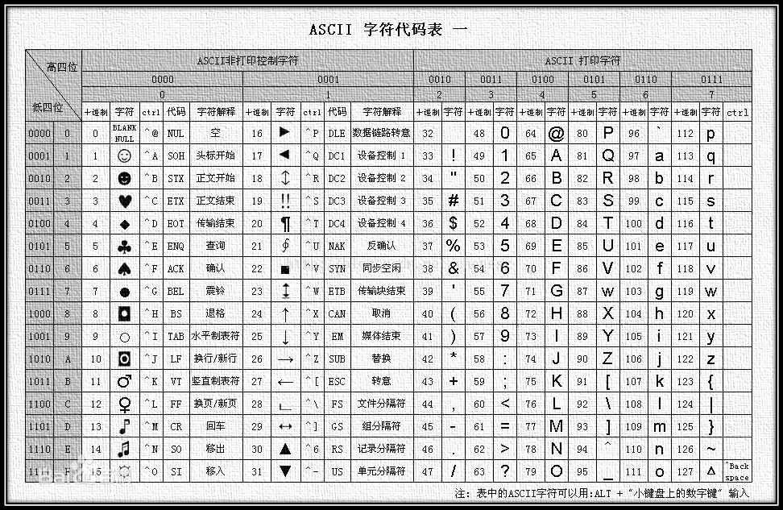

## 一、模块的使用

#### 1.1、为什么要模块化(了解)

在计算机程序的开发过程中，随着程序代码越写越多，在一个文件里代码就会越来越长，越来越不容易维护。
为了编写可维护的代码，我们把很多函数分组，分别放到不同的文件里，这样，每个文件包含的代码就相对较少，很多编程语言都采用这种组织代码的方式。(一个js文件就是一个模块)

使用模块有什么好处：

- 最大的好处是大大提高了代码的可维护性。其次，编写代码不必从零开始。当一个模块编写完毕，就可以被其他地方引用。我们在编写程序的时候，也经常引用其他模块，包括 Node.js 内置的模块和来自第三方的模块。
- 使用模块还可以避免函数名和变量名冲突。相同名字的函数和变量完全可以分别存在不同的模块中，因此，我们自己在编写模块时，不必考虑名字会与其他模块冲突。

说重点：**主要的原因是方便项目的开发和维护**。

#### 1.2、模块规范的定义(了解)

1. 一个js文件就是一个模块，模块的作用域是`私有的`，内部定义的变量或者函数，只在当前的文件（模块）可以使用
2. 如果别人需要使用我们模块里面的东西，那么有两点要做(以CommonJS 的 Modules 规范：    Node.js为例)
   1. 自己编写的模块，由于模块作用域是私有的，默认情况下，外部是没办法使用的；如果希望别人可以使用，则需要导出  `exports` 或者 `module.exports`。 导出的时候，以对象的方式进行导出
   2. 别人要使用某个模块，则需要先引入该模块，使用 `require` 引入，引入后需要使用一个变量来接收导入的对象。


对书写格式和交互规则的详细描述，就是模块定义规范（Module Definition Specification）：

- AMD 规范：                    Require.js
- CMD 规范：                    Sea.js
- CommonJS 的 Modules 规范：    NodeJs
- ES6 模块化规范     import ...  from  ...

#### 1.3、模块化使用

导出数据方式一：

```js
exports.num = num;
exports.sum = sum;
exports.Animal = Animal;
```

导出数据方式二：

```js
// 通过module.exports 等于一个对象，来导出数据
// 对象可采用es6简化对象的写法
module.exports = {
    num,
    sum,
    Animal
};
```

导入数据：

```js
// 注意1： 如果要使用某个模块里面的数据，则需要使用 require 关键字进行导入。
// 注意2：在导入用户自己开发的模块的时候，需要加上路径（1. 相对路径（多） 2. 绝对路径） 注意: ./ 必须写上
// 注意3：模块文件的扩展名(后缀名)可以写，也可以不写
// 注意4：导出的模块一般需要使用一个变量来接收，一般把接收的量定义为常量
// 注意5: 定义常量的名称和文件的名称保持一致（这个不是必须，大家都这么做）
const m1 = require("./modules/m1.js");

```

完整代码：

```js
// m1.js中：    
let num = 10;
function sum(a, b) {
    return a+b
}

class Animal{
    constructor(){
        this.age=0
    }
}

// 导出数据方式1：
// exports.num = num;
// exports.sum = sum;
// exports.Animal = Animal;


// 导出数据方式2：
// 通过module.exports 等于一个对象，来导出数据
// 对象可采用es6简化对象的写法
module.exports = {
    num,
    sum,
    Animal
};


```

```js
//01-模块的使用.js
const m1 = require("./modules/m1.js");


console.log(m1);   //{ num: 10, sum: [Function: sum], Animal: [Function: Animal] }
console.log(m1.sum(10, 20));
const obj = new m1.Animal();   //30
console.log(obj.age);   //0
```

## 二、模块里面this的指向问题

exports实际上是module.exports的引用，

在 nodejs 里面的 this 代表当前的这个模块，也就是 exports 对象

```js
console.log(exports);   //{}
console.log(module.exports);  //{}
console.log(exports === module.exports);  //true  exports实际上是module.exports的引用

console.log('this', this); // this {}

console.log(this === exports);// true   // 在 nodejs 里面的 this 代表当前的这个模块，也就是 exports 对象  并且，交互模式下，没有exports这个对象
console.log(global === this );   //false    this不指向全局对象
```

## 三、nodejs常用内置模块

一般项目中模块分为3种，nodejs内置模块、自己书写的模块、第三方模块(使用一个专门的工具npm进行统一管理)

常用的内置模块如下：

- fs            ：文件操作
- http          ：网络操作
- path          ：路径操作
- querystring   ：查询参数解析
- url           ：url 解析

```js
const fs = require("fs");
const http = require('http');
const path = require('path');
const querystring = require('querystring');
const url = require('url');
```


nodejs内置模块的文档网址：<http://nodejs.cn/api/> 


## 四、path内置模块

```js
const path = require("path");

console.log(__dirname); // 当前执行的文件绝对路径，不包含文件名

console.log(__filename);  // 当前执行的文件绝对路径，包含文件名


let extname = path.extname( __filename );   // 获取扩展名(后缀名)
console.log(extname);

let baseName = path.basename( __filename );  // 获取文件名(包含后缀名)
console.log(baseName);

let dirname = path.dirname(__filename);   //获取目录(路径)
console.log(dirname);

let parse = path.parse(__filename);  //获取路径字符串的对象
console.log(parse);

//路径的拼接操作 join
// join 默认相对路径的拼接 ，以当前操作系统路径分割符进行拼接
let fullPath1 = path.join('path.js');
// fullPath1 = path.join(__dirname,'path.js'); //带目录
// fullPath1 = path.join(__dirname,'a','path.js'); //带多级目录
console.log(fullPath1);
```

## 五、Buffer数据类型

JavaScript 语言自身只有字符串数据类型，没有二进制数据类型。但在处理像文件流时（文件读写操作），必须使用到二进制数据。因此在 Node.js 中，定义了一个 Buffer 类，该类用来创建一个专门存放二进制数据的缓存区。说白了，Buffer 类似于一个整数数组。

下面是一张ASCII表：



创建buffer对象 ：

```js
let buf1 = Buffer.from([97, 98, 99]);  //根据一个数组创建 Buffer 对象
console.log(buf1);  //<Buffer 61 62 63> 以16进制存在buffer对象中
console.log(buf1.toString());

let buf2 = Buffer.from("nodejs");   //根据一个字符串创建 Buffer 对象
console.log(buf2);
console.log(buf2.toString());

let buf3 = Buffer.alloc(10);   // 创建了可以存放10个字符的buffer对象
buf3.write("abc");  //按照ASCII表的值，转16进制，存在buffer中
console.log(buf3);
console.log(buf3.toString());

// 总结： 以后看到 <Buffer .....  > 需要  toString()   才能看到里面的真实数据
```

## 六、fs文件系统模块  

Node.js 的 API 内置有两个模块： path 和 fs ，我们使用 JavaScript 代码编写程序运行在 Node.js 环境中就可以操作文件

#### 6.1、同步读取文件信息

同步读取：读取的时候，要等文件读取完毕后，才会执行后面的代码     (sync  同步)

```js
const fs = require("fs");
const path = require("path");
let pathName = path.join(__dirname, 'hello.txt');

// const content = fs.readFileSync(pathName);   同步读取文件
// console.log(content);
// console.log(content.toString());

const content = fs.readFileSync(pathName, "utf-8");
console.log(content);

```

#### 6.2、异步读取文件信息

不用等待文件读取完毕就会执行后面的代码。

思考：如何读到后面的数据

答：在读取文件的时候，传递一个回调函数callback，当读取完毕后，回调函数执行，读取后面的数据

```js
const fs = require("fs");
const path = require("path");

let pathName = path.join(__dirname, "hello2.txt");
// console.log(file);
//参数1 要读取的文件
//参数2 设置读取到内容的编码，设置后读到的内容为字符串，如果不传则读到的数据为 buffer
//参数3 回调函数，读取完文件后执行的代码
fs.readFile(pathName, "utf-8",(error, data)=>{

    // console.log(error);
    // console.log(data);

   	if(error){
        console.log(error);
        return
    }

    console.log(data);
});
```

#### 6.3、异步写入

```js
const fs = require("fs");
const path = require("path");

let pathName = path.join(__dirname, "hello.txt");


fs.writeFile(pathName, "hello_write111", "utf-8",(error)=>{
    console.log("error");
    console.log("写完啦");
});
console.log("end");
```

#### 6.4、几个常见方法

```js
const fs = require("fs");
fs.renameSync(旧文件名, 新文件名);   //修改文件名
fs.readdirSync(__dirname);    //读取当前路径下的文件名列表

let str = "hello";
str.endsWith("he");   //true
str.startsWith("go");  //false
str.substring(2,4) //ll 左闭右开区间
str.substring(2) //llo  下标为2取到结束
```

#### 6.5、小案例

需求：把当前文件夹的js文件的名字都添加前缀  [day03]

```js
const fs = require("fs");
let nameList = fs.readdirSync(__dirname);

nameList.forEach(currFileName => {
    if(currFileName.endsWith(".js")){
        fs.renameSync(currFileName, `[day03]${currFileName}`)
    }
});
```

需求：把当前文件夹的名字都删除前缀 [day03]

```js
const fs = require("fs");
let nameList = fs.readdirSync(__dirname);
let str1 = "[day03]"

nameList.forEach(currFileName => {
    if(currFileName.startsWith(str1)){
        fs.renameSync(currFileName, currFileName.substring(str1.length))
    }
});
```

#### 6.6、思考题

// 需求：现在存在三个文件 1.txt(我) 2.txt（爱） 3.txt（nodejs）
// 每个文件里面有一个字符。`使用：fs.readFile(异步) 顺序读取` 1.txt 2.txt 3.txt 里面的内容，然后组成 `我爱nodejs` 把这个字符串写入 异步的写 到 data.txt 文件里面。

```js
const fs = require("fs");
const path = require("path");

let pathName1 = path.join(__dirname,"files", "1.txt");
let pathName2 = path.join(__dirname,"files", "2.txt");
let pathName3 = path.join(__dirname,"files", "3.txt");
let pathName4 = path.join(__dirname,"files", "data.txt");


fs.readFile(pathName1,"utf-8",(error1, data1)=>{
    if(error1){
        console.log(error1);
        return
    }

    fs.readFile(pathName2,"utf-8",(error2, data2)=>{

        if(error2){
            console.log(error2);
            return
        }

        fs.readFile(pathName3,"utf-8",(error3, data3)=>{

            if(error3){
                console.log(error3);
                return
            }

            // console.log(data1+data2+data3);

            fs.writeFile(pathName4,data1+data2+data3,"utf-8",(error)=>{
                console.log(data1+data2+data3);
            })

        })
    })
});
```

#### 6.7、回调地狱

在上面的题目中，操作之间是存在依赖性的，上一步依赖下一步的成功执行。但是操作又是通过异步api完成，则我们只能在回调函数里面编写，那么这个时候就会出现回调嵌套回调，俗称：回调地狱 Callback Hell。

后面我们使用promise来解决。


