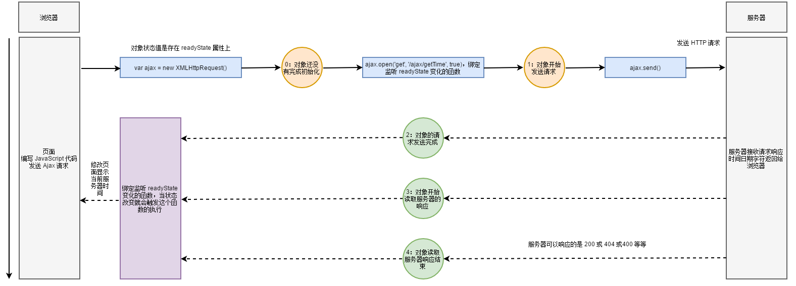

## 一、AJAX技术简介

AJAX 即 “Asynchronous JavaScript and XML”（异步的 JavaScript 与 XML 技术），指的是一套综合了多项技术的浏览器端网页开发技术。AJAX 的概念由 Jesse James Garrett 所提出，说白了就可以使用 JavaScript 代码发送网络请求并处理响应，由浏览器实现。

出现的很早 `1998` 年出来，首次是`微软`提出来的，并没有引起重视；直到`2005`年左右，谷歌推出 `gmail，gmap` 使得ajax技术一时间流行起来。

俗话：ajax技术就是在页面不刷新情况下，和服务器端进行交互的交互。

传统的 Web 应用允许用户端填写表单（form），当提交表单时就向网页服务器发送一个请求。服务器接收并处理传来的表单，然后送回一个新的网页，但这个做法浪费了许多带宽，因为在前后两个页面中的大部分 HTML 码往往是相同的。由于每次应用的沟通都需要向服务器发送请求，应用的回应时间依赖于服务器的回应时间。这导致了用户界面的回应比本机应用慢得多。

与此不同，AJAX 应用可以仅向服务器发送并取回必须的数据，并在客户端采用 JavaScript 处理来自服务器的回应。因为在服务器和浏览器之间交换的数据大量减少，服务器回应更快了。同时，很多的处理工作可以在发出请求的客户端机器上完成，因此 Web 服务器的负荷也减少了。

**特点：**

**异步请求，局部刷新**。

同步是指：发送方发出数据后，等接收方发回响应以后才发下一个数据包的通讯方式。

异步是指：发送方发出数据后，不等接收方发回响应，接着发送下个数据包的通讯方式。

局部刷新指刷新页面部分内容。

**优缺点：**

优点：Web 应用程序更为迅捷地回应用户动作，并避免了在网络上发送那些没有改变的信息，减轻服务器压力。

缺点：浏览器实现之间有差异处理兼容性问题；不能回退和前进；默认不支持跨域访问（https://developer.mozilla.org/zh-CN/docs/Web/Security/Same-origin_policy）。

**注意事项**：

ajax 这门技术，必须要在网络协议环境下才可以使用。不能把网页直接拖入到浏览器执行，必须在 web 服务器模式下访问。

总结：ajax对我们来讲就是书写一段js代码来向服务器发送请求(异步)。

## 二、AJAX书写步骤

1、创建 AJAX 对象；
2、设置请求路径，请求方式等；
3、绑定监听状态改变的处理函数，在处理函数可获取响应数据；
4、发送请求。

创建ajax对象会有浏览器兼容性问题：

```js
function createAjax() {
    var ajax;
    try {       // 非 IE 
        ajax = new XMLHttpRequest();
    }
    catch (e) { // IE
        ajax = new ActiveXObject('Microsoft.XMLHTTP');
    }
    return ajax;
}
```

## 三、响应处理和响应流程

响应处理，即对服务响应回浏览器的数据根据状态码和 AJAX 对象的状态信息进行不同的处理，在绑定状态改变的处理函数中写对应的逻辑代码即可。

AJAX 对象有 4 个属性：

- readyState 总共有 5 个状态值，分别为 0 ~ 4，每个值代表了不同的含义：onreadystatechange
  - 0：初始化，AJAX 对象还没有完成初始化
  - 1：载入，AJAX 对象开始发送请求
  - 2：载入完成，AJAX 对象的请求发送完成
  - 3：解析，AJAX 对象开始读取服务器的响应
  - 4：完成，AJAX 对象读取服务器响应结束
- status 表示响应的 HTTP 状态码，常见状态码如下：
  - 200：成功
  - 302：重定向
  - 404：找不到资源
  - 500：服务端错误
- responseText 获得字符串形式的响应数据。
- responseXML  获得 XML 形式的响应数据。

综合以上，在状态改变的处理函数一般针对 readyState == 4 且 status == 200 的情况才处理，再根据后台返回的数据类型决定从 responseText 或者 responseXML 获取服务器响应回去来的数据。



## 四、使用ajax发送get请求

前端代码：

```html
<body>
    <h1>这是首页</h1>
    欢迎来到我们网站！！ <br><br>
    <button id="obtn">点击获取数据---点击发送Get请求</button>
    <div  id="odiv"></div>
<script>
    let obtn = document.getElementById("obtn");
    let odiv = document.getElementById("odiv");

    obtn.onclick = () => {

        //发送ajax请求
        // 1、创建 AJAX 对象；
        let ajax = new XMLHttpRequest();

        // 2、设置请求路径，请求方式等；ajax.open(请求方式，路径)
        ajax.open('GET', '/get_data');
        // 3、绑定监听状态改变的处理函数，在处理函数可获取响应数据；
        ajax.onreadystatechange = ()=>{
            // 获取响应回来的数据
            if(ajax.readyState===4&& ajax.status===200){
                console.log(ajax.readyState);
                console.log(ajax.responseText);
                // 请求到数据之后，就可以把数据更新到页面上
                odiv.innerHTML = ajax.responseText;
            }
        };
        // 4、发送请求。
        ajax.send()
    }
</script>
```

服务端代码：

```js
else if(requestUrl=== "/get_data"){       //或者写成：/get_data.*/.test(requestUrl)
    response.setHeader("Content-type","text/html;charset=utf-8");
    response.write("这个数据是来自服务器的...");
    response.end();
}
```

**避免缓存问题的写法**：

AJAX 能提高页面载入的速度主要的原因是通过 AJAX 减少了重复数据的载入，也就是说在载入数据的同时将数据缓存到内存中，一旦数据被加载其中，只要我们没有刷新页面，这些数据就会一直被缓存在内存中，当我们提交的 URL 与历史的 URL 一致时，就不需要提交给服务器，也就是不需要从服务器上面去获取数据，虽然这样降低了服务器的负载提高了用户的体验，但是我们不能获取最新的数据。为了保证我们读取的信息都是最新的，我们就需要禁止他的缓存功能。解决方式有以下几种：

- 在 URL 后面加上一个随机数：Math.random()。
- 在 URL 后面加上时间搓：new Date().getTime()。
- 在使用 AJAX 发送请求前加上 ajax.setRequestHeader('Cache-Control', 'no-cache')。

例如：

```js
ajax.open( ..... );

ajax.setRequestHeader('Cache-Control', 'no-cache');
ajax.send();
```


## 五、使用ajax发送post请求

前端代码：

```html
<script>
    let obtn = document.getElementById("obtn");
    let odiv = document.getElementById("odiv");
    obtn.onclick = () => {

        let username = document.getElementById("username").value;
        let password = document.getElementById("password").value;
        let params = `username=${username}&password=${password}`;
        //发送ajax请求
        // 1、创建 AJAX 对象；
        let ajax = new XMLHttpRequest();

        // 2、设置请求路径，请求方式等；ajax.open(请求方式，路径)
        ajax.open('POST', '/login_post');
        
        ajax.setRequestHeader("enctype","application/x-www-form-urlencoded");
        // 3、绑定监听状态改变的处理函数，在处理函数可获取响应数据；
        ajax.onreadystatechange = ()=>{
            // 获取响应回来的数据
            if(ajax.readyState===4&& ajax.status===200){
                console.log(ajax.readyState);
                console.log(ajax.responseText);
                // 请求到数据之后，就可以把数据更新到页面上
                odiv.innerHTML = ajax.responseText;
            }
        };
        // 4、发送请求。
        ajax.send(params)
    }
</script>
```

服务端代码：

```js
else if(requestUrl=== "/login_post"){   //来处理css文件的请求   如果这个路径包含.css
    request.on('data',(postData)=>{
        let uname = postData.toString().split("&")[0].split("=")[1];   // 获取用户提交的用户名
        let pwd = postData.toString().split("&")[1].split("=")[1];    // 获取用户提交的密码

        if(uname===username && pwd===password){
            response.end("账号密码正确，登录成功");
        }else{
            response.end("账号或者密码错误，登录失败");
        }
    });

}
```

**超时处理：**

有时网络会出现问题或者服务端出问题导致请求时间过长，一般提示网络请求稍后重试，以增加用户的体验感。在代码中我们可以通过定时器和请求中断来实现超时处理的效果。

```js
var timer = setTimeout(function () {
    // 取消请求，中断请求
    ajax.abort();
}, 5000);
```

## 六、方法抽取(了解)

```js
function ajax(mehtod, url, param, success, time){

    var ajax;
    
    //处理ajax获取时候的兼容性问题
    try {       // 非 IE 
        ajax = new XMLHttpRequest();
    }
    catch (e) { // IE
        ajax = new ActiveXObject('Microsoft.XMLHTTP');
    }

    if(method === 'get'){
        param = encodeURI(param);  //针对get请求的查询参数出现中文的编码处理
        url = url + '?' + param;
        param = null;
    }
    
    ajax.open(method, url);

    if(method === 'post'){
        ajax.setRequestHeader('Content-Type', 'application/x-www-form-urlencoded');
    }

    ajax.onreadystatechange = function () { // onload
        if(ajax.readyState == 4 && ajax.status == 200){
            success(ajax.responseText);
        }
    }
    
    ajax.send(param);

    var timer = setTimeout(function () {
        ajax.abort();
    }, time);
}
```

## 七、jQuery 中 ajax 方法使用

- async：默认设置下，所有请求均为异步请求。
- contentType：发送信息至服务器时内容编码类型，默认为 "application/x-www-form-urlencoded"。
- **data**：发送到服务器的数据，可以为对象或者 Key=value 格式字符串，若为对象则会自动转换为请求字符串格式。
- **type**：默认: "GET"，其它 HTTP 请求方法，如 PUT 和 DELETE 也可以使用，但取决浏览器支持。
- **url**：发送请求的地址，默认当前页地址。
- dataType：预期服务器返回的数据类型。如果不指定，jQuery 将自动根据 HTTP 包 MIME 信息来智能判断，比如 XML MIME类型就被识别为 XML，可以不填，可用值："xml"、"html"、"script"、"json"、"jsonp"、"text"。
- cache：默认为 true（dataType 为 script 和 jsonp 时默认为 false，设置为 false 将禁用缓存。
- context：这个对象用于设置 AJAX 相关回调函数的上下文。也就是说，让回调函数内 this 的指向（若不指定为当前选项）。
- beforeSend：发送请求前调用此函数，可用与如添加自定义 HTTP 头，检查请求参数是否合法。XMLHttpRequest 对象是唯一的参数。若在函数中返回 false 可以取消本次请求。 

```js
function (XMLHttpRequest) {
    // this 默认情况下调用本次 AJAX 请求时传递的 option 对象
}
```

- **success**：请求成功后的回调函数，参数：由服务器返回，并根据 dataType 参数进行处理后的数据；描述状态的字符串。

```js
function (data, textStatus) {
    // data 可能是 xmlDoc, jsonObj, html, text, 等等
    
```

- error：请求失败时调用此函数。有以下三个参数：XMLHttpRequest 对象、错误信息、捕获的异常对象。

```js
function (XMLHttpRequest, textStatus, errorThrown) {
}
```

例如：

```js
$.ajax({
    url: 'url',
    type: 'GET',
    data: {username:'zs', password:'12345'},
    success: function(data){
        // 请求成功业务逻辑
    }
});
```

## 八、使用 jQuery 发送 GET 方式 AJAX 请求

#### 8.1、使用.ajax()方法

```js
$("#obtn").click(()=>{
    $.ajax({
        url:'/get_data',
        data:{name:"nodejs"},
        type:"GET",
        success: function(data){
            console.log(data)
        }
    });
})
```

#### 8.2、使用.get()方法

- url：请求 URL 地址
- data：请求参数。
- callback：请求成功时回调函数。
- type：预期服务器返回的数据类型。

```js
$.get('/get_data', {name:'nodejs', age:11}, function(data){
     //请求成功的业务逻辑(成功之后的操作)
});
```

## 九、使用 jQuery 发送 POST 方式 AJAX 请求

#### 9.1、使用.ajax()方法

```js
$.ajax({
    url:"/login_post",
    type:"POST",
    data: {username:$("#username").val(), password:$("#password").val()},
    success:(data)=>{
        console.log(data);
    }
});
```

#### 9.2、使用.post()方法

- url：请求 URL 地址
- data：请求参数。
- callback：请求成功时回调函数。
- type：预期服务器返回的数据类型。

```js
$.post('url', {username:$("#username").val(), password:$("#password").val()}, function(data){
    // 请求成功业务逻辑
    console.log(data);
});
```

