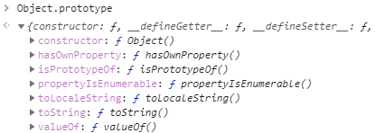
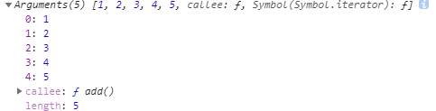
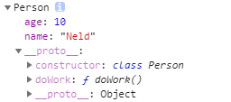

[TOC]

## Object原型对象的成员

Object原型对象和Object构造函数中事先定义好了一系列的方法，如果我们能够熟练掌握这些方法的使用，那么在今后对JS的使用能够更加游刃有余。首先来看看Object原型对象上的方法。

****

**constructor**：获取创建当前实例对象的构造函数

**hasOwnProperty**：判断当前实例对象中是否存在指定的属性

```js
function Person(name) {
    this.name = name;
}
var p = new Person("Neld");
console.log(p.hasOwnProperty("name"));//true
console.log(p.hasOwnProperty("age"));//false
```

**isPrototypeOf**：判断当前对象是否在指定对象的原型链中

```js
console.log(Person.prototype.isPrototypeOf(p));//true
console.log(Object.prototype.isPrototypeOf(p));//true
console.log(Array.prototype.isPrototypeOf(p));//false
```

**propertyIsEnumerable**：属性是否可以枚举（循环遍历）

```js
function Person(name) {
    this.name = name;
}
Person.prototype.des = "H5-JS面向对象";
for(var k in p){
    console.log(k,p[k]);
}
```

上面循环遍历可以得到Person对象中的name和des属性，但是Person同时从Object中继承过来了很多的属性和方法（如上截图），为什么没有在这里打印出来呢？这里我们就可以使用propertyIsEnumerable方法来检查指定方法的可枚举性了。

```js
console.log(p.propertyIsEnumerable("name"));//true
console.log(p.propertyIsEnumerable("constructor"));//false
```

**valueOf**:

​	基本包装类型：返回对应的值

​	引用类型：返回this，对象本身

​	日期类型：返回时间戳

```
var strObj = new String("demo");
console.log(strObj.valueOf());//demo 基本包装类型：返回对应的值
var obj = {name:'ls',age:18};
console.log(obj.valueOf());//{name:'ls',age:18} 返回对象本身
var date = new Date();
console.log(date.valueOf());//1559489503989 返回时间戳
```

**toString**：返回数据特定的格式的字符串

​	基本类型：返回对应值的字符串

​		如果是数字类型，可以传递一个参数指定转换成上面进制的数字字符串

​	引用类型：返回[object Object]格式的字符串，object为对象的类型，**O**bject为对象对应的构造函数

```js
console.log("abc".toString());//"abc"
console.log((123).toString());//"123"
console.log((100).toString(2));//1100100
console.log((100).toString(16));//64
console.log(true.toString());//"true"

function Person(name) {
    this.name = name;
}
var p = new Person("Neld");
console.log(p.toString());//"[object Object]"
```

上面说，引用类型是返回[object Object]格式的字符串，但是使用数组调用toString方法是个例外。

```js
var arr = [1,2,"A",false];
console.log(arr.toString());//"1,2,A,false"
```

可以看到，数组的toString方法返回的是所有元素拼接而成的字符串，那么，这是为什么呢？

很简单，说明这里和其他引用类型对象调用的不是同一个toString方法，事实证明确实如此。

我们通过打印Array.prototype可以看到，在数组的原型对象上存在一个toString方法，和Object中的toString方法一样。

说明JS对数组的toString效果有特殊的处理，方案就是在数组中重新定义一个和Object中方法名一样（toString）的方法，但是具体实现功能不一样。可以理解为将Object中的toString方法覆盖。

所以，数组对象调用的toString方法不再是Object中的方法了。那么，如果数组需要调用到Object中的toString应该如何实现呢？

```js
console.log(Object.prototype.toString.call(arr));//"[object Array]"
```

可以利用前面学过的call来借用Object中的toString即可。

到此，如果我们需要判断当前对象是否是数组类型就可以实现了。

```js
function isArray(arr) {
    if(Array.isArray){
        return Array.isArray(arr);
    }else{
        return Object.prototype.toString.call(arr) == "[object Array]";
    }
}
console.log(isArray({}));//false
console.log(isArray([1, 2, 3]));//true
```

Array.isArray()方法是ES5中提供的方法，所以，如果使用低版本的ES，就不能直接使用该方法，上面的方法就是在解决版本兼容问题。

**toLocaleString**：和toString方法类似，可以将日期转换成本地格式的数据

```js
var d = new Date();
console.log(d.toLocaleString());//2019/3/10 下午4:23:54
```

## Function构造函数创建对象

 所有的函数对象都是由Function构造函数创建出来的，那么我们来认识一下Function这个构造函数的基本使用。

```js
//创建函数无参数的函数对象：
var fun2 = new Function()；
fun2();
```

fun2是直接使用Function创建出来的函数，但是这个函数中没有任何实现。没有任何实现的函数是没有意义的，那么使用Function如何定义一个有函数体的函数对象呢？

```js
var fun2 = new Function("console.log('hello h5');");
fun2();//hello h5
```

直接将函数体的代码以字符串的形式传递给Function构造函数，这样就可以创建一个有函数体的函数对象了。

如果函数体中有多行代码也是一样的方式，将其放在一个字符串中传递即可。

```js
var fun2 = new Function("console.log('hello h5');console.log('hello java');");
fun2();//hello h5
```

如果需要定义一个带有参数的函数对象，又应该如何实现呢？

```js
var fun2 = new Function("a", "b", "return a + b;");
console.log(fun2(1, 2));//3
```

将Function中的最后一个参数作为函数体，前面的都是函数的形参。

到此，我们使用Function既能够创建无参数的函数，也可以创建有参数的函数了。

## Function和Object

前面我们学习了Function和Object，而且也学习了instanceof关键字的使用，下面来看几个例子，检验一下大家对前面所学知识点的掌握情况。

```js
function Person() {
}
var p = new Person();
console.log(p instanceof Person);//①
Person.prototype = {};//修改Person的原型对象
console.log(p instanceof Person);//②
```

①处的打印结果相信大家都非常清楚，因为p对象是由Person构造函数创建出来的，所以Person构造函数的原型对象在p对象的原型链上，所以使用instanceof判断的结果为true。

②处的结果会受到上面修改Person原型对象的影响，修改之后Person的原型对象不在p的原型链中，所以结果返回false。

```js
var f = new Function();
console.log(f instanceof Function);//①
console.log(f instanceof Object);//②
console.log(Function instanceof Object);//③
console.log(Object instanceof Function);//④

```

①：返回true

②：返回true

上面两个比较简单，这里就不再做说明了。

③：这个也比较简单，Object的原型对象是所有对象的原型链的终点，所以只要最后是Object，都应该返回true。

④：这个判断稍微有点难度，但是如果大家对于前面画过的原型链的图还熟悉的话，应该能够得到正确答案。

因为Function.prototype是Object这个函数对象的原型对象，所以这句话可以这样说了，Function的原型对象在Object的原型链上，所以该判断理应返回true。

总结：如果大家能比较快的得到上面每个练习的答案的话，说明大家对于instanceof和对象的原型链还是认识的比较透彻了，恭喜大家！


## arguments参数详解

对于函数的参数，存在形参和实参个数不对应的问题：

形参 > 实参：存在没有被赋值的形参，这些没被赋值的形参值为undefined

```js
function fun(a,b,c) {
    console.log(a, b, c);
}
fun(1,2);// 1 2 undefined
```

形参 < 实参：存在多余的实参，这些多余的实参将被忽略

```js
function fun(a,b,c) {
    console.log(a, b, c);
}
fun(1,2,3, 4);// 1 2 3
```

上面是函数中很基本的知识点了，我们再来看看下面这个需求应该如何完成。

需求：将用户传递进来的数字（参数个数未知）相加，返回相加的结果。

分析：由于不知道用户会传递多少个参数，所有没办法在定义函数的时候使用确定的形参来接收数据，但是，如果不能拿到参数的个数或者具体的实参，那么是无法完成相关功能的，所以我们需要想办法获取到对应的实参。

这里就需要使用到Function中的隐藏属性---arguments

```js
function add() {
    console.log(arguments);
}
add(1,2,3,4,5);
```

****

从打印结果可以看出，arguments中有我们传递进函数的所有实参，所以要实现所有数字相加就可以实现了。

```js
function add() {
    var sum = 0;
    for (var i = 0; i < arguments.length; i++) {
        sum += arguments[i];
    }
    return sum;
}
console.log(add(1, 2, 3, 4, 5));//15
```

在不清楚函数实参的具体传递情况的时候，arguments的作用就非常强大了。

注意：arguments不是一个数组，而是伪数组，所以不能使用数组中的方法来操作arguments中的元素。

那么，在arguments中还有一个方法callee,这个方法我们在这里简单的提一下他的作用，当我们需要在函数中调用自己的时候（如：递归），此时可以使用该方法来实现，但这个方法在ES5中已经不建议使用了。

## eval函数的基本使用

eval：将字符串类型的参数转换成JS代码，立即执行。

eval函数呢Function的功能比较相似，但是还是存在区别：

​	Function:需要调用函数，才会执行代码

​	eval：转换之后立即执行

在开发中的应用场景：

​	当获取到一个字符串类型的数据，但是想将其转换成JS代码执行的时候使用该函数可以实现

```js
var jsonStr = "({name:'Neld',age:10})";
console.log(eval(jsonStr));//转换成JS的对象
```

注意点：

​	在实际开发中不建议使用eval函数，原因：

1. 存在安全隐患
2. 影响程序的执行性能


## 创建对象的N中方式总结

字面量			：

内置构造函数	   ：

简单工厂函数	   ：

自定义构造函数       ：

Object.create()      ：

Object.assign()      ：

## 类型检查的四种方式总结

通过前面知识点的学习，我们已经get到了四种类型检查的方式，为了在开发中灵活运用他们，我们需要对这几种方式进行总结。

1. **typeof: 主要用来判断基本类型**

   ```js
   console.log(typeof "abc");//"string"
   console.log(typeof 123);//"number"
   console.log(typeof true);//"boolean"
   console.log(typeof null);//"object"
   console.log(typeof Function);//"function"
   console.log(typeof {name:"Neld", age: 10});//"object"
   ```

   对于字符串，数字和布尔类型，返回对应类型的字符串（string, number, boolean），undefined和Function比较特殊，分别是undefined和function，这两个需要单独记忆，其他的（包括null）都是返回object

   

2. **constructor: 可以用来判断创建对象的构造器的类型**

   ```js
   function Person() {}
   function Dog() {}
   
   var p = new Person();
   var d = new Dog(); 
   
   console.log(p.constructor == Person);//true
   console.log(d.constructor == Dog);//true
   ```

   使用这种方式，我们可以知道对象的具体类型是什么。

3. **instanceof: 判断指定构造函数的原型对象是否在当前实例对象的原型链上**

   ```js
   function Person() {}
   function Dog() {}
   
   var p = new Person();
   var d = new Dog(); 
   
   console.log(p instanceof Person);//true
   console.log(d instanceof Dog);//true
   console.log(p instanceof Object);//true
   console.log(d instanceof Object);//true
   ```

   Person和Object的原型对象分别在p和b对象的原型链上，所以上面的返回值都是true

4. **Object.prototype.toString(): 获取数据类型对应的字符串**

   ```js
   console.log(Object.prototype.toString.call("Neld"));//[object String]
   console.log(Object.prototype.toString.call(10));//[object Number]
   console.log(Object.prototype.toString.call(p));//[object Object]
   console.log(Object.prototype.toString.call([]));//[object Array]
   ```

   上面几种方式都能够以自身的方式来判断数据的类型，在开发中，我们根据具体的需求选择即可。

## class的基本使用

ES5中可以使用function定义一个类，并使用它来创建对象。

```js
function Person(name, age){
    //对象成员
    this.name = name;
    this.age = age;
}
Person.prototype.doWork = function(){
    console.log("ES中在原型对象上添加方法")；
}
var p = new Person("Neld", 10);
```

在ES6中，可以使用class关键字定义同样的类。

```js
class Person{
    constructor(name,age){
        this.name = name;
        this.age = age;
    }
    doWork(){
        console.log("E6中在原型对象上添加方法");
    }
}
var p = new Person("Neld",10);
console.log(p);
```

ES6中使用class定义类只是一种语法糖，底层最终还是转换成ES5中使用的function类定义类，及其其中的实例成员和原型成员。

****

**class使用的细节**

​	1. constructor方法是创建对象的构造方法，通常在这里为实例对象定义属性（方法也是可以的）

​	2. constructor方法外面的方法是对象的原型方法

​	3. 在之前外面还为构造方法添加过成员（静态成员），那么在这里我们应该如何实现呢？

​	可以使用**static关键字**来实现。

```js
static doWork2(){
    console.log("静态方法");
}		
```

## class的继承结构

使用class定义类后，要如何实现类与类之间的继承关系呢？

```js
class Animal {
    constructor(name, age){
        this.name = name;
        this.age = age;
    }
    eat(){
        console.log("吃饭");
    }
    sleep(){
        console.log("睡觉");
    }
}
class Person extends Animal{
    constructor(name,age){
        super(name,age);//①
    }
    play(){
        console.log("打豆豆");
    }
}
console.log(new Person("Neld", 10));
```

Animal中定义了动物都应该有的属性和方法

使用extends关键字实现Person类继承Animal类的功能，此时他们两就属于继承关系了。

在Person的构造方法中，使用super关键字调用父类中的构造方法。

## 作用域安全的构造函数

构造函数的调用方式存在下面两种：

​	直接调用：普通函数

​	使用new一起调用：创建对象

```js
function Person(name, age) {
    this.name = name;
    this.age = age;
}
console.log(Person("zs", 10));//undefined
console.log(new Person("ls", 12));//初始化了name和age的Person对象
```

如果我们直接调用Person函数，因为函数默认的返回值为undefined，所以得到undefined结果。

如果使用new关键字来调用Person函数，此时在函数中会默认创建一个对象，并将该对象设置给this，然后将name和age封装到该对象中，最后返回该对象。所以得到的是一个封装好数据的对象。

所以，如果我们想要创建对象，这里必须使用new来调用。但是，在实际开发中，我们有可能会忘记使用new，而是直接调用该构造函数，此时会造成什么问题呢？

1. 得不到想要的对象，这是最容易想到的

2. 会存在作用域安全的问题，这里需要解释一下

   直接调用该函数，那么在函数内部中的this指向window

   如果我们在函数中需要修改当前创建对象（this）中的属性时，有可能会不知不觉的将window作用域下的某些变量给修改掉，导致数据错乱的问题。

```js
var name = "今天天气不错";
function Person(name, age) {
    this.name = name;
    this.age = age;
}
Person("zs", 10);
console.log(name);//zs
```

此时，在Person函数中的this是指向window的，所以this.name访问到的是函数外面（全局作用域）中的name，并为其赋值为zs，所以，最终得到的name值为zs。

既然存在这样的问题，我们就得解决，那么思路应该是怎样的呢？

首先，造成上面问题的根本原因是程序员在使用的过程中可能会忘记new关键字，而导致作用域不安全的问题

所以，而当没有使用new关键字的时候，构造函数中的this关键字是指向window的

反过来，如果构造函数中的this指向window，说明没有使用new关键字，此时就有了下面的代码：

```js
function Person(name, age) {
    if(this == window){
        throw "调用构造器需要使用new关键字";
    }else{
        this.name = name;
        this.age = age;
    }
}
```

在构造函数中判断this的指向即可解决忘记new关键字的问题。

但是在ES6中，这种方式存在一定的问题，此时的this不一定是指向window，原因我们后面再说。此时我们换种思路来解决。

如果使用new调用该构造函数，那么this指向的是什么呢？对，是当前构造函数创建的对象，所以根据类型判断也是可以的。

```js
if(!(this instanceof Person)){
    throw "调用构造器需要使用new关键字";
}else{
    this.name = name;
    this.age = age;
}
```

上面这种方式是完全OK的，下面我们再给出一种方式，大家可以了解一下。

在ES6中，为new引入了一个target属性，如果没有使用new调用构造函数，那么在该构造函数中new.target为undefined，反之为当前的构造函数。

```js
if(!new.target){
    throw "调用构造器需要使用new关键字";
}else{
    this.name = name;
    this.age = age;
}
```

以上解决了我们在使用构造函数创建对象的过程中可能存在的问题。如果出现了，我们也能够快速的解决。


## 浅拷贝和深拷贝的实现

在开发中，我们会有这样的需求，就是将A对象中的属性或者是方法拷贝到B对象中，而这里的拷贝我们按照拷贝的深度分为浅拷贝和深拷贝，下面我们来分析一下：

```js
var p1 = {
    name:"zs",
    age:10,
    favs:["H5","Java","C"],
    wife:{
        name:"lily",
        age:8
    }
}
var p2 = {};
for(var key in p1){
    p2[key] = p1[key];
}
console.log(p2);
```

上面的代码中，我们将p1对象中的属性拷贝给了p2对象，这种拷贝方式我们称之为浅拷贝，为什么呢？我们来画图说明。


上面是p1对象的内存结构图，通过上面的拷贝操作得到的p2是什么结构呢？


我们得到和0x11一模一样的一份数据，而p2就指向该内存区域的数据，然后在0x44中的favs和wife这两个属性仍然指向0x22和0x33这两块内存区域的数据，所以此时的拷贝只拷贝了对象中的第一层属性，称之为浅拷贝。

浅拷贝在使用的过程中存在数据共享的问题（如果修改p1中的favs或者wife中的数据，p2中的这两个属性也会跟着被修改），因为他们引用的是同一块内存区域的数据。这个问题的我们可以使用深拷贝来实现。

所谓深拷贝，就是将对象引用的对象，或者对象引用的对象的引用的对象，一次往下推，全部都拷贝，大家不共享任何数据。

所以要实现深拷贝，当我们发现属性对应的值是一个对象的时候，应该将该对象拷贝一份，然后赋值给当前属性。

```js
function deepCopy(source,target) {
    for(var key in source){
        if(source.hasOwnProperty(key)){//只拷贝当前对象的属性
            if(typeof source[key] == "object"){//如果属性是引用类型的对象
                // //根据原属性的类型决定是数组还是普通对象
                target[key] = Array.isArray(source[key]) ? [] : {};
                deepCopy(source[key],target[key]);//递归调用，完成所有层次的拷贝
            }else{
                target[key] = source[key];
            }
        }
    }
}
deepCopy(p1,p2);
```

通过上面的深度拷贝得到的p2对象是和p1完全不同的两份数据，此时不再存在数据共享的问题。


## 函数的调用和this的丢失

调用函数大家都非常熟悉了，这里再统一的复习总结一下，需要强调的是，使用不同的方式调用函数，函数内部的this指向存在不同

1. 普通调用	fun()	                       this指向调用函数的对象---window
2. 对象调用 obj.fun()                       this指向调用函数的对象---obj
3. 使用new关键字调用 new Fun()  this指向函数内部创建的新对象
4. call或者apply调用                        this指向call或者apply方法的第一个参数

所以我们在调用函数的过程中需要时刻关注我们调用方式的不同对this的影响，如下面的案例中就发生了this的丢失问题。

```html
<div id="main"></div>
<script>
    console.log(document.getElementById("main"));
    var getById = document.getElementById;
    console.log(getById("main"));//Uncaught TypeError: Illegal invocation
</script>
```

根据元素id属性获取元素的操作是大家非常熟悉的，而这种代码也是非常需要优化的，功能很小但是代码太长。

所以，上面的代码中将根据元素id获取元素的方法赋值给了另外一个变量getById,此时的getById就等价于document.getElementById方法，所以，按理说，应该可以使用getById完成获取元素的操作，但是结果却报错了，这是为什么呢？

原因其实很简单：

1. 在document的getElementById方法中用到了this，正常使用document调用的时候this是指向document的
2. 要完成获取元素的功能，this就必须要指向document
3. 当使用getById("main")调用函数的时候，函数中this拿到的确是window
4. 函数中本来需要的是document拿到的确是window的时候，代码执行报错

那么，如果非得对这段代码做优化，我们应该怎么做呢？

```js
var getById = function(id){
    return document.getElementById(id);
}
console.log(getById("main"));
```

这段代码大家相信大家都能够看懂，所以我们以后再简化一个函数的使用的时候，一定要注意，不要轻易的将函数的this给搞丢了。


