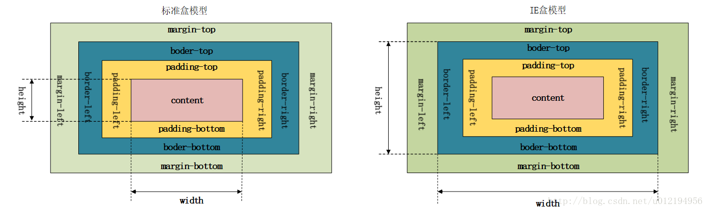

## 一、简述Chome盒模型与IE盒模型的区别

每个元素在页面中占位大小 = content + padding + margin + border

Chrome盒模型内容大小等于content大小；

IE盒模型内容大小等于content + padding + border的总和。



<p align="center">（图仅查看即可，无须画出）</p>

## 二、**BFC（Block Formatting Context） 是什么？应用？** 

### 1、概念

BFC 就是 ‘块级格式上下文’ 的格式，创建了BFC的元素就是一个独立的盒子，不过只有BLock-level box可以参与创建BFC，它规定了内部的Bloc-level Box 如何布局，并且与这个独立盒子里的布局不受外部影响，当然它也不会影响到外面的元素。

### 2、应用场景

- 解决margin叠加的问题
- 用于布局（overflow: hidden）,BFC不会与浮动盒子叠加。
- 用于清除浮动，计算BFC高度。

## 三、页面导入样式时，使用link和@import有什么区别

```
1、link属于XHTML标签，除了加载CSS外，还能用于定义RSS（简易信息聚合，是一种基于XML标准，在互联网上被广泛采用的内容包装和投递协议），rel连接属性等作用；@import是CSS提供的，只能用于加载CSS；
2、页面被加载时，link会同时被加载；而@import引用的CSS会等到页面被加载完成后再加载；
3、link是XHTML标签，没有兼容问题；而@import只有在IE5以上才能被识别；
4、link支持使用JavaScript控制DOM修改样式；而@import不支持。
```

## 四、简述优雅降级与渐进增强

### 1、渐进增强（progressive enhancement）

针对低版本浏览器进行构建页面，保证最基本的功能，然后再针对高级浏览器进行效果、交互等改进和追加功能达到更好的用户体验。

### 2、优雅降级（graceful degradation）

一开始就构建完整的功能，然后再针对低版本浏览器进行兼容。

### 3、区别：

a. 优雅降级是从复杂的现状开始，并试图减少用户体验的供给；渐进增强则是从一个非常基础的，能够起作用的版本开始，并不断扩充，以适应未来环境的需要。

b. 渐进增强观点认为应该关注于内容本身，这使得渐进增强成为一种更为合理的设计范例；优雅降级观点认为应该针对那些最高级、最完善的浏览器来设计网站。

## 五、重绘与重排

### 1、重绘

重绘是一个元素外观的改变所触发的浏览器行为（例如改变visibility，outline，background等属性），浏览器会根据元素的新属性重新绘制，使元素呈现新的外观。

### 2、重排

重排时更明显的一种改变，可以理解为渲染树需要重新计算。常见的触发重排的操作：

- DOM元素的几何属性变化


- DOM树的结构变化（例如节点的增减、移动）


- 获取某些属性（例如offsetTop，offsetLeft，offsetHeight，offsetWidth，clientWidth，clientHeight等）


- 改变元素的一些样式（例如调整浏览器窗口大小）

### 3、两者的区别

- 重绘不会带来重新布局，并不一定伴随着重排。

- 在实践中，应该尽量减少重排次数和缩小重排的影响范围。有以下几种方法：


- [ ] 将多次改变样式属性的操作合并成一次操作


- [ ] 将需要多次重排的元素，position属性设为absolute或fixed，使其脱离文档流，这样它的变化就不会影响到其他元素


- [ ] 在内存中多次操作节点，完成后再添加到文档中去


- [ ] 如果要对一个元素进行复杂的操作，可以将其display属性设置为none使其隐藏，待操作完成后再显示


- [ ] 在需要经常获取那些引起浏览器重排的属性值时，要缓存到变量

## 六、rgba与opacity的区别

rgba和opacity都能实现透明效果，但最大的不同在于opacity作用于元素本身以及元素内的所有内容，而rgba只作用于元素本身，子元素不会继承透明效果。

## 七、简述iframe标签的优缺点

### 1、优点

- iframe能够把嵌入的页面展示出来，如果有多个网页引用iframe，只需要修改iframe的内容，就可以实现调用的每一个页面内容的更改，方便快捷
- 网页如果为了统一风格，头部和版本都是一样的，就可以写成一个页面，用iframe来嵌套，可以增加代码的可重用
- 重载页面时不需要重载整个页面，只需要重载页面中的一个框架页，减少了数据的传输，增加了网页的下载速度
- 方便制作导航栏

### 2、缺点

- 会产生很多页面，不利于管理
- 浏览器的前进/后退按钮无效
- 无法被一些搜索引擎索引到，现在搜索引擎爬虫还不能很好的处理iframe中的内容，所以不利于SEO
- 多数小型的移动设备无法显示框架，兼容性差
- 多框架的页面会增加服务器的http请求，对于大型网站是不可取的

## 八、解释下浮动和它的工作原理？清除浮动的方法

浮动元素脱离文档流，不占据空间。浮动元素碰到包含它的边框或者浮动元素的边框停留。

### 1、使用空标签清除浮动

这种方法是在所有浮动标签后面添加一个空标签 定义css clear:both. 弊端就是增加了无意义标签。

###  2、使用after伪对象清除浮动

该方法只适用于非IE浏览器。具体写法可参照以下示例。使用中需注意以下几点。一、该方法中必须为需要清除浮动元素的伪对象中设置 height:0，否则该元素会比实际高出若干像素；

```css
#parent::after{
  content:"";
  height:0;
  visibility:hidden;
  display:block;
  clear:both;
}
```

### 3、溢出隐藏

```css
overflow: hidden;
```

###  4.浮动外部元素

## 九、如何让一个盒子在页面垂直水平居中

### 方法一：已知宽高

```css
div{
  position: absolute;
  left: 0;
  right: 0;
  bottom: 0;
  top: 0;
  margin: auto;
}
```

### 方法二：未知宽高

```css
div{
	position: absolute;
  left: 50%;
  top: 50%;
  transform: translate(-50%,-50%);
}
```

## 十、前端性能优化方案

 1、减少DOM操作
 2、部署前，图片压缩，代码压缩
 3、优化js代码结构，减少冗余代码
 4、减少http请求，合理设置HTTP缓存
 5、使用内容分发cdn加速
 6、静态资源缓存
 7、图片延迟加载

## 十一、CSS3有哪些新特性

```
border-radius   圆角
box-shadow   阴影
text-shadow   文字阴影
gradient   线性渐变
transform  旋转
scale  缩放
translate   位移
媒体查询   多栏布局   多背景
```

## 十二、什么是空元素？

即没有内容的HTML元素，例如：br、meta、hr、link、input、img

## 十三、Label的作用是什么

Label标签来定义表单控制间的关系,当用户选择该标签时，浏览器会自动将焦点转到和标签相关的表单控件上。

## 十四、xhtml和html有什么区别

HTML与XHTML之间的差别，主要分为功能上的差别和书写习惯的差别两方面。

关于功能上的差别，主要是XHTML可兼容各大浏览器、手机以及PDA，并且浏览器也能快速正确地编译网页。 

由于XHTML的语法较为严谨，所以如果你是习惯松散结构的HTML编写者，那需要注意XHTML的规则。

下面列出了几条容易犯的错误，供理解。 

1. **所有标签都必须小写**

   在XHTML中，所有的标签都必须小写，不能大小写穿插其中，也不能全部都是大写。

2.  **标签必须成双成对**

   像是<p>...</p>、<a>...</a>、<div>...</div>标签等，当出现一个标签时，必须要有对应的结束标签，缺一不可，就像在任何程序语言中的括号一样

3. **标签顺序必须正确**

   标签由外到内，一层层包覆着，所以假设你先写div后写h1，结尾就要先写h1后写div。只要记住一个原则“先进后出”，先弹出的标签要后结尾。

4. **所有属性都必须使用双引号**

   在XHTML 1.0中规定连单引号也不能使用，所以全程都得用双引号。

5. 不允许使用target="_blank"

   从XHTML 1.1开始全面禁止target属性，如果想要有开新窗口的功能，就必须改写为rel="external"，并搭配JavaScript实现此效果。

## 十五、img标签上title与alt属性的区别是什么?

alt：当图片不显示是用文字代表

title：为该属性提供信息

## 十六、解释csssprites，如何使用。

Css精灵把一堆小的图片整合到一张大的图片上，减轻服务器对图片的请求数量。

## 十七、a标签中 active hover link visited 正确的设置顺序是什么?

按照 `lvha` 顺序排列
a:link
a:visited
a:hover
a:active

## 十八、什么是 FOUC（无样式内容闪烁）？你如何来避免 FOUC？

FOUC - Flash Of Unstyled Content 文档样式闪烁
<style type="text/css" media="all">@import "../fouc.css";</style>
而引用CSS文件的@import就是造成这个问题的罪魁祸首。IE会先加载整个HTML文档的DOM，然后再去导入外部的CSS文件，因此，在页面DOM加载完成到CSS导入完成中间会有一段时间页面上的内容是没有样式的，这段时间的长短跟网速，电脑速度都有关系。
解决方法：只要在<head>之间加入一个<link>或者<script>元素就可以了。

## 十九、DOCTYPE作用？严格模式与混杂模式 ， 标准模式和怪异模式

1. `<!DOCTYPE>` 声明位于HTML文档中的第一行，处于<html>标签之前，告知浏览器的解析器用什么文档标准解析这个文档；
2. 严格模式下，排版和JS以浏览器支持的最高标准运行；混杂模式下，页面以宽松向后兼容的方式显示；
3. 如何触发混杂模式：DOCTYPE不存在或格式不正确，会导致文档以混合模式呈现；
4. 标准模式（standards mode）是指浏览器按照W3C标准解析执行代码；怪异模式（quirks mode）则是使用浏览器自己的方式解析执行代码；
5. 浏览器解析时到底使用何种模式，与网页中的DTD声明（文档类型定义，DOCTYPE相关）有关，忽略DTD声明，将使网页进入怪异模式。

## 二十、em、rem的区别

- em是相对长度单位，相对于当前对象内文本的字体尺寸。如当前对行内文本的字体尺寸未被人为设置，则相对浏览器的默认字体尺寸。它会继承父级元素的字体大小，因此并不是一个固定的值。
- rem是CSS3新增的一个相对单位(root em,根em),使用rem为元素设定字体大小事，仍然是相对大小但相对的只是HTML根元素。