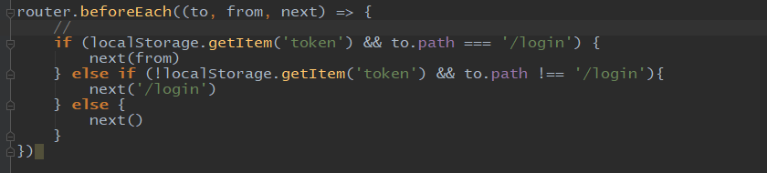

# 员工管理

## 一、页面功能分析

按照页面功能作为区分可以分为及大部分：

- 员工列表查询，包含：根据关键字、部门条件查询、批量删除功能、删除功能
- 添加页面
- 编辑页面
- 导出功能


## 二、员工列表查询功能

> 实现步骤：
>
> 1. 先实现员工列表接口api和部门列表api
> 2. 实现界面布局和功能


### 1. 新增员工列表api

文件位置：`/src/request/api.js`

```js
// 获取员工列表
export const getEmployeesApi = params => request.get(`${path}/employees`, {params})
```

```js
// router/index.js 添加员工路由
children： [
	{
        path: '/employee',
        component: Employee
	}
]
```


### 2. 实现列表布局

views/empolyee/Employee.vue

> 注意点：
>
> 1. el-table上选中或者取消选中都会触发selection-change方法，参数是选中的员工对象
> 2. 添加和编辑要跳转页面
> 3. 删除接口传入的参数是ids：[1,2,3]类似这样的，最后传递给后端时候`ids=1&ids=2&ids=3`这样的结果


```vue
<template>
    <div class="employee-container content-container">
        <el-form :inline="true">
            <el-form-item label="关键字">
                <el-input v-model="keyword" placeholder="请输入姓名/邮箱"></el-input>
            </el-form-item>
            <el-form-item label="部门">
                <el-select :data="departments" v-model="selectDepartment">
                    <el-option label="全部" :value="-1"></el-option>
                    <el-option
                            v-for="department in departments"
                            :label="department.name"
                            :value="department.id"
                            :key="department.id">
                    </el-option>
                </el-select>
            </el-form-item>
            <el-form-item>
                <el-button type="primary" icon="el-icon-search" @click="queryEmployeeData()">查询</el-button>
                <el-button type="success" icon="el-icon-plus" @click="addEmployPage()">添加</el-button>
                <el-button type="danger" icon="el-icon-delete" @click="deleteEmployees()">批量删除</el-button>
                <el-button type="warning" icon="el-icon-sort-down">导出</el-button>
            </el-form-item>
        </el-form>
        <el-table :data="employees" border @selection-change="employeeSelChange">
            <el-table-column type="selection"></el-table-column>
            <el-table-column prop="id" label="编号"></el-table-column>
            <el-table-column prop="name" label="名称"></el-table-column>
            <el-table-column prop="email" label="email"></el-table-column>
            <el-table-column prop="age" label="年龄"></el-table-column>
            <el-table-column prop="dept.name" label="部门"></el-table-column>
            <el-table-column label="操作" width="180px" fixed="right">
                <template slot-scope="scope">
                    <el-button type="primary" icon="el-icon-edit" size="small" @click="editEmployee(scope.row)">编辑
                    </el-button>
                    <el-button type="danger" icon="el-icon-delete" size="small" @click="delEmployee(scope.row)">删除
                    </el-button>
                </template>
            </el-table-column>
        </el-table>
        <div class="content-footer">
            <el-pagination
                    @size-change="sizeChange"
                    @current-change="currentChange"
                    background
                    :page-size="pageSize"
                    :page-sizes="[5, 10, 50, 100]"
                    :total="total"
                    layout="sizes,prev,pager,next,total">
            </el-pagination>
        </div>
    </div>
</template>

<script>
    import {
        getDepartMentsApi,
        getEmployeesApi,
        delEmployeeApi,
        delEmployeesApi
    } from '@/request/api'

    export default {
        name: "Employee",
        data() {
            return {
                keyword: '',
                selectDepartment: -1,
                departments: [],
                employees: [],
                pageSize: 10,
                currentPage: 1,
                selectEIds: [],
                total: 0
            }
        },
        methods: {
            // 请求员工列表
            queryEmployeeData() {
                getEmployeesApi({
                    currentPage: this.currentPage,
                    pageSize: this.pageSize,
                    keyword: this.keyword,
                    deptId: this.selectDepartment
                }).then(res => {
                    if (res.success === true) {
                        this.employees = res.data.list
                        this.total = res.data.total
                    }
                })
            },
            // 跳转到添加员工页面
            addEmployPage() {
                this.$router.push({path: '/employee/add'})
            },
            editEmployee(row) {
                this.$router.push({path: `/employee/edit/${row.id}`})
            },
            delEmployee(row) {
                this.$confirm('此操作将删除改员工', '删除员工提示', {
                    cancelButtonText: '否',
                    confirmButtonText: '是'
                }).then(() => {
                    delEmployeeApi({
                        id: row.id
                    }).then(res => {
                        if (res.success === true) {
                            this.$message.success('删除成功！')
                            this.queryEmployeeData()
                        }
                    })
                }).catch(() => {

                })
            },
            employeeSelChange(val) {
                this.selectEIds = val
            },
            // 删除多个员工信息
            deleteEmployees(val) {
                if (this.selectEIds.length > 0) {
                    const ids = this.selectEIds.map(employee => employee.id) || []
                    delEmployeesApi({
                        ids
                    }).then(res => {
                        if (res.success === true) {
                            this.$message.success('删除成功！')
                            this.queryEmployeeData()
                        }
                    })
                }
            },
            sizeChange(val) {
                this.pageSize = val
                this.queryEmployeeData()
            },
            currentChange(val) {
                this.currentPage = val
                this.queryEmployeeData()
            }
        },
        created() {
            // 请求部门列表
            getDepartMentsApi({
                currentPage: 1,
                pageSize: 1000
            }).then(res => {
                if (res.success === true) {
                    this.departments = res.data.list
                }
            })
            this.queryEmployeeData()
        }
    }
</script>

<style scoped>

</style>
```

```js
// request/request.js
if (config.method === 'delete') {
    config.params = config.params || {}
    config.params.token = token
    // a:[1,2,3] ===> a=1&a=2&a=3
    config.url += '?' + qs.stringify(config.params, {arrayFormat: 'repeat'})
    delete config.params
}
```


## 三、员工添加页面

### 1. 添加和编辑员工界面

> 添加员工和编辑员工页面相似，所以公用一个页面组件。
>
> 如果选中超级管理员，则不用选择角色。


```vue
<template>
    <div class="content-container container">
        <el-form :model="employeeForm" :rules="employeeRules" ref="employeeForm" label-width="100px">
            <el-form-item label="用户名" prop="name">
                <el-input v-model="employeeForm.name" placeholder="请输入用户名"></el-input>
            </el-form-item>
            <el-form-item v-if="!employeeID" label="密码" prop="password">
                <el-input v-model="employeeForm.password" type="password" placeholder="请输入密码"></el-input>
            </el-form-item>
            <el-form-item v-if="!employeeID" label="验证密码" prop="checkPass">
                <el-input v-model="employeeForm.checkPass" type="password" placeholder="再输入一遍密码"></el-input>
            </el-form-item>
            <el-form-item label="电子邮箱" prop="email">
                <el-input v-model="employeeForm.email" placeholder="请输入邮箱"></el-input>
            </el-form-item>
            <el-form-item label="年龄" prop="age">
                <el-input v-model="employeeForm.age"></el-input>
            </el-form-item>
            <el-form-item label="部门">
                <el-select v-model="employeeForm.dept">
                    <el-option
                            v-for="department in departments"
                            :key="department.id"
                            :label="department.name"
                            :value="department.id"
                    ></el-option>
                </el-select>
            </el-form-item>
            <el-form-item label="超级管理员">
                <el-switch
                        v-model="employeeForm.admin"
                ></el-switch>
            </el-form-item>
            <el-form-item label="分配角色" v-show="!employeeForm.admin">
                <el-transfer v-model="employeeForm.roles" :data="roles"></el-transfer>
            </el-form-item>
            <el-form-item>
                <el-button type="primary" @click="saveEmployee()">保存</el-button>
                <el-button type="danger" @click="reset()">重置</el-button>
            </el-form-item>
        </el-form>
    </div>
</template>

<script>
    import {getDepartMentsApi, getRolesApi, addEmployeeApi, getEmployeeApi, updateEmployeeApi} from "@/request/api";

    export default {
        name: "AddEmployee",
        data() {
            return {
                departments: [],
                roles: [],
                employeeForm: {
                    name: '',
                    password: '',
                    checkPass: '',
                    email: '',
                    age: '',
                    admin: false, // 是否超级管理员
                    dept: 0,
                    roles: []
                },
                employeeRules: {
                    name: [
                        {required: true, message: '请输入用户名', trigger: 'blur'},
                        {min: 5, max: 20, message: '用户名长度必须大于5个', trigger: 'blur'}
                    ],
                    password: [
                        {required: true, message: '请输入密码', trigger: 'blur'},
                        {min: 4, max: 6, message: '请输入一个长度介于4和6之间的字符串', trigger: 'blur'}
                    ],
                    checkPass: [
                        {required: true, message: '请输入密码', trigger: 'blur'},
                        {min: 4, max: 6, message: '请输入一个长度介于4和6之间的字符串', trigger: 'blur'},
                        {validator: this.checkPwdVali, trigger: 'blur'}
                    ],
                    email: [
                        {required: true, message: '请输入电子邮箱', trigger: 'blur'},
                        {validator: this.emailVali, trigger: 'blur'}
                    ],
                    age: [
                        {required: true, message: '请输入年龄', trigger: 'blur'},
                        {validator: this.ageVali, trigger: 'blur'}
                    ]
                },
                employeeID: null
            }
        },
        methods: {
            checkPwdVali(rule, value, callback) {
                if (value === this.employeeForm.password) {
                    return callback()
                }
                callback('两次输入的密码不相同')
            },
            emailVali(rule, value, callback) {
                if (/^[a-zA-Z0-9_-]+@[a-zA-Z0-9_-]+(\.[a-zA-Z0-9_-]+)+$/g.test(value)) {
                    return callback()
                }
                callback('请输入正确的邮箱地址')

            },
            ageVali(rule, value, callback) {
                if (!Number.isInteger(value)) {
                    return callback()
                } else if (value < 18 || value > 65) {
                    return callback('请输入一个介于 18 和 65 之间的值')
                }
                callback('只能输入整数')
            },
            saveEmployee() {
                const paramsObj = {
                    name: this.employeeForm.name,
                    email: this.employeeForm.email,
                    age: this.employeeForm.age,
                    admin: this.employeeForm.admin,
                    dept: {id: this.employeeForm.dept},
                    ids: !this.employeeForm.admin ? this.employeeForm.roles : []
                }
                if (this.employeeID) {
                    updateEmployeeApi({
                        id: this.employeeID,
                        ...paramsObj
                    }).then(res => {
                        if (res.success) {
                            this.$message.success('更新员工信息成功!')
                            this.$router.replace({path: '/employee'})
                        }
                    })
                } else {
                    this.$refs['employeeForm'].validate(vali => {
                        if (vali) {
                            addEmployeeApi({
                                password: this.employeeForm.password,
                                ...paramsObj
                            }).then(res => {
                                if (res.success === true) {
                                    this.$message.success('添加员工信息成功!')
                                    this.$router.replace({path: '/employee'})
                                }
                            })
                        } else {
                            return false
                        }
                    })
                }
            },
            reset() {
                this.$refs['employeeForm'].resetFields();
            },

        },
        created() {
            this.employeeID = this.$route.params.eid || null
            // 获取当前员工的信息
            if (this.employeeID) {
                getEmployeeApi({id: this.employeeID}).then(res => {
                    if (res.success === true) {
                        this.employeeForm = res.data
                        this.employeeForm.dept = res.data.dept.id
                        this.employeeForm.roles = res.data.roles.map(role => role.id) || []
                    }
                })
            }

            // 部门管理列表
            getDepartMentsApi({
                currentPage: 1,
                pageSize: 1000
            }).then(res => {
                if (res.success === true) {
                    this.departments = res.data.list
                    if (!this.employeeID) {
                        this.employeeForm.dept = this.departments[0].id
                    }
                }
            })

            // 获取角色列表
            getRolesApi({
                currentPage: 1,
                pageSize: 1000
            }).then(res => {
                if (res.success === true) {
                    this.roles = res.data.list.map(dep => {
                        return {
                            key: dep.id,
                            label: dep.name
                        }
                    })
                }
            })
        }
    }
</script>

<style lang="less" type="text/less" scoped>
    .el-form {
        margin-top: 20px;
        width: 700px;
    }
</style>
```


### 2. 实现首页拦截

> 规则：
>
> 1. token不存在，则跳转到登陆页
> 2. token存在，若地址改成是登陆地址，则跳转到原来页面
> 3. 其他情况直接跳转


文件位置：`src/router/index.js`

```js
...
{
    path: "*",
    redirect: "/"
}
...
```




