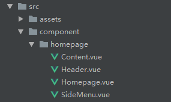

# 部门管理

## 1.首页

> 分析：
>
> 1. 首页分为3部分：头部组件、左侧组件、中间内容组件
>
> 2. 所有的页面（除首页外）都包含头部、左侧导航菜单、中间内容。由于路由变化的时候变化的只有中间的内容部分，头部和左侧导航菜单不变，所以可以使用 `子路由` 实现这个效果。


- 创建4个组件文件：Homepage.vue、Header.vue、SideMenu.vue、Content.vue




定义路由：`/src/router/index.js`

```js
const Home = () => import('@/component/homepage/Homepage.vue')
const Department = () => import('@/views/department/Department.vue')

const routes = [
	{
        path: '',
        component: Home,
        children: [
        	{
                path: '/department',
                component: Department
            }
        ]
    }
]
```


文件位置：`component/homepage/Homepage.vue`

```vue
<template>
    <div class="wrapper">
        <ma-header @collapseHeader="collapseHeader" :collapse="collapse"></ma-header>
        <ma-side-menu :collapse="collapse"></ma-side-menu>
        <ma-content :collapse="collapse"></ma-content>
    </div>
</template>

<script>
    import MaContent from './Content'
    import MaSideMenu from './SideMenu'
    import MaHeader from './Header'
    export default {
        name: "Homepage",
        data() {
            return {
                collapse: false,
            }
        },
        components: {
            MaContent,
            MaSideMenu,
            MaHeader
        },
        methods: {
            collapseHeader(c){
                this.collapse = c
            }
        }
    }
</script>

<style lang="less" scoped>
.wrapper{
    position: relative;
    width: 100%;
    height: 100%;
}
</style>
```


### 1.头部组件

> 背景颜色：409EFF
>
> 用到的element-ui ：el-dropdown、el-dropdown-menu、el-dropdown-item、icon
>
> 实现组件布局
>


文件位置：`component/homepage/Header.vue`

```vue
<template>
    <div class="header-wrapper">
        <h3>叩丁狼客户关系管理后台</h3>
        <i class="el-icon-menu collapse-icon" @click="collapseFn()"></i>
        <el-dropdown class="header-dropdown" @command="handleCommand">
            <span class="el-dropdown-link">
            {{username}}<i class="el-icon-arrow-down el-icon--right"></i>
            </span>
            <el-dropdown-menu slot="dropdown">
                <el-dropdown-item command="a">退出登录</el-dropdown-item>
            </el-dropdown-menu>
        </el-dropdown>
    </div>
</template>

<script>
    export default {
        name: "Header.vue",
        props: {
            collapse: {
                type: Boolean,
                default: false
            }
        },
        data() {
            return {
                username: localStorage.getItem('username'),
            }

        },
        methods: {
            handleCommand() {
            },
            collapseFn() {
                this.$emit('collapseHeader', !this.collapse)
            }
        }
    }
</script>

<style lang="less" scoped>
.header-wrapper {
    height: 70px;
    background-color: #409EFF;
    color: #fff;
    line-height: 70px;
    h3 {
        float:left;
        letter-spacing: 1px;
        padding: 0 20px;
    }
    .collapse-icon {
        float: left;
        line-height: 70px;
        font-size: 22px;
    }
    .header-dropdown {
        float: right;
        padding-right: 20px;
        color: #fff;

    }
}
</style>
```


### 2.左侧菜单组件

> 背景颜色（324157）、文字颜色（bfcbd9）、选中文字颜色（20a0ff）
>
> 用到的element-ui：el-menu、el-submenu、el-menu-item；
>
> 实现菜单布局（绝对定位，隐藏滚动条）;
>
> 把路由配置单独抽离，写在一个文件内（config/config.js）；


`config/config.js`

```js
export const menuConfig =  [
    {
        icon: 'el-icon-s-tools',
        title: '系统管理',
        subs: [
            {
                index: '/department',
                title: '部门管理'
            },
            {
                index: '/employee',
                title: '员工管理'
            },
            {
                index: '/permission',
                title: '权限管理'
            },
            {
                index: '/role',
                title: '角色管理'
            }
        ]
    },
    {
        icon: 'el-icon-s-management',
        title: '数据管理',
        subs: [
            {
                index: '/sysdictionary',
                title: '字典目录'
            },
            {
                index: '/sysdictionaryitem',
                title: '字典明细'
            }
        ]
    },
    {
        icon: 'el-icon-service',
        title: '客户管理',
        subs: [
            {
                index: '/customerlist',
                title: '客户列表'
            },
            {
                index: '/pcustomerlist',
                title: '潜在客户'
            },
            {
                index: '/rpoolcustomer',
                title: '客户池'
            },
            {
                index: '/failcustomer',
                title: '失败客户'
            }
        ]
    },
    {
        icon: 'el-icon-s-custom',
        title: '客户历史',
        subs: [
            {
                index: '/customertracehistory',
                title: '跟进历史'
            }
        ]
    },
    {
        icon: 'el-icon-s-data',
        title: '报表统计',
        subs: [
            {
                index: '/customerreport',
                title: '潜在客户报表'
            }
        ]
    }
]
```


`component/homepage/SideMenu.vue`

```vue
<template>
    <el-menu
            :default-active="activeRoute"
            class="sidemenu"
            background-color="#324157"
            text-color="#bfcbd9"
            active-text-color="#20a0ff"
            :collapse="collapse"
            unique-opened
            router
    >
        <el-submenu v-for="menu in menuDatas" :key="'menu' + menu.id" :index="menu.id">
            <template slot="title">
                <i class="el-icon-location"></i>
                <span>{{menu.title}}</span>
            </template>
            <el-menu-item v-for="submenu in menu.childrens" :key="submenu.id" :index="submenu.id">
                <span slot="title">{{submenu.title}}</span>
            </el-menu-item>
        </el-submenu>
    </el-menu>
</template>

<script>
    import {menuConfig} from '@/config/config'

    export default {
        name: "SideMenu",
        props: {
          collapse: {
              type: Boolean,
              default: false
          }
        },
        data() {
            return {
                menuDatas: menuConfig
            }
        },
        methods: {},
        computed: {
            activeRoute() {
                return this.$route.meta.path
            }
        },
        created() {

        }
    }
</script>

<style lang="less" scoped>
    .sidemenu {
        position: absolute;
        top: 70px;
        left: 0;
        bottom: 0;
        overflow-y: auto;
    }
    .sidemenu::-webkit-scrollbar{
        width: 0;
    }
    .sidemenu:not(.el-menu--collapse) {
        width: 250px;
    }
    .sidemenu > ul {
        width: 100%;
    }

</style>
```


### 3.内容组件

`component/homepage/Content.vue`

```vue
<template>
    <div class="content-container" :class="{'content-collapse': collapse}">
    <h3>{{$route.meta.title}}</h3>
    <section class="content">
        <router-view/>
    </section>
    <footer>
        <div class="footer_left">
            <strong>Copyright &copy; 2016-2019 <a href="http://www.wolfcode.cn" target="_blank">叩丁狼</a>.</strong>
            All rights reserved.
        </div>
        <div class="footer_right"><strong>Version</strong> 1.0.0</div>
    </footer>
    </div>
</template>

<script>
    export default {
        name: "Content",
        props: {
            collapse: {
                type: Boolean,
                default: false
            }
        },
    }
</script>

<style lang="less" scoped>
    .content-container {
        position: absolute;
        top: 70px;
        left: 250px;
        right: 0;
        bottom: 0;
        display: flex;
        flex-direction: column;
        justify-content: space-between;
        padding: 10px;
        transition: left .3s ease-in-out;
        background-color: #fff;

        .content {
            width: 100%;
            height: 100%;
            overflow-y: auto;
        }
        .footer_left {
            float: left;
            font-size: 12px;
        }

        .footer_right {
            float: right;
            padding-right: 10px;
            font-size: 12px;
        }
    }

    .content-collapse {
        left: 65px;
    }

</style>
```


### 4.头部组件收起展开功能

> 上面已经使用父传子、子传父的方式实现了头部组件，兄弟组件间传值还可以使用event bus的方式传值，除了以上两种外，还可以使用vuex来实现。下面使用event bus来实现兄弟组件间的传值

#### 1. 创建git分支

**git checkout -b feature-eventbus**


#### 2. 创建bus.js

component/homepage/bus.js

```js
import Vue from 'vue'

// 创建Event Bus
const bus = new Vue()

export default bus
```


#### 2.修改头部组件

component/homepage/Header.vue

```vue
<template>
    <div class="header-wrapper">
        <h3>叩丁狼客户关系管理后台</h3>
        <i class="el-icon-menu collapse-icon" @click="collapseFn()"></i>
        <el-dropdown class="header-dropdown" @command="handleCommand">
            <span class="el-dropdown-link">
            {{username}}<i class="el-icon-arrow-down el-icon--right"></i>
            </span>
            <el-dropdown-menu slot="dropdown">
                <el-dropdown-item command="a">退出登录</el-dropdown-item>
            </el-dropdown-menu>
        </el-dropdown>
    </div>
</template>

<script>
    import bus from './bus'
    export default {
        name: "Header.vue",
        data() {
            return {
                username: localStorage.getItem('username'),
                collapse: false
            }

        },
        methods: {
            handleCommand() {
            },
            collapseFn() {
                this.collapse = !this.collapse
                bus.$emit('collapseHeader', this.collapse)
            }
        }
    }
</script>

<style lang="less" scoped>
.header-wrapper {
    height: 70px;
    background-color: #409EFF;
    color: #fff;
    line-height: 70px;
    h3 {
        float:left;
        letter-spacing: 1px;
        padding: 0 20px;
    }
    .collapse-icon {
        float: left;
        line-height: 70px;
        font-size: 22px;
    }
    .header-dropdown {
        float: right;
        padding-right: 20px;
        color: #fff;

    }
}
</style>
```


#### 3.修改左侧菜单

`component/homepage/SideMenu.vue`

```vue
<template>
    <el-menu
            :default-active="activeRoute"
            class="sidemenu"
            background-color="#324157"
            text-color="#bfcbd9"
            active-text-color="#20a0ff"
            :collapse="collapse"
            unique-opened
            router
    >
        <el-submenu v-for="menu in menuDatas" :key="'menu' + menu.id" :index="menu.id">
            <template slot="title">
                <i class="el-icon-location"></i>
                <span>{{menu.title}}</span>
            </template>
            <el-menu-item v-for="submenu in menu.childrens" :key="submenu.id" :index="submenu.id">
                <span slot="title">{{submenu.title}}</span>
            </el-menu-item>
        </el-submenu>
    </el-menu>
</template>

<script>
    import {menuConfig} from '@/config/config'
    import bus from './bus'

    export default {
        name: "SideMenu",
        data() {
            return {
                menuDatas: menuConfig,
                collapse: false
            }
        },
        methods: {},
        computed: {
            activeRoute() {
                return this.$route.meta.path
            }
        },
        created() {
            bus.$on('collapseHeader', (msg) => {
                this.collapse = msg
            })
        }
    }
</script>

<style lang="less" scoped>
    .sidemenu {
        position: absolute;
        top: 70px;
        left: 0;
        bottom: 0;
        overflow-y: auto;
    }
    .sidemenu::-webkit-scrollbar{
        width: 0;
    }
    .sidemenu:not(.el-menu--collapse) {
        width: 250px;
    }
    .sidemenu > ul {
        width: 100%;
    }

</style>
```


#### 4.修改和完善内容组件

`/component/homepage/Content.vue`

```vue
<template>
    <div class="content-container" :class="{'content-collapse': collapse}">
        <h3>{{$route.meta.title}}</h3>
        <section class="content">
            <router-view/>
        </section>
        <footer>
            <div class="footer_left">
                <strong>Copyright &copy; 2016-2019 <a href="http://www.wolfcode.cn" target="_blank">叩丁狼</a>.</strong>
                All rights reserved.
            </div>
            <div class="footer_right"><strong>Version</strong> 1.0.0</div>
        </footer>
    </div>
</template>

<script>
    import bus from './bus'

    export default {
        name: "Content",
        data() {
            return {
                collapse: false
            }
        },
        created() {
            bus.$on('collapseHeader', (msg) => {
                this.collapse = msg
            })
        }
    }
</script>

<style lang="less" scoped>
    .content-container {
        position: absolute;
        top: 70px;
        left: 250px;
        right: 0;
        bottom: 0;
        display: flex;
        flex-direction: column;
        justify-content: space-between;
        padding: 10px;
        transition: left .3s ease-in-out;
        background-color: #fff;

        .content {
            width: 100%;
            height: 100%;
            overflow-y: auto;
        }

        .footer_left {
            float: left;
            font-size: 12px;
        }

        .footer_right {
            float: right;
            padding-right: 10px;
            font-size: 12px;
        }
    }

    .content-collapse {
        left: 65px;
    }

</style>
```


## 2.部门管理


> 用到的element-ui ：el-table、el-table-column、el-button、el-pagination、el-dialog
>
> 实现步骤：
>
> ​	1.获取部门列表数据，绑定到table上面
>
> ​	2.添加、修改单个部门数据，实现修改、添加部门接口，使用el-dialog实现界面
>
> ​	3.$nextTick的使用
>
> ​	4.抽离现有的el-dialog


### 1.获取部门列表数据，绑定到table上面

> 实现部门列表接口，使用el-table的data绑定数据；
>
> 然后通过el-table-column来展示每一列显示的内容，el-table-column还能通过插槽的形式在每一个表格中显示其他组件；
>
> 通过el-pagination来实现翻页功能；


### 2.添加、修改单个部门数据，实现修改、添加部门接口，使用el-dialog实现界面

> 实现添加、修改单个部门接口，通过el-dialog中的body放入el-form组件来完成模态框内容；


### 3.$nextTick

> 点击编辑，然后再点击添加没有清除掉输入框里面的数据
>
> 1. resetFields()只是重置值，重置为初始值；
>
> 2. el-form的初始值在created的时候确定的，如果在created的时候赋值了，那么在以后的重置都不会重置为空字符串；
>
> 3. 在弹窗第一次显示的时候，才会触发el-form的created，这时候如果是编辑，那el-form里面就会有默认值，那么在以后调用resetFields的时候也不会重置为空字符串了；


初始化的时候el-dialog里没有el-form的内容


当点击添加或者编辑按钮后，el-dialog里有el-form的内容


问题分析：只要在created时候先不赋值给el-form，等到created结束之后再赋值就可以解决问题，这就需要引入我们的$nextTick方法，参数是一个回调函数。这个回调函数在什么时候执行呢？是在下次DOM更新循环结束之后执行。


#### 1. $nextTick例子


```vue
<template>
    <div>
        <div ref="m1">{{m1}}</div>
        <div v-if="m2">Hello Vue m2: {{m2}}</div>
        <div v-if="m3">Hello Vue m3: {{m3}}</div>
        <div v-if="m4">Hello Vue m4: {{m4}}</div>
        <button @click="changeM1()">
            改变m1的值
        </button>
    </div>
</template>

<script>
    export default {
        name: "Department",
        data() {
            return {
                m1: 'Hi,Vue',
                m2: '',
                m3: '',
                m4: ''
            }
        },
        methods: {
            changeM1() {
                this.m1 = '你好，Vue'
                this.m2 = this.$refs['m1'].innerHTML
                this.$nextTick(() => {
                    this.m3 = this.$refs['m1'].innerHTML
                })
                this.m4 = this.$refs['m1'].innerHTML
            }
        }
    }
</script>

<style scoped>
</style>
```


点击按钮前的效果：


点击按钮之后的效果：


> 1. Vue 实现响应式并不是数据发送变化之后DOM立即变化的，而是按照一定的策略进行DOM的更新。
> 2. nextTick是在下次DOM更新循环结束之后执行的延迟回调，在修改数据之后使用nextTick，就可以在回调中获取更新后的DOM。
> 3. 上面点击按钮之后**m1**改变，但是对应的m1的DOM内容没有立即改变，所以当**m2**和**m4**都通过DOM操作获取**m1**内容时，拿到的旧值。而**m3**通过nextTick的回调函数获取**m1** DOM的值，此时回调函数内拿到的m1时改变后的值，所以**m3**显示的是新的值。


### 4.抽离现有的el-dialog


Department.vue

```vue
<template>
    <div>
        <div class="header-container">
            <el-button type="success" @click="addDepartment">添加</el-button>
        </div>
        <el-table
                :data="tableData"
                border
                stripe
        >
            <el-table-column
                    prop="id"
                    label="编号">
            </el-table-column>
            <el-table-column
                    prop="name"
                    label="部门名称">
            </el-table-column>
            <el-table-column
                    prop="sn"
                    label="部门编号">
            </el-table-column>
            <el-table-column
                    label="操作">
                <template slot-scope="scope">
                    <el-button @click="editDepartment(scope.row)" type="primary" size="small">编辑</el-button>
                    <el-button type="danger" size="small" @click="delDepartment(scope.row)">删除</el-button>
                </template>
            </el-table-column>
        </el-table>
        <section class="footer-container">
            <el-pagination
                    @size-change="sizeChange"
                    @current-change="currentChange"
                    background
                    :page-size="pageSize"
                    :page-sizes="[5, 10, 50, 100]"
                    layout="prev, pager, next, sizes, total"
                    :total="total">
            </el-pagination>
        </section>
        <dep-dialog
                :title="dialogTitle"
                :visible="dialogVisible"
                :formData="formData"
                @closeDialog="closeDialog"
        />
    </div>
</template>

<script>
    import {getDepartments, editDepartment, addDepartment, delDepartment} from '@/request/api'
    import DepDialog from './children/Edit'

    export default {
        name: "Department",
        data() {
            return {
                tableData: [],
                currentPage: 1,
                pageSize: 10,
                keyword: '',
                deptId: null,
                total: 0,
                dialogTitle: '',
                dialogVisible: false,
                formData: {}
            }
        },
        components: {
            DepDialog
        },
        methods: {
            sizeChange(size) {
                this.pageSize = size
                this.getDepartmentsFn()
            },
            currentChange(page) {
                this.currentPage = page
                this.getDepartmentsFn()
            },
            getDepartmentsFn() {
                getDepartments({
                    pageSize: this.pageSize,
                    currentPage: this.currentPage
                }).then(res => {
                    if (res.success) {
                        this.tableData = Object.freeze(res.data.list)
                        console.log(this.tableData)
                        this.total = res.data.total
                    }
                })
            },
            addDepartment() {
                this.dialogTitle = '添加部门'
                this.dialogVisible = true
            },
            editDepartment(row) {
                this.dialogTitle = '编辑部门'
                this.dialogVisible = true
                this.$nextTick(() => {
                    this.formData = {...row}
                })
            },
            delDepartment(row) {
                this.$confirm('此操作将删除该条记录，是否继续？', '提示', {
                  type: 'warning'
                }).then(() => {
                    delDepartment({
                        id: row.id
                    }).then(res => {
                        if (res.success === true) {
                            this.$message({
                                message: '删除部门信息成功！',
                                type: 'success'
                            })
                            this.getDepartmentsFn()

                        }
                    })
                }).catch(() => {

                })
            },
            closeDialog(data) {
                this.dialogVisible = false
                this.formData = {}
                if (data) {
                    if (data.id) {
                        editDepartment({
                            ...data
                        }).then(res => {
                            if (res.success === true) {
                                this.$message({
                                    message: '修改部门信息成功！',
                                    type: 'success'
                                })
                                this.getDepartmentsFn()

                            }
                        })
                    } else {
                        addDepartment({
                            ...data
                        }).then(res => {
                            if (res.success === true) {
                                this.$message({
                                    message: '添加部门信息成功！',
                                    type: 'success'
                                })
                                this.getDepartmentsFn()
                            }
                        })
                    }
                }
            }
        },
        created() {
            this.getDepartmentsFn()
        }
    }
</script>

<style lang="less" scoped>

</style>
```


Edit.vue

```vue
<template>
    <el-dialog
            :title="title"
            :visible.sync="visible"
            width="35%"
            :before-close="handleClose">
        <el-form :model="newForm" :rules="depRules" ref="depForm" label-width="80px">
            <el-form-item label="部门名称" prop="name">
                <el-input v-model="newForm.name" placeholder="请输入部门名称"></el-input>
            </el-form-item>
            <el-form-item label="部门编号" prop="sn">
                <el-input v-model="newForm.sn" placeholder="请输入部门编号"></el-input>
            </el-form-item>
        </el-form>
        <span slot="footer" class="dialog-footer">
                <el-button @click="handleClose">取 消</el-button>
                <el-button type="primary" @click="saveDep">确 定</el-button>
          </span>
    </el-dialog>
</template>

<script>
    export default {
        name: "DepDialog",
        props: {
            title: {
                type: String,
                default: ''
            },
            visible: {
                type: Boolean,
                default: false
            },
            formData: {
                type: Object,
                default: {}
            }
        },
        data() {
            return {
                newForm: {},
                depRules: {
                    name: [
                        {required: true, message: '请输入部门名称', trigger: 'blur'}
                    ],
                    sn: [
                        {required: true, message: '请输入部门编号', trigger: 'blur'}
                    ]
                }
            }
        },
        watch: {
            formData(val) {
                val = val || {}
                this.newForm = JSON.parse(JSON.stringify(val))
            }
        },
        methods: {
            handleClose() {
                this.$refs['depForm'].resetFields()
                this.$emit('closeDialog')
            },
            saveDep() {
                this.$emit('closeDialog', {...this.newForm})
                this.$refs['depForm'].resetFields()
            }
        }
    }
</script>

<style lang="less" scoped>

</style>
```

### 5. 请求统一处理错误消息

request/request.js


> 1. 引入element-ui的Message
>
> ```js
> import {Message} from "element-ui"
> ```
>
> 
>
> 2. 返回拦截器里加上如下代码
>
> ```js
> Message({
> 	message: response.data.msg || '请求失败',
> 	type: 'error',
> 	duration: 5 * 1000
> })
> ```

