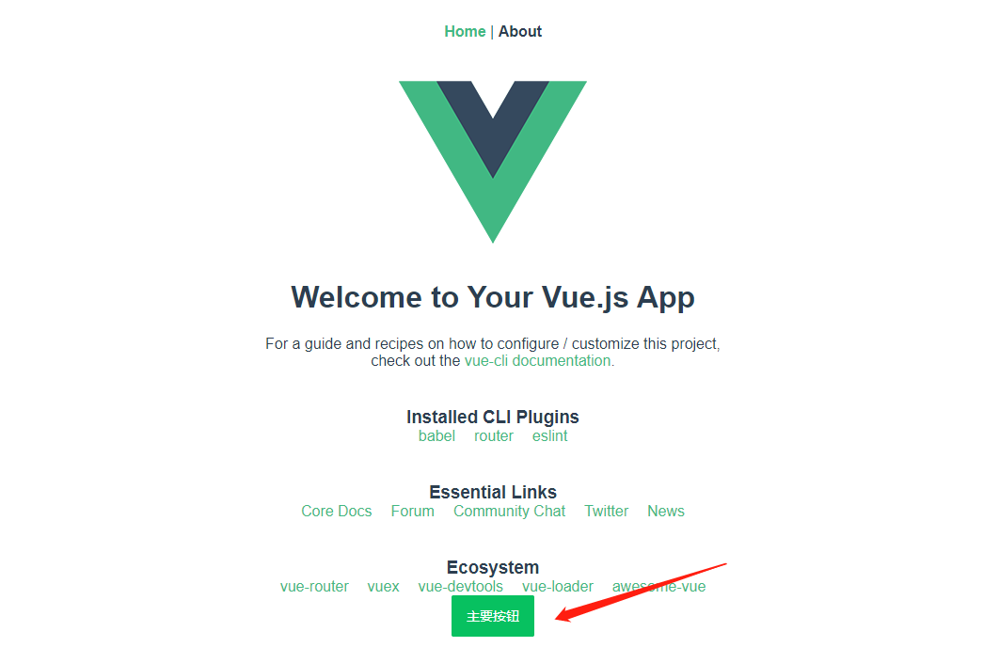

## 一、项目参考

解压 `codesohigh-net163-dev.zip` 文件后，执行：

```
cd net163
npm i
yarn serve
```

首次打开会比较慢，因为没做图片懒加载。太久显示不出来就多刷几次，后期我们自己添加懒加载。


## 二、建立仓库

到码云（https://gitee.com/）上，新建仓库（仓库命名随意），一个人开发的话，直接master，不要其他分支也行。


## 三、本地建仓

在本地新建空白目录，并在该目录下打开git bash，执行 `git init`，然后克隆SSH地址：

```
git clone git@gitee.com:xxx/mynet163.git
```

**SSH地址来源：**


执行效果：


## 四、使用VueCli建立项目

```
cd mynet163/
vue create .
```


如果以前在本机做过vue开发，那么直接按照默认配置安装即可。

接下来做一次项目提交：

```
git status
git add .
git commit -m '提交'
```

如果发现提交上去后，远程仓库没有变化，就需要回到git bash，重新执行：

```
git checkout master
git add .
git commit -m '提交'
```

如果你看到以下效果，就证明你成功了：


以后每半天的代码，都需要提交一次。以保障代码不会丢失。

## 五、安装VantUI

官网地址：https://youzan.github.io/vant/#/zh-CN/quickstart

通过vscode打开项目，使用 `ctrl+~` 打开终端。我们通过yarn来安装vant：

```
yarn add vant
```

### 1、引入方式

VantUI支持全局引入与按需引入，我们选用按需引入。

### 2、按需引入自动化

按需引入又分为自动按需引入与手动按需引入，我们选用自动按需引入：

```
yarn add babel-plugin-import
```

安装完成后，打开 `babel.config.js` 写入：

```js
module.exports = {
  presets: [
    '@vue/cli-plugin-babel/preset'
  ],
  plugins: [
    ['import', {
      libraryName: 'vant',
      libraryDirectory: 'es',
      style: true
    }, 'vant']
  ]
}
```

怎样验证安装成功了呢？我们引用一个Button组件，看看效果就知道了。

> Button组件的文档：https://youzan.github.io/vant/#/zh-CN/button#dai-ma-yan-shi

`main.js` 中：

```js
import { Button } from 'vant';
Vue.use(Button);
```

`Home.vue` 中：

```html
<van-button type="primary">主要按钮</van-button>
```

运行 `yarn serve` 可以看到：



如此，我们成功了！

### 3、路径提示配置

- 安装 Path Intellisense插件
- 打开设置 - 首选项 - 搜索 `Path Intellisense` - 打开 `settings.json` ，添加：

```json
 "path-intellisense.mappings": {
     "@": "${workspaceRoot}/src"
 }
```

- 在项目 `package.json` 所在同级目录下创建文件 `jsconfig.json`：

```json
{
    "compilerOptions": {
        "target": "ES6",
        "module": "commonjs",
        "allowSyntheticDefaultImports": true,
        "baseUrl": "./",
        "paths": {
          "@/*": ["src/*"]
        }
    },
    "exclude": [
        "node_modules"
    ]
}
```

- 重启vscode

## 六、Vant组件独立化编写

如果我们所有要用到的组件都直接写在 `main.js` 中，那这份入口文件会很冗余，不利于维护。所以我们在 `src/components` 下新建 `vant.js` ，写入：

```js
import Vue from 'vue'
import { Button } from 'vant';
Vue.use(Button);
```

在 `main.js` 中：

```js
import '@/components/vant.js'
```

如此，我们所有要引入组件的代码，就在 `vant.js` 中来完成。

## 七、清空项目非必要文件

- 将 `views` 下面的文件清空，保留 `Home.vue` ，删除 `components/HelloWorld.vue`，并且 `Home.vue` 中不再引入 `HelloWorld` 组件。
- 删除 `src/assets` 下的图片。
- 将 `router/index.js` 中 `about` 的路由注释掉。
- 删除 `App.vue` 中的less。

## 八、端口配置

如果想要更改8080端口，可以在根目录下新建 `vue.config.js` 中：

```js
module.exports = {
    devServer: {
        port: 3000
    }
}
```

重新运行 `yarn serve` 就可以在 `http://localhost:3000` 中访问项目了。

## 九、首页UI

### 1、搜索框

ui地址：https://youzan.github.io/vant/#/zh-CN/search

`vant.js` 中：

```js
import { Button, Search } from 'vant';
...
Vue.use(Search);
```

`Home.vue` 中：

```html
<template>
  <div class="home">
    <van-search v-model="value" shape="round" background="#fcf" placeholder="商品搜索，共239款好物" />
  </div>
</template>

<script>
export default {
  name: "Home",
  data(){
    return {
      value: ""
    }
  },
  components: {}
};
</script>
```

### 2、轮播图

ui地址：https://youzan.github.io/vant/#/zh-CN/swipe

`vant.js` 中：

```js
import { Button, Search, Swipe, SwipeItem, Lazyload  } from 'vant';
...
Vue.use(Swipe);
Vue.use(SwipeItem);
Vue.use(Lazyload);
```

`Home.vue` 中：

```html
<!-- 这里高度先写220，后面删掉即可 -->
<van-swipe :autoplay="3000" :height="220">
    <van-swipe-item v-for="(image, index) in images" :key="index">
        
    </van-swipe-item>
</van-swipe>

<script>
export default {
  data() {
    return {
      ...,
      images: [
        'https://img.yzcdn.cn/vant/apple-1.jpg',
        'https://img.yzcdn.cn/vant/apple-2.jpg',
      ],
    };
  }
};
</script>
```

## 十、数据请求

接口地址：http://kumanxuan1.f3322.net:8360/

接口文档：

```
网易严选项目接口文档【叩丁狼《网易严选》项目接口文档】 http://www.docway.net/project/1Ve70KqViGf/share/1VeX91oC7pg 阅读密码:zhaowenxian
```

### 1、代理配置

我们对 `vue.config.js` 进行配置：

```js
module.exports = {
    devServer: {
        port: 3000,
        proxy: {
            '/api': {
                target: "http://kumanxuan1.f3322.net:8360/",
                pathRewrite: {
                    '^/api': ''
                }
            }
        }
    }
}
```

<font color="red">由于配置文件修改了，这里一定要记得重新 `yarn serve` ！！</font>

### 2、安装axios、qs

```js
cnpm i axios qs -S
```

### 3、API与Request封装

在 `src` 下新建 `request` ，其中再新建 `request.js` 和 `api.js` 。

`request.js` 中：

```js
import axios from 'axios'

const instance = axios.create({
    baseUrl: 'http://kumanxuan1.f3322.net:8360/',
    timeout: 5000
})

// 请求拦截【instance.interceptors.request.use(cb, cb)】
instance.interceptors.request.use(config => {
    // config.headers.token = "xxxx"
    return config;
}, err => {
    return Promise.reject(err)
})

// 响应拦截【instance.interceptors.response.use(cb, cb)】
instance.interceptors.response.use(result => {
    return result.data;
}, err => {
    return Promise.reject(err)
})

export default instance;
```

查看接口文档，首页接口地址为：`preUrl+/index/index`

`api.js` 中：

```js
import request from './request'

// 请求地址
const baseUrl = 'http://kumanxuan1.f3322.net:8360/';

// 请求首页的数据
export const GetHomeLists = () => request.get(`${baseUrl}/index/index`)
```

### 4、发起请求

`Home.vue` 中：

```js
created(){
    GetHomeLists()
        .then(res=>{
            if(res.errno == 0){
                console.log(res.data)	// 成功拿到所有首页数据
            }
        })
}
```

## 十一、组件化

### 1、搜索框组件化

在 `src/components` 下新建 `home/Search.vue` ：

```html
<template>
    <van-search v-model="value" shape="round" background="#fcf" placeholder="商品搜索，共239款好物" />
</template>
<script>
export default {
   data() {
      return {
          value: ""
      }
   },
}
</script>
<style lang="less">

</style>
```


### 2、轮播图组件化

在 `src/components/home` 下，新建 `Banner.vue`：

```html
<template>
  <van-swipe :autoplay="3000" :height="200">
    <van-swipe-item v-for="(item, index) in bannerimgarr" :key="index">
      
    </van-swipe-item>
  </van-swipe>
</template>
<script>
export default {
  props: {
      "bannerimgarr": {
          type: Array
      }
  },
  data() {
    return {};
  }
};
</script>
<style lang="less" scoped>

</style>

```


### 3、品类组件化

在 `src/components/home` 下，新建 `Channel.vue`：

```html
<template>
  <van-grid :column-num="5">
    <van-grid-item v-for="item in channelarr" :key="item.id" :icon="item.icon_url" :text="item.name" />
  </van-grid>
</template>
<script>
export default {
  props: ["channelarr"],
  data() {
    return {};
  }
};
</script>
<style lang="less">
</style>

```

### 4、Home中引入组件

`Home.vue` 中：

```html
<template>
  <div class="home">
    <search></search>
    <banner :bannerimgarr="bannerImgArr"></banner>
    <channel :channelarr="channelArr"></channel>
  </div>
</template>

<script>
import { GetHomeLists } from '@/request/api'
import Search from '@/components/home/Search'
import Banner from '@/components/home/Banner'
import Channel from '@/components/home/Channel'

export default {
  name: "Home",
  data() {
    return {
      // banner的图片数组
      bannerImgArr: [],
      // channel的数组
      channelArr: []
    };
  },
  components: {
    Search,
    Banner,
    Channel
  },
  created(){
    GetHomeLists()
      .then(res=>{
        console.log(res)
        if(res.errno == 0){
          // console.log(res.data)
          this.bannerImgArr = res.data.banner;
          this.channelArr = res.data.channel;
          // console.log(this.bannerImgArr)
        }
      })
  }
};
</script>

<style lang="less" >

</style>
```

## 十二、弹出层

我们使用Popup来完成侧边弹出层：

ui地址：https://youzan.github.io/vant/#/zh-CN/popup

### 1、popup引入

`Home.vue` 中：

```html
<template>
  <div class="home">
    <search @showpopup="showPopup"></search>
    <banner :bannerimgarr="bannerImgArr"></banner>
    <channel :channelarr="channelArr"></channel>
    <van-popup v-model="popupShow" position="right" :style="{ height: '100%', width: '90%', background: '#efefef' }">
      <!-- 这里可以插入新的组件，用来写popup中的内容 -->
    </van-popup>
  </div>
</template>

<script>
import { GetHomeLists } from '@/request/api'
import Search from '@/components/home/Search'
import Banner from '@/components/home/Banner'
import Channel from '@/components/home/Channel'

export default {
  name: "Home",
  data() {
    return {
      ...
      // 弹出层的显示状态
      popupShow: false,
    };
  },
  ...
  methods: {
    showPopup(){
      this.popupShow = true;
    }
  }
};
</script>

<style lang="less" >

</style>
```

### 2、子弹出层

```html
<template>
  <div class="subpopup">
    <!-- 搜索框 -->
    <search></search>
    <!-- 未上架提示 -->
    <outline-tips></outline-tips>
  </div>
</template>
<script>
/* 
  共有这几个独立的区块
  1、下拉列表(down-list)
  2、历史记录+热门搜索(history-hot)
  3、商品列表区块（pro-list，含outlineTips）
  4、未上架商品（outline-tips）
*/
import Search from '@/components/popup/Search'
import OutlineTips from '@/components/popup/OutlineTips'
export default {
  data() {
    return {
      // 搜索框提示文字
      placeholder: "请输入关键词"
    };
  },
  computed: {
      // 未上架商品状态
      ifShowOutlineTip(){
          return true;
      }
  },
  components: {
    Search,
    OutlineTips
  }
};
</script>
<style lang="less" scoped>
.subpopup {
  
}
</style>
```


## 十三、Vuex

安装vuex：

```
yarn add vuex
```

在 src 下新建 `store/index.js` ，用来控制弹出层是否显示：

```js
import Vue from 'vue'
import Vuex from 'vuex'

Vue.use(Vuex)

const store = new Vuex.Store({
  state: {
    // 弹出框popup的显示状态
    showPopup: true
  },
  mutations: {
      // 切换popup的显示状态
    togglePopup (state, payload) {
      state.showPopup = payload;
    }
  }
})

export default store;
```

`main.js` 中：

```js
...
import store from '@/store/index.js'

new Vue({
  router,
  store,
  render: h => h(App)
}).$mount('#app')
```

`Home.vue` 中：

```html
<search @showpopup="$store.commit('togglePopup', true)"></search>

<van-popup v-model="$store.state.showPopup" position="right" :style="{ height: '100%', width: '90%' }">
    <sub-popup></sub-popup>
</van-popup>
```

## 十四、部分开发小技巧

### 1、Actions中获取State的值

可以在 `{commit}` 之后追加 `rootState`

```js
getGoodsList({ commit, rootState }) {
      GetSearchGoodsList({
        params: {
          keyword: rootState.searchVal,
          ...
        }
      }).then(res=>{
        ...
      })
```

### 2、快速修改某个数组中一个或多个对象的属性名

先进性深拷贝，再做替换：

```js
JSON.parse(JSON.stringify(data).replace(/name1/g, 'new_name1').replace(/name2/g, 'new_name2').replace(/name3/g, 'new_name3')...)
```

replace可以重复链式编程，name1表示旧属性名，new_name表示新属性名

### 3、样式深度修改

如果你在开发中，碰到vantui的样式你无法替换，可以尝试在类名前面加 `/deep/` ：

```less
section{
    /deep/.box{
        color: red;
    }
}
```

### 4、v-model与state

理论上，修改state的值，唯一的途径是通过mutations。所以v-model直接使用state的值会出现问题，因此，我们可以借助computed属性来解决这个场面：

```jsx
* store中：
const store = new Vuex.Store({
	state: {
		val: "你好，世界"
	},
    mutations: {
        changeVal(state, payload){
            state.val = payload;
        }
    }
})

* 组件中：
<input v-model="value" />
<script>
export default {
    computed: {
        value: {
            get(){
                return this.$store.state.val;
            },
            set(val){
                this.$store.commit("changeVal", val);
            }
        }
    }
}
</script>

```


