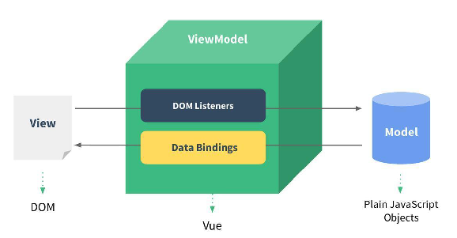
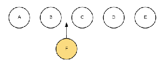
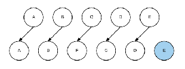

# vue01

## 1 Vue简介（了解）

### 1.1 Vue是什么？

- Vue (读音 /vjuː/，类似于 view)，不要读错。

- Vue是一个**渐进式**的框架，什么是渐进式的呢？（只是单一的数据双向绑定的框架，包含一些基础语法）
  - 渐进式意味着你可以将Vue作为你应用的一部分嵌入其中，带来更丰富的交互体验。
  - 或者如果你希望将更多的业务逻辑使用Vue实现，那么Vue的核心库以及其生态系统。
  - 比如Core+Vue-router（前端路由）+Vuex（状态管理）+axios（网路请求库），也可以满足你各种各样的需求。
  - vue-router等都是第三方库，需要引入使用
- Vue有很多特点和Web开发中常见的高级功能
  - 解耦视图和数据（操作数据，不会直接操作DOM-- vue库实现）
  - 可复用的组件
  - 前端路由技术（vue-router）
  - 状态管理(vueX -- 管理所有组件的公用数据)
  - 虚拟DOM（json对象 -- 底层dom 底层实现需要操作虚拟dom）

这些特点，你不需要一个个去记住，我们在后面的学习和开发中都会慢慢体会到的，一些技术点我也会在后面进行讲解。

- 学习Vuejs的前提？
  - 从零学习Vue开发，并不需要你具备其他类似于Angular、React，甚至是jQuery的经验。
  - 但是你需要具备一定的HTML、CSS、JavaScript基础。


## 2 Vue 安装使用（理解）

### 2.1 项目里引入Vue的方式

使用一个框架，我们第一步要做什么呢？安装下载它

- 安装Vue的方式有很多：

  - 方式一：直接CDN引入

  ```html
  <!-- 开发环境版本，包含了有帮助的命令行警告 --> 
  <script src="https://cdn.jsdelivr.net/npm/vue/dist/vue.js"></script>
  <!-- 生产环境版本，优化了尺寸和速度 -->
  <script src="https://cdn.jsdelivr.net/npm/vue"></script>
  ```

  - 方式二：下载和引入

  ```
  // 开发环境 https://vuejs.org/js/vue.js
  // 生产环境 https://vuejs.org/js/vue.min.js
  ```

  - 方式三：NPM（包管理器）安装

    后续通过Vue-Cli4（vue官方的脚手架）方式引入，我们使用该方式


**添加VSCode的模板：**

> 文件 -> 首选项 -> 用户代码片段，在输入框内输入html.json，用下面的代码覆盖掉原来的即可，下次新建html文件直接输入**hv**，然后按下回车即可

```json
{
	"html:5": {
		"prefix": "hv",
		"body": [
			"<!DOCTYPE html>",
			"<html>",
			"<head>",
				"\t<meta charset=\"UTF-8\">",
				"\t<meta name=\"viewport\" content=\"width=device-width, initial-scale=1.0\">",
				"\t<meta http-equiv=\"X-UA-Compatible\" content=\"ie=edge\">",
				"\t<title></title>",
				"\t<script src=\"https://cdn.jsdelivr.net/npm/vue/dist/vue.js\"></script>",
			"</head>",
			"<body>",
				
			"</body>",
			"</html>",
		],
		"description": "HTML5"
	}
}
```


### 2.2 Hello Vue案例

```html
...
  <!-- 通过src引入vuejs --> 
  <script src="https://cdn.jsdelivr.net/npm/vue/dist/vue.js"></script>
</head>
<body>
  <div id="app">
    {{aa}}
  </div>
</body>

<script>
  new Vue({
    el:'#app', // 挂载在页面哪一个标签上
    data: {
      aa: 'Hello Vue'
    }
  })
</script>
...
```

> 上面的代码做了什么事情？
>
> 1. 先看js代码，会发现创建了一个Vue对象
>
> 2. 创建Vue对象的时候，传入了一个options：{}
>
>       2.1 {}中的el属性：该属性决定了这个Vue对象挂载到哪一个元素上，很明显，我们这里挂载到了id为app的元素上。
>
>       2.2 {}中包含了data属性：该属性中通常会存储一些数据，好像上面例子中的aa就是直接定义出来的数据


### 2.3 Vue体验案例

```html
<script src="https://cdn.jsdelivr.net/npm/vue/dist/vue.js"></script>
</head>
<body>
  <div id="app">
    <span>姓名：{{obj.name}} 年龄：{{obj.age}} 性别：{{obj.sex}}</span>
  </div>
</body>
<script>
  new Vue({
    el: '#app',
    data: {
      obj:{
        name: '张三',
        age: 14,
        sex: '男'
      }
    }
  })
</script>
```


### 2.4 双向绑定案例

需求：输入框输入数据，会显示到 `span` 元素上，分别通过 `js` 和 `vue` 实现

```html
<body>
  <div id="app">
    <input type="text" id="input"/>
    <span id="span"></span>
  </div>
  <script>
    var inputObj = document.getElementById('input');
    var spanObj = document.getElementById('span');

    inputObj.oninput = function() {
      spanObj.innerHTML = this.value;
    }
  </script>
</body>
```


```html
...  
<script src="https://cdn.jsdelivr.net/npm/vue"></script>
</head>
<body>
  <div id="app">
    <input type="text" id="input" v-model="inputVal"/>
    <span id="span">{{inputVal}}</span>
  </div>
  <script>
    new Vue({
      el: '#app',
      data: {
        inputVal:''
      }
    })
  </script>
</body>
...
```


## 3 Vue中的MVVM（掌握）

### 3.1 什么是MVVM？

> 1. View层：
>
>    视图层，在前端里就是我们常说的DOM层，主要作用是给用户展示各种信息；
>
> 2. Model层：
>
>    数据层，数据可能是我们自定定义的数据，或者是从网络请求下来的数据；
>
> 3. ViewModel层：
>
>    视图模型层，是View层和Model层沟通的桥梁；一方面它实现了数据绑定（Data Binding），将Model的改变实时反应到View中；另一方面它实现了DOM监听，当DOM发生改变可以对应改变数据（Data）





补充：MVC（M：Model模型，V：View视图，C：Controller控制器）


## 4 模板语法（掌握）

### 4.1 插值操作

#### 4.1.1 如何将data中的定义的数据，展示到HTML中呢？

前面已经通过Mustache语法（也就是双大括号），Mustache：胡子/胡须 {{}} **插值语法**


#### 4.1.2 v-pre（不会编译）

> 跳过这个元素和它的子元素的编译过程。可以用来显示原始 Mustache 标签。跳过大量没有指令的节点会加快编译。


#### 4.1.3 v-html

> 相当于innerHtml，但动态渲染任意的HTML元素，可能会导致XSS攻击；


#### 4.1.4 v-text

> v-text作用和Mustache 比较相似，都是用于数据显示在界面中


#### 4.1.6 v-cloak

> cloak：斗篷，遮挡物；浏览器可能会直接显示未编译的Mustache标签，所以v-cloak可以避免这个问题


例子：

```html
<!DOCTYPE html>
<html lang="en">
<head>
  <meta charset="UTF-8">
  <meta name="viewport" content="width=device-width, initial-scale=1.0">
  <meta http-equiv="X-UA-Compatible" content="ie=edge">
  <title>Document</title>
  <style>
    [v-cloak] {
      display: none;
    }
  </style>
</head>
<body>
  <div id="app">
    <div v-html="htmlTxt"></div>
    <div v-text="textTxt"></div>
    <div v-pre>{{123}}</div>
    <div v-cloak>hello {{textTxt}}</div>
  </div>
</body>
<script src="https://cdn.jsdelivr.net/npm/vue/dist/vue.js"></script>
<script>
  let vm = new Vue({
    el: '#app',
    data: {
      htmlTxt: '<p><strong>我是html</strong></p>',
      textTxt: 'Vue'
    }
  })
</script>
</html>
```


### 4.2 显示隐藏操作

#### 4.2.1 v-show、v-if

> v-if 根据条件渲染或者销毁元素，而v-show只会控制元素的显示和隐藏，相当于改变display值


#### 4.2.2 v-on

> 为元素绑定事件可以直接在元素上 `v-on:click="方法名称()"` ，或者简写成 `@click="方法名称()"`
>
> 对应的方法要写在Vue对象中的 `methods` 中，在指令中想要访问data属性中的数据，可以通过this加上自己定义的属性名即可，`this.自定义属性名称`


 选项卡例子：

```html
<!DOCTYPE html>
<html lang="en">

<head>
  <meta charset="UTF-8">
  <meta name="viewport" content="width=device-width, initial-scale=1.0">
  <meta http-equiv="X-UA-Compatible" content="ie=edge">
  <title>Document</title>
  <script src="https://cdn.jsdelivr.net/npm/vue/dist/vue.js"></script>
  <style>
    * {
      margin: 0;
      padding: 0;
    }

    li {
      display: inline-block;
      width: 200px;
      height: 200px;
      background-color: pink;
    }

    button.active {
      color: red;
    }
  </style>
</head>

<body>
  <div id="app">
    <button class="active" @click="toggle(1)">1</button>
    <button @click="toggle(2)">2</button>
    <button @click="toggle(3)">3</button>
    <ul>
      <li v-show="a === 1">1</li>
      <li v-show="a === 2">2</li>
      <li v-show="a === 3">3</li>
    </ul>
  </div>
</body>

<script>
  new Vue({
    el: '#app',
    data: {
      a: 1,
      b: 2
    },
    methods: {
      toggle(staus) {
        this.a = staus
      }
    }
  })
</script>

</html>
```


### 4.3 属性绑定

#### 4.3.1 v-bind介绍

> 前面我们都是通过指令来将值插入到我们的标签内容中，但除了内容外，我们还需要动态绑定某些属性，比如：a标签中的href属性，img标签中的src属性；这个时候我们就可以使用v-bind指令，它的作用就是可以动态绑定属性。


例子：

```html
<!DOCTYPE html>
<html lang="en">
<head>
  <meta charset="UTF-8">
  <meta name="viewport" content="width=device-width, initial-scale=1.0">
  <meta http-equiv="X-UA-Compatible" content="ie=edge">
  <title>Document</title>
  <script src="https://cdn.jsdelivr.net/npm/vue/dist/vue.js"></script>
</head>
<body>
  <div id="app">
    
    <a :href="href">Vue官网</a>
  </div>
</body>
<script>
  new Vue({
    el: '#app',
    data: {
      src: 'https://vuejs.org/images/logo.png',
      href: 'https://vuejs.org/'
    }
  })
</script>
</html>
```


**注意点**

> `v-bind` 和 `v-on` 一样也有简写的方式，`v-bind:src=""` 可以简写成 `:src=""`


#### 4.3.2 v-bind绑定class

> 很多时候，我们希望能动态切换class，选中字体颜色变红，初始状态字体为黑色；绑定class有两种方式：对象语法，数组语法。


- 对象语法

  - 用法一：直接通过{}绑定一个类

    ```html
    <style>.active {color: red;}</style>
    ...
    <h2 :class="{'active': isActive}">Hello Vue!</h2>
    ...
    <script>
    	new Vue({
            el: '#app',
            data: {
                isActive: true
            }
        })
    </script>
    ```

  - 用法二：和普通的类同时存在，并不冲突

    ```html
    <style>
        .active {color: red;}
        .line {text-decoration: underline;}
        .title {font-size: 20px;}
    </style>
    ...
    
    <h2 class="title" :class="{'active': isActive, 'line': isLine}">Hello World</h2>
    ...
    <script>
    	new Vue({
            el: '#app',
            data: {
                isActive: true,
                isLine: false
            }
        })
    </script>
    ```

  - 如果过于复杂，可以放在一个methods或者computed中

    ```html
    <style>
        .active {color: red;}
        .line {text-decoration: underline;}
        .title {font-size: 20px;}
    </style>
    ...
    <h2 class="title" :class="classes()">Hello World</h2>
    ...
    
    <script>
    	new Vue({
            el: '#app',
            data: {
                isActive: true,
                isLine: false
            },
            methods: {
              classes() {
                return {
                  'active': this.isActive,
                  'line': this.isLine
                }
              }
            }
        })
    </script>
    ```

- 数组语法

  - 用法一：通过[]来绑定一个类

    ```html
    <style>.active {color: red;}</style>
    ...
    <h2 :class="['active']">Hello Vue!</h2>
    ...
    <script>
    	new Vue({
            el: '#app',
            data: {
                
            }
        })
    </script>
    ```

  - 用法二：和普通的类同时存在，并不冲突

    ```html
    <style>
    	.active {color: red;}
        .line {text-decoration: underline;}
        .title {font-size: 20px;}
    </style>
    ...
    <h2 class="title" :class="['active', 'line']">Hello Vue!</h2>
    ...
    <script>
    	new Vue({
            el: '#app',
            data: {
                
            }
        })
    </script>
    ```

  - 用法三：如果过于复杂，可以放在一个methods或者computed中

    ```html
    <style>
    	.active {color: red;}
        .line {text-decoration: underline;}
        .title {font-size: 20px;}
    </style>
    ...
    <h2 class="title" :class="classes()">Hello Vue!</h2>
    ...
    <script>
    	new Vue({
            el: '#app',
            data: {
                
            },
            methods: {
              classes() {
                return ['active', 'line']
              }
            }
        })
    </script>
    ```

    

#### 4.3.3 v-bind绑定style

> 我们可以利用v-bind:style来绑定一个内嵌样式。
>
> 注意：
>
> 1. 我们可以使用驼峰式语法：比如font-size ---> `fontSize`
> 2. 或短横线分隔 `font-size`
>
> 绑定class有两种方式：
>
> 1. 对象语法
> 2. 数组语法


**对象语法**

```html
<div :style="{color: currentColor, fontSize: fontsize + 'px'}">
    Hello Vue
</div>
...
<script>
  new Vue({
    el: '#app',
    data: {
      currentColor: 'pink',
      fontsize: 30
    }
  })
</script>
```


**数组语法**

```html
<div :style="[colorStyle, fontStyle]">
    Hello Vue
</div>
...
<script>
  new Vue({
    el: '#app',
    data: {
      colorStyle: {color: 'pink'},
      fontStyle: {'font-size': '20px'}
    }
  })
</script>
```

### 4.4 循环遍历v-for、key

> v-for格式：item in items形式

```html
<!DOCTYPE html>
<html lang="en">
<head>
    <meta charset="UTF-8">
    <meta name="viewport" content="width=device-width, initial-scale=1.0">
    <meta http-equiv="X-UA-Compatible" content="ie=edge">
    <title>Document</title>
    <script src="https://cdn.jsdelivr.net/npm/vue/dist/vue.js"></script>
</head>
<body>
    <div id="app">
        <div>
            <input type="text" v-model="inputVal"/>
            <button @click="add">添加</button>
        </div>
        
        <ul>
            <li v-for="(item,index) in arr" v-bind:key="index">
                <input type="checkbox"/>
                {{item.name}}
            </li>
        </ul>
    </div>
</body>
<script>
    new Vue({
        el: '#app',
        data: {
            arr: [
                {id: 1, name: 'Vue'},
                {id: 2, name: 'React'},
                {id: 3, name: 'Angular'}
            ],
            inputVal: ''
        },
        methods: {
            add() {
                this.arr.unshift({id: this.arr.length + 1, name: this.inputVal})
            }
        }
    })
</script>
</html>
```


**组件的key属性**

> 官方推荐我们使用v-for时，给对应的元素或组件添加一个key属性。
>
> 为什么需要这个key属性呢（了解）？
>
> 1. 这个其实和Vue的虚拟DOM的Diff算法有关系。
>
> 当某一层有很多相同节点时，也就是列表节点时，我们插入一个新的节点到列表中
>
> 1. 在B和C之间加一个F，Diff算法默认执行起来时这样的；即把C更新成F，D更新成C，E更新成D，最后再插入一个新的E，这样的效率也太低了。
>
> 当我们使用key来为每一个节点做唯一标识
>
> 1. Diff算法会以key作为标识来识别此节点，找到正确的位置区插入新的节点，所以**key的作用是为了高效的更新虚拟DOM**






### 4.5 计算属性

<https://cn.vuejs.org/v2/guide/computed.html>

> 我们知道，在模板中可以直接通过插值语法显示一些data中的数据。但是某些情况下，我们可能需要对数据进行转化后再显示，或者需要将多个数据结合起来进行显示


**例子**

```html
<div id="app">
    书籍总价值：{{totalPrice}}
</div>
...
<script>
  new Vue({
    el: '#app',
    data: {
     books: [
       {name: 'Vuejs入门', price: 99, count: 3},
       {name: 'Vuejs底层', price: 89, count: 1},
       {name: 'Vuejs从入门到放弃', price: 19, count: 5},
     ]
    },
    computed: {
      totalPrice() {
        return this.books.reduce((prev, current) => {
          prev += current.price * current.count
          return prev
        }, 0)
      }
    }
  })
</script>
```


> 为什么会有这样的一个属性呢，用methods都可以实现我们的功能，为什么多了这样一个计算属性的东西呢？
>
> 因为计算属性会进行缓存，如果多次使用，计算属性只会调用一次。**多次使用，如果没有改变，只会调用一次，对计算性能比较好**


```html
<div id="app">
    <div>{{fullName}}</div>
    <div>{{fullName}}</div>
    <div>{{fullName}}</div>
    <div>{{getFullName()}}</div>
    <div>{{getFullName()}}</div>
    <div>{{getFullName()}}</div>
</div>

<script>
  const vm = new Vue({
    el: '#app',
    data: {
      lastName: 'Li',
      firstName: 'kob'
    },
    computed: {
      fullName() {
        console.log('执行了fullName的计算属性')
        return this.firstName + ' ' + this.lastName
      }
    },
    methods: {
      getFullName() {
        console.log('执行了getfullName的方法-------')
        return this.firstName + ' ' + this.lastName
      }
    }
  })
</script>
```