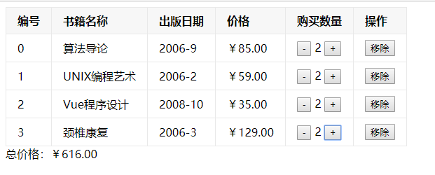

# Vue02

## 1. v-model

> 表单控件在实际开发中是非常常见的，Vue中使用v-model指令来实现表单元素和数据的双向绑定。


**简单的input例子：**

```html
<!DOCTYPE html>
<html lang="en">

<head>
  <meta charset="UTF-8">
  <meta name="viewport" content="width=device-width, initial-scale=1.0">
  <meta http-equiv="X-UA-Compatible" content="ie=edge">
  <title>Document</title>
  <script src="https://cdn.jsdelivr.net/npm/vue/dist/vue.js"></script>
</head>

<body>
  <div id="app">
    <input type="text" v-model="msg" />
    <p>{{msg}}</p>
  </div>
</body>
<script>
  const vm = new Vue({
    el: '#app',
    data: {
      msg: ''
    }
  })
</script>

</html>
```

> 案例解析：
>
> 1. 当我们在输入框内容时，因为input使用了v-model绑定了msg， 所以会实时将输入的内容传递给定义的属性msg，data里面的属性msg也就发生改变。
> 2. 因为上面我们使用了Mustache语法，所以当属性msg发生改变的时候，DOM也会跟着改变。
> 3. 所以，通过v-model实现了双向的数据绑定。


**v-model原理**

`v-model` 其实是个语法糖，它背后本质上包含了两个操作：

1. `v-bind` 绑定input元素的value属性
2. `v-on` 指令绑定input元素的input事件

```html
<input type="text" v-model="msg"/>
<!-- 等同于 -->
<input type="text" v-bind:value="msg" v-on:input="msg = $event.target.value"/>
```


**v-model: select**

```html
<body>
  <div id="app">
    <select v-model="mySelect">
      <option value="orange">橙子</option>
      <option value="apple">苹果</option>
      <option value="banana">香蕉</option>
    </select>
  </div>
</body>
<script>
  const vm = new Vue({
    el: '#app',
    data: {
      mySelect: 'banana'
    }
  })
</script>
```


## 2. 数组操作

> 常用操作： push（返回数组长度）、unshift（返回数组长度）、shift（返回删除的值）、pop（返回删除的值）、slice（返回新的数组）、splice、concat（返回新数组）
>
> 新增迭代方法：forEach（没有返回值）、map、filter、reduce


## 3 自定义过滤器

> Vue.js 允许你自定义过滤器，可被用于一些常见的文本格式化。过滤器可以用在两个地方：**双花括号插值和 v-bind 表达式** ( 后者从 2.1.0+ 开始支持 )。过滤器应该被添加在 JavaScript 表达式的尾部，由“管道”符号指示：


**格式化时间：**

```html
<body>
  <div id="app">
    <div>{{datetime | formatDate}}</div>
  </div>
</body>
<script>
  const vm = new Vue({
    el: '#app',
    data: {
      datetime: 1569219175397
    },
    filters: {
      formatDate(value) {
        date = new Date(value)
        return date.getFullYear() + '-' + (date.getMonth() + 1) + '-' + date.getDate()
      }
    }
  })
</script>
```


```js
// 全局方式引入：
Vue.filter('formatDate', function (value) {
    date = new Date(value)
    return date.getFullYear() + '-' + (date.getMonth() + 1) + '-' + date.getDate()
})
```


## 4. 图书购物车例子



```html
<!DOCTYPE html>
<html lang="en">

<head>
  <meta charset="UTF-8">
  <meta name="viewport" content="width=device-width, initial-scale=1.0">
  <meta http-equiv="X-UA-Compatible" content="ie=edge">
  <title>Document</title>
  <script src="https://cdn.jsdelivr.net/npm/vue/dist/vue.js"></script>
  <style>
    table {
      border: 1px solid #e9e9e9;
      border-collapse: collapse;
      border-spacing: 0;
    }

    td,
    th {
      padding: 8px 16px;
      border: 1px solid #e9e9e9;
      text-align: left;
    }
    th {
      background-color: #f7f7f7;
    }
  </style>
</head>

<body>
  <div id="app">
    <table>
      <thead>
        <tr>
          <th v-for="(title,index) in titles" :key="index" v-text="title"></th>
        </tr>
      </thead>
      <tbody>
        <tr v-for="(book, index) in books" :key="index">
          <td v-text="index"></td>
          <td v-text="book.name"></td>
          <td v-text="book.date"></td>
          <td>{{book.price | priceRule}}</td>
          <td>
            <button @click="sub(index)">-</button>
            <span>{{book.num}}</span>
            <button @click="add(index)">+</button>
          </td>
          <td>
            <button @click="remove(index)">移除</button>
          </td>
        </tr>
      </tbody>
    </table>
    <div>总价格：{{totalPrice | priceRule}}</div>
  </div>
</body>
<script>
  const vm = new Vue({
    el: '#app',
    data: {
      titles: ['编号', '书籍名称', '出版日期', '价格', '购买数量', '操作'],
      books: [{
          name: '算法导论',
          date: '2006-9',
          price: 85,
          num: 1
        },
        {
          name: 'UNIX编程艺术',
          date: '2006-2',
          price: 59,
          num: 1
        },
        {
          name: 'Vue程序设计',
          date: '2008-10',
          price: 35,
          num: 1
        },
        {
          name: '颈椎康复',
          date: '2006-3',
          price: 129,
          num: 1
        },
      ]
    },
    filters: {
      priceRule(value) {
        return '￥' + value.toFixed(2)
      }
    },
    computed: {
      totalPrice() {
        return this.books.reduce((prev, current)=> {
          prev +=current.num * current.price
          return prev
        }, 0)
      }
    },
    methods: {
      add(idx){
        this.books[idx].num++
      },
      sub(idx){
        this.books[idx].num--
        if (this.books[idx].num == 0) {
          this.books.splice(idx, 1)
        }
      },
      remove(idx){
        this.books.splice(idx, 1)
      }
    }
  })
</script>

</html>
```


## 5. 本地存储

### 1. localStorage永久存储

```js
// 添加数据；setItem的value值是字符串类型的数据
localStorage.setItem('name','张三')；
// 获取数据
localStorage.getItem('name'); // 张三
// 清空
localStorage.clear();
```

**注意事项：**

> 1. 除非是主动删除，不然是不会自动删除的
> 2. 一般浏览器存储的大小是5M
>
>  5M = 1024 * 5kb


### 2. sessionStorage临时会话存储

```js
// 添加数据；setItem的value值是字符串类型的数据
sessionStorage.setItem('name','张三')；
// 获取数据
sessionStorage.getItem('name'); // 张三
// 清空
sessionStorage.clear();
```

**注意事项：**

> 1. 关闭浏览器会自动清空数据
> 2. 一般浏览器存储的大小是5M


### 3. cookie

> 1. cookie:
>
> 网站中，**http请求时无状态**的。也就是第一次登陆成功（发送请求），第二次请求服务器依然不知道是哪一个用户。这时候的cookie就是解决这个问题的，第一次登陆后服务器返回数据（cookie）给浏览器，然后浏览器保存在本地，当该用户发送第二次请求，浏览器自动会把上次请求存储的cookie数据自动带上给服务器，服务器根据客户端的cookie来判断当前是哪一个用户。cookie存储有大小限制，不同浏览器不一样，一般是4kb，所以cookie只能存储小量数据。
>
> 4kb = 4 * 1024 byte (字节) =  4 * 1024 * 8 bit（位）
>
>   服务器会把第一次登陆后服务器返回的cookie存储到浏览器中
>
> ​    发一个请求给后端（自动带上第一次登陆后的cookie），拿回我自己购物车的列表
>
>   服务端接收到这个请求后，根据浏览器带上的cookie做出判断，判断当前是哪一个用户
>
> 
>
> 2. session：
>
> session和cookie的作用有点类似，也是存储用户相关信息。不同的是cookie存储在浏览器，而session存储在服务器。


