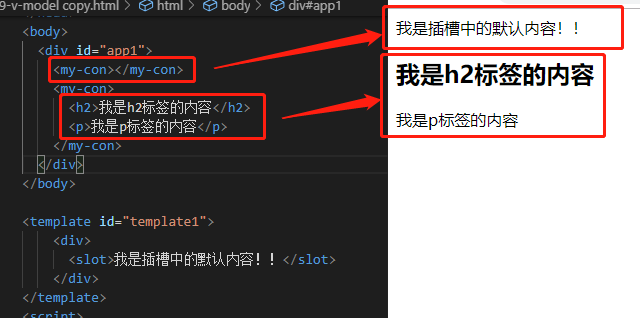
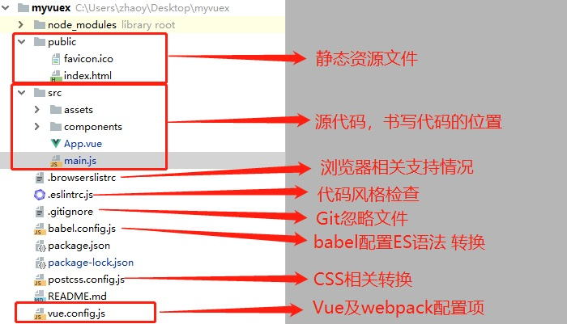

# Vue-cli

## 1. 插槽（slot）


### 1. 为什么使用slot

> slot翻译为插槽，组件的插槽：
>
> 1. 组件的插槽也是为了让我们封装的组件更加具有扩展性。
> 2. 让使用者可以决定组件内容的一些内容到底展示什么。


**京东头部导航栏例子：**


### 2. 如何在组件中使用slot呢？

> 如何去封装这类的组件呢？
>
> 1. 它们也很多区别，但是也有很多共性。
> 2. 如果，我们每一个单独去封装一个组件，显然不合适：比如每个页面都返回，这部分内容我们就要重复去封装。
> 3. 但是，如果我们封装成一个，好像也不合理：有些左侧是菜单，有些是返回，有些中间是搜索，有些是文字，等等
>
> 如何封装合适呢？**抽取共性，保留不同**
>
> 1. 最好的封装方式就是将共性抽取到组件中，将不同暴露为插槽。
> 2. 一旦我们预留了插槽，就可以让使用者根据自己的需求，决定插槽中插入什么内容。
> 3. 是搜索框，还是文字，还是菜单。由调用者自己来决定。


### 3. slot的基本使用

> 了解了为什么用slot，我们再来谈谈如何使用slot？
>
> 1. 在子组件中，使用特殊的元素`<slot>`就可以为子组件开启一个插槽。
> 2. 该插槽插入什么内容取决于父组件如何使用。



```html
<!DOCTYPE html>
<html lang="en">

<head>
  <meta charset="UTF-8">
  <meta name="viewport" content="width=device-width, initial-scale=1.0">
  <meta http-equiv="X-UA-Compatible" content="ie=edge">
  <title>Document</title>
  <style>
    
  </style>
  <script src="https://cdn.jsdelivr.net/npm/vue/dist/vue.js"></script>
</head>
<body>
  <div id="app1">
    <my-con></my-con>
    <my-con>
      <h2>我是h2标签的内容</h2>
      <p>我是p标签的内容</p>
    </my-con>
  </div>
</body>

<template id="template1">
    <div>
      <slot>我是插槽中的默认内容！！</slot>
    </div>
</template>
<script>
  var componentA = {
    template: '#template1',
  }
  const vm1 = new Vue({
    el: '#app1',
    data: {
      
    },
    components: {
      myCon: componentA
    }
  })
</script>

</html>
```


### 4. 具名插槽

> 当子组件的功能复杂时，子组件的插槽可能并非是一个。
>
> 1. 比如我们封装一个导航栏的子组件，可能就需要三个插槽，分别代表左边、中间、右边。
> 2. 那么，外面在给插槽插入内容时，如何区分插入的是哪一个呢？
> 3. 这个时候，我们就需要给插槽起一个名字
>
> 如何使用具名插槽呢？
>
> 1. 非常简单，只要给slot元素一个name属性即可
> 2. `<slot name='myslot'></slot>`


```html
<!DOCTYPE html>
<html lang="en">

<head>
  <meta charset="UTF-8">
  <meta name="viewport" content="width=device-width, initial-scale=1.0">
  <meta http-equiv="X-UA-Compatible" content="ie=edge">
  <title>Document</title>
  <style>
    
  </style>
  <script src="https://cdn.jsdelivr.net/npm/vue/dist/vue.js"></script>
</head>
<body>
  <div id="app1">
    <my-con>
      <div slot="left">左侧</div>
      <div slot="right">右侧</div>
      <div slot="center">中间</div>
    </my-con>
  </div>
</body>

<template id="template1">
    <div>
      <slot name="left">我是左侧插槽中的默认内容！！</slot>
      <slot name="center">我是中间侧插槽中的默认内容！！</slot>
      <slot name="right">我是右侧插槽中的默认内容！！</slot>
    </div>
</template>
<script>
  var componentA = {
    template: '#template1',
  }
  const vm1 = new Vue({
    el: '#app1',
    data: {
      
    },
    components: {
      myCon: componentA
    }
  })
</script>

</html>
```


### 5. 作用域插槽

> 默认情况下，父组件使用子组件，插槽数据默认是拿父组件的数据，而不是子组件拿数据。
>
> **作用域插槽**在父组件使用我们的子组件时， 插槽的数据从子组件中拿到数据，而不是从父组件拿到。


```js
<!DOCTYPE html>
<html lang="en">

<head>
  <meta charset="UTF-8">
  <meta name="viewport" content="width=device-width, initial-scale=1.0">
  <meta http-equiv="X-UA-Compatible" content="ie=edge">
  <title>Document</title>
  <style>

  </style>
  <script src="https://cdn.jsdelivr.net/npm/vue/dist/vue.js"></script>
</head>

<body>
  <div id="app1">
    <my-con>
      <template slot-scope="scope" slot="content">
        <ul>
          <li v-for="item in scope.data">{{item}}</li>
        </ul>
        <p v-for="item in scope.language">{{item}}</p>
      </template>
    </my-con>
  </div>
</body>

<template id="template1">
  <div>
    <slot :data="lists" :language="languages" name="content"></slot>
  </div>
</template>
<script>
  var componentA = {
    template: '#template1',
    data() {
      return {
        lists: ['vue', 'react', 'angular'],
        languages: ['前端', 'UI', 'JAVA']
      }
    }
  }
  const vm1 = new Vue({
    el: '#app1',
    components: {
      myCon: componentA
    }
  })
</script>

</html>
```


## 2. 什么是Vue CLI

> 1. 如果你只是简单写几个Vue的Demo程序, 那么你不需要Vue CLI.
>
> 2. 如果你在开发大型项目, 那么你需要, 并且必然需要使用Vue CLI
>    1. 使用Vue.js开发大型应用时，我们需要考虑代码目录结构、项目结构和部署、热加载、代码单元测试等事情。
>    2. 如果每个项目都要手动完成这些工作，那无疑效率比较低效，所以通常我们会使用一些脚手架工具来帮助完成这些事情。
> 3. 那究竟什么是Vue-CLI呢？
>    1. CLI（Command Line Interface）.翻译为命令行界面，就是我们所说的脚手架。
>    2. Vue CLI是一个官方发布的vue项目脚手架
>    3. 使用vue-cli可以快速搭建Vue环境和webpack配置


## 3. Vue CLI使用准备

### Node版本

> Vue CLI 需要Node.js 8.9 或者更高版本（推荐使用 8.11.0+）。你可以使用`nvm` 或 `nvm-window`来管理电脑上面的Node版本。


**安装Vue CLI脚手架的包：**

```js
npm install -g @vue/cli
# OR
yarn global add @vue/cli
```

安装之后，你就可以在命令行中访问 `vue` 命令。你可以通过简单运行 `vue`，看看是否展示出了一份所有可用命令的帮助信息，来验证它是否安装成功。

你还可以用这个命令来检查其版本是否正确 ：

```bash
vue --version
```


如果安装比较慢，可以把npm切换成淘宝的源：

```
npm config set registry https://registry.npm.taobao.org/
```


## 4. 创建项目

### 初始化项目

**vue create**

运行以下命令来创建一个新项目：

```js
vue create hello-world
```


你会被提示选取一个 preset。你可以选默认的包含了基本的 Babel + ESLint 设置的 preset，也可以选“手动选
择特性”来选取需要的特性。


这个默认的设置非常适合快速创建一个新项目的原型，而手动设置则提供了更多的选项，它们是面向生产的项目更加需要的。


如果你决定手动选择特性，在操作提示的最后你可以选择将已选项保存为一个将来可复用的 preset


> ~/.vuerc
>
> 被保存的 preset 将会存在用户的 home 目录下一个名为 `.vuerc` 的 JSON 文件里。如果你想要修改被保存的 preset / 选项，可以编辑这个文件。
>
> 在项目创建的过程中，你也会被提示选择喜欢的包管理器或使用[淘宝 npm 镜像源](https://npm.taobao.org/)以更快地安装依赖。这些选择也将会存入 `~/.vuerc`。


### 使用图形化界面

你也可以通过 `vue ui` 命令以图形化界面创建和管理项目：

```bash
vue ui
```

上述命令会打开一个浏览器窗口，并以图形化界面将你引导至项目创建的流程。


### 项目结构

**项目目录**




```js
node_modules
public // 静态资源文件
    |-favicon.ico
    |-index.html
src // 项目源代码，书写代码的地方
    |-assets
    |-App.vue
    |-main.js
.browserslistrc    // 浏览器相关支持情况
.eslintrc.js       // 代码相关支持情况
.gitignore         // Git忽略文件
babel.config.js    // babel配置ES语法 转换
package-lock.json  // npm安装依赖库的具体信息
package.json       // npm依赖库版本信息
postcss.config.js  // css相关转换
README.md          // 项目说明
vue.config.js      // Vue及webpack配置项
```


### vue.config.js

`vue.config.js` 是一个可选的配置文件，如果项目的 (和 `package.json` 同级的) 根目录中存在这个文件，那么它会被 `@vue/cli-service` 自动加载。你也可以使用 `package.json` 中的 `vue` 字段，但是注意这种写法需要你严格遵照 JSON 的格式来写。

这个文件应该导出一个包含了选项的对象：

```js
// vue.config.js
module.exports = {
  // 选项...
}
```


**webpack中添加别名**

```js
module.exports = {
    //1.基础的配置方式 
    configureWebpack: {
      resolve: {
        alias: {
          'components': '@/components',
          'pages': '@/pages'
        }
      }
    },

    //2.利用webpack4的webpack-chain来配置 
    chainWebpack: (config) => {
      config.resolve.alias
        .set('@', resolve('src'))
        .set('components', resolve('src/components'))
    }
  }
```


