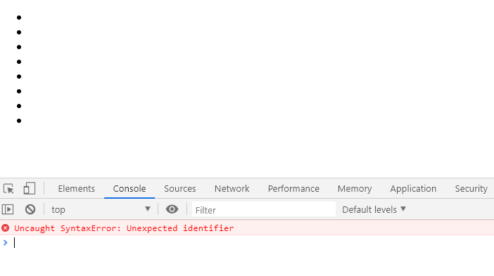
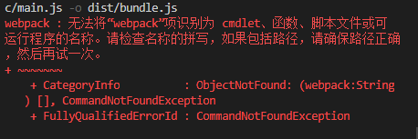
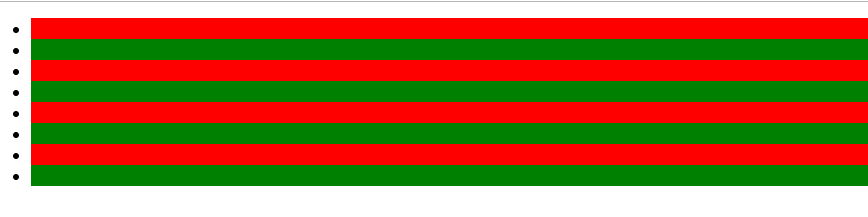
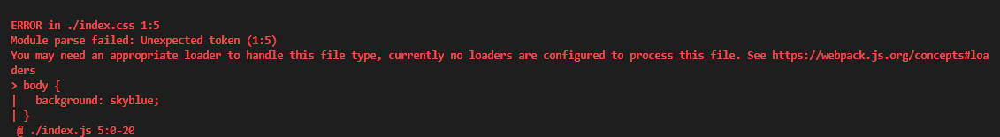
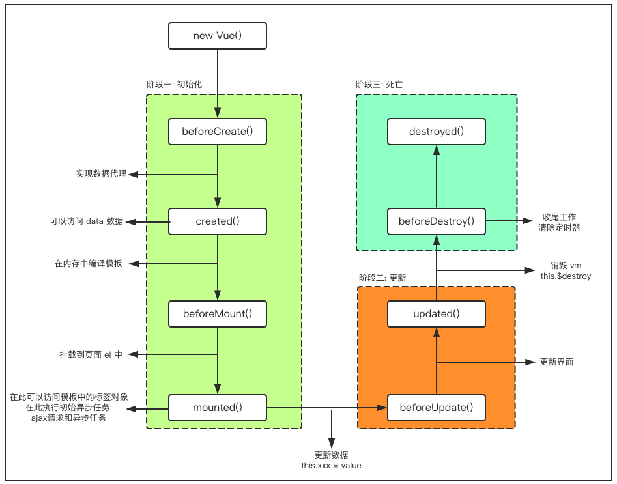
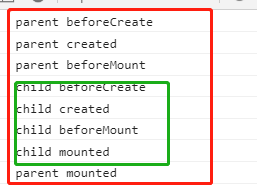
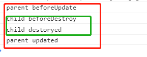
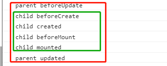

# Vue05

## 1. Webpack

> 从本质上来说，webpack是一个**静态模块打包工具**。
>
> 要想让我们写好的模块化代码在各式各样的浏览器上能做到兼容，就必须借助于其他工具；而webpack的其中一个核心就是让我们可以进行模块化开发，并帮我们处理模块间的依赖关系。不仅仅是Javascript文件，我们的css、图片、json文件等在webpack中都可以当作模块来使用，这就是webpack的模块化概念。


### 1. gulp和webpack

> Gulp侧重于前端开发的 **整个过程** 的控制管理（像是流水线），我们可以通过给gulp配置不通的task（通过Gulp中的gulp.task()方法配置，比如启动server、sass/less预编译、文件的合并压缩等等）来让gulp实现不同的功能，从而构建整个前端开发流程。


> Webpack有人也称之为 **模块打包机** ，由此也可以看出Webpack更侧重于模块打包，当然我们可以把开发中的所有资源（图片、js文件、css文件等）都可以看成模块，最初Webpack本身就是为前端JS代码打包而设计的，后来被扩展到其他资源的打包处理。Webpack是通过loader（加载器）和plugins（插件）对资源进行处理的。


### 2. webpack初体验

#### 1. 生成项目依赖文件

```js
// 执行后生成package.json文件
npm init -y 
```


#### 2. 安装依赖

```js
// 最后的参数-D是安装到package.json的开发依赖devDependencies对象里，也可以用 --save-dev代替
npm install webpack webpack-cli -D
// -S是--save的简写，这样安装的话，会安装到dependencies对象里
npm install jquery -S
```

```js
// package.json
{
  "name": "webpack-demo",
  "version": "1.0.0",
  "description": "",
  "main": "index.js",
  "scripts": {
    "test": "echo \"Error: no test specified\" && exit 1"
  },
  "author": "",
  "license": "ISC",
  "devDependencies": {
    "webpack": "^4.40.2",
    "webpack-cli": "^3.3.9"
  },
  "dependencies": {
    "jquery": "^3.4.1"
  }
}

```

### 3.创建入口文件

`index.html`

```html
<!DOCTYPE html>
<html lang="en">
<head>
  <meta charset="UTF-8">
  <meta name="viewport" content="width=device-width, initial-scale=1.0">
  <meta http-equiv="X-UA-Compatible" content="ie=edge">
  <title>Document</title>
</head>
<body>
  <ul>
    <li></li>
    <li></li>
    <li></li>
    <li></li>
    <li></li>
    <li></li>
    <li></li>
    <li></li>
  </ul>
</body>
<script src="./index.js"></script>
</html>
```


`index.js`

```js
import $ from 'jquery'
$('ul li:even').css({background: 'red'})
$('ul li:odd').css({background: 'green'})
```


在浏览器打开



> 为什么会这样？因为浏览器并不兼容import引入模块这种方式，所以我们要用到webpack打包

### 4. 通过webpack打包

```js
// 执行命令
webpack index.js -o dist/bundle.js
```



> 出现这个报错，这是因为命令行执行时候会找全局的webpack，但是我们并没有安装全局的webpack，所以我们可以安装全局webpack，或者是使用脚本方式启动


**package.json**

```js
{
  "name": "webpack-demo",
  "version": "1.0.0",
  "description": "",
  "main": "index.js",
  "scripts": {
    "start": "webpack index.js -o dist/bundle.js"
  },
  "author": "",
  "license": "ISC",
  "devDependencies": {
    "webpack": "^4.40.2",
    "webpack-cli": "^3.3.9"
  },
  "dependencies": {
    "jquery": "^3.4.1"
  }
}

```


执行package.json文件中添加的start命令

```js
// 生成 dist文件夹和bundle.js文件
npm run start
```


然后再把index.html原来引入index.js的地方改成是通过webpack生成的bundle.js

```html
<!--index.html文件-->
<!--<script src="./index.js"></script>-->
<script src="./dist/bundle.js"></script>
```


最终浏览器看到的效果：



**优化**

> webpack index.js -o dist/bundle.js 这一句其实是可以写在一个配置文件里


**webpack.config.js：**

```js
const path = require('path');

module.exports = {
  entry: path.join(__dirname, './index.js'),
  output: {
    path: path.join(__dirname, './dist'),
    filename: 'bundle.js'
  }
}
```


**package.json：**

```json
"scripts": {
    "start": "webpack --config webpack.config.js"
  }
```


### 5.webpack-dev-server

> 这时候如果修改index.html的背景颜色red改成是gray，会发现浏览器刷新也没有效果，需要再跑一次`npm run start`命令才有用，这时候就需要webpack-dev-server(热重载)


**安装：**

```js
npm install webpack-dev-server -D
```


**package.json：**

```json
"scripts": {
    "start": "webpack-dev-server --config webpack.config.js --open --port 3002 --hot"
  }
// --open 自动打开浏览器
// --port 服务监听的端口 3002
// --hot  自动更新
```


**index.html**

```html
<script src="./bundle.js"></script>
```


### 6. html-webpack-plugin

安装：`npm i html-webpack-plugin -D`

**webpack.config.js**

```js
const path = require('path');
const HtmlWebpackPlugin = require('html-webpack-plugin');

module.exports = {
  entry: path.join(__dirname, './index.js'),
  output: {
    path: path.join(__dirname, './dist'),
    filename: 'bundle.js'
  },
  plugins: [
    new HtmlWebpackPlugin({
      template: path.join(__dirname, './index.html'),
      filename: 'index.html'
    })
  ]
}
```


> 删掉index.html文件里面的bundle.js引用，因为html-webpack-plugin会自动把打包出来的bundle自动加到我们的index.html代码里


### 7. css-loader

创建一个index.css

**index.css**

```css
body {
    background: skyblue;
}
```


**index.js**

```js
import $ from 'jquery'
$('ul li:even').css({background: 'gray'})
$('ul li:odd').css({background: 'green'})

import './index.css'
```



> 为什么报错，因为webpack默认是不识别`.css`文件的，需要我们通过 `loader`  将 `.css` 文件进行解释成正确的模块。


**安装css-loader和style-loader**

```js
npm install css-loader style-loader -D
// css-loader的作用是将index.css文件解析为webpack能识别的模块，然后打包进bundle.js里面，但是这样样式并未成功显示在浏览器中。
// style-loader的作用就是将打包到bundle.js中的样式绑定到浏览器上，以style标签的形式显示出来
```


**webpack.config.js**

```js
const path = require('path');
const HtmlWebpackPlugin = require('html-webpack-plugin');

module.exports = {
  entry: path.join(__dirname, './index.js'),
  output: {
    path: path.join(__dirname, './dist'),
    filename: 'bundle.js'
  },
  plugins: [
    new HtmlWebpackPlugin({
      template: path.join(__dirname, './index.html'),
      filename: 'index.html'
    })
  ],
  module: {
    rules: [{
      test: /.css$/,
      use: ['style-loader', 'css-loader']
    }]
  }
}
```


> 补充：引入的文件是less
>
> 安装：npm install less-loader less -D
>
> 规则： 
>
> {
>
> ​	test: /.less$/,
>
> ​	use: ['style-loader', 'css-loader', 'less-loader']
>
> }


### 8. ES6 转 ES5 

> 安装 

```js
npm install babel-core babel-loader@7.1.5 babel-plugin-transform-runtime babel-preset-env babel-preset-stage-0 -D 
```


> 配置loader 

```js
{test:/\.js/,use:['babel-loader'],exclude:/node_modules/} 
```

exclude表示排除掉 node_modules下载的依赖项。这样可以加速网站开发，而且我们也只需要对我们的项目src 

源文件进行编译即可。

 

> 新增.babelrc文件 

```json
{ 
    "presets":["env","stage-0"], 
    "plugins":["transform-runtime"] 
} 
```


修改main.js使用es6语法 

```js
class Person { 
    constructor(){ 
    } 
} 

var p = new Person(); 
```


执行命令编译 

```js
npm start 
```


编译后的结果

```js
\n\n var Person = function Person() {\n (0, _classCallCheck3.default)(this, Pe 

rson);\n};\n\nvar p = new Person();\n\n 
```

至此关于webpack的基本配置已经到这里。 


解释 

**babel-present-env** 仅仅包括 babel-present-2015 、2016、2017，不包括： 

**babel-stage-x** ，也不包括 babel-polyfill 

**babel-present-env** 仅仅转换 新版的语法 如：箭头函数，并不转换新版api 如：Array.include转换新版 

api及抹平浏览器之间的差异（兼容ie）需要 babel-polyfill 

**babel-polyfill** 会污染全局，比较暴力。而 `babel-plugin-transfrom-runtime` 是哪里需要就给 

哪里转换。 


## 2. Vue生命周期



### 1. 生命周期简介

> 什么是生命周期： 从Vue创建、运行、到销毁期间，总是伴随着各种各样的事件，这些事件，统称为生命周期。


**生命周期钩子函数：**就是生命周期事件的别名；


### 2. 初始

**beforeCreate：**实例刚刚在内存中被创建出来，此时还没有初始化 `data` 和 `methods` 属性。

**created：**实例已经在内存中创建好，此时 `data`和`methods` 已经创建好，此时还没有开始编译模板

```html
<!DOCTYPE html>
<html lang="en">

<head>
  <meta charset="UTF-8">
  <meta name="viewport" content="width=device-width, initial-scale=1.0">
  <meta http-equiv="X-UA-Compatible" content="ie=edge">
  <title>Document</title>
  <style>

  </style>
  <script src="https://cdn.jsdelivr.net/npm/vue/dist/vue.js"></script>
</head>

<body>
  <div id="app1">
    <input type="text" v-model="msg" />
    <div id="msg">{{msg}}</div>
  </div>
</body>
<script>
  const vm1 = new Vue({
    el: '#app1',
    data: {
      msg: '123'
    },
    beforeCreate() {
      console.log('beforeCreate', this.msg, document.getElementById('msg') && document.getElementById('msg')
        .innerHTML); // beforeCreate undefined {{msg}}
    },
    created() {
      console.log('created', this.msg, document.getElementById('msg') && document.getElementById('msg').innerHTML); // created 123 {{msg}}
    },
  })
</script>

</html>
```

> `beforeCreate：` `data`的数据访问不到，且html还没有编译
>
> `created:` `data` 数据可以访问到，也可以修改，但是模板还没有编译


### 3. 挂载

**beforeMount：**此时已经完成了模板编译，但是还没有挂载到页面中；

**mounted：**这个时候已经把编译好的模板挂载到页面指定的容器里；

```html
<!DOCTYPE html>
<html lang="en">

<head>
  <meta charset="UTF-8">
  <meta name="viewport" content="width=device-width, initial-scale=1.0">
  <meta http-equiv="X-UA-Compatible" content="ie=edge">
  <title>Document</title>
  <style>

  </style>
  <script src="https://cdn.jsdelivr.net/npm/vue/dist/vue.js"></script>
</head>

<body>
  <div id="app1">
    <input type="text" v-model="msg" />
    <div id="msg">{{msg}}</div>
  </div>
</body>
<script>
  const vm1 = new Vue({
    el: '#app1',
    data: {
      msg: '123'
    },
    beforeMount() {
      console.log('beforeMount', this.msg, document.getElementById('msg') && document.getElementById('msg')
        .innerHTML); //beforeMount 123 {{msg}}
    },
    mounted() {
      console.log('mounted', this.msg, document.getElementById('msg') && document.getElementById('msg').innerHTML); //mounted 123 123
    },
  })
</script>

</html>
```

> `beforeMount:` `data` 的数据可以访问和修改，而且此时的模板已经编译好了，还没有更新到页面中
>
> `mounted:` 此时编译的模板更新到页面中了

### 4. 更新

**beforeUpdate：**状态更新之前执行此函数，此时的 `data` 中的数据是最新，但是界面上显示的还是旧的，因为此时还没有开始重新渲染DOM节点；

**updated：**实例更新完毕之后调用此函数，此时`data` 中的状态值和界面上显示的数据，都已经完成了更新，界面已经被重新渲染好了；

```html
<!DOCTYPE html>
<html lang="en">

<head>
  <meta charset="UTF-8">
  <meta name="viewport" content="width=device-width, initial-scale=1.0">
  <meta http-equiv="X-UA-Compatible" content="ie=edge">
  <title>Document</title>
  <style>

  </style>
  <script src="https://cdn.jsdelivr.net/npm/vue/dist/vue.js"></script>
</head>

<body>
  <div id="app1">
    <input type="text" v-model="msg" />
    <div id="msg">{{msg}}</div>
  </div>
</body>
<script>
  const vm1 = new Vue({
    el: '#app1',
    data: {
      msg: '123'
    },
    beforeUpdate() {
      console.log('beforeUpdate', this.msg, document.getElementById('msg') && document.getElementById('msg')
        .innerHTML); // beforeUpdate 1231 123
    },
    updated() {
      console.log('updated', this.msg, document.getElementById('msg') && document.getElementById('msg').innerHTML); // updated 1231 1231
    },
  })
</script>

</html>
```

> **beforeUpdate：** 此时修改输入框的内容，`data`中的数据已经更新了，但是页面上显示的还是旧数据；
>
> **updated：**此时 `data` 的内容已经更新，页面显示的也是最新的数据。


### 5. 销毁

**beforeDestroy：**实例销毁之前调用，在这一步，实例让然完全可用。

**destroyed：**实例销毁后调用，调用后，Vue实例指向的所以东西会被解绑，所有的事件监听器会被移除，所有的子实力也会被销毁。


### 6. activated和deactivated

> **keep-alive**组件的作用是用来缓存组件，保持这些组件的状态，以避免反复重渲染导致的性能问题。

<https://cn.vuejs.org/v2/api/#activated>

这两个组件是在keep-alive组件中才能生效，**该钩子在服务器端渲染期间不被调用。**

**activated：**keep-alive 组件激活时调用。

**deactivated：**keep-alive 组件停用时调用。


### 7. 组件的生命周期

> 组件的生命周期和Vue实例的生命周期相似。 但是组件没有`el`属性。


```html
<!DOCTYPE html>
<html lang="en">

<head>
  <meta charset="UTF-8">
  <meta name="viewport" content="width=device-width, initial-scale=1.0">
  <meta http-equiv="X-UA-Compatible" content="ie=edge">
  <title>Document</title>
  <style>

  </style>
  <script src="https://cdn.jsdelivr.net/npm/vue/dist/vue.js"></script>
</head>

<body>
  <div id="app1">
    <p-con></p-con>
  </div>
</body>
<template id="t1">
  <div>
    <div>父组件</div>
    <child-con v-if="isShow"></child-con>
    <button @click="isShow=!isShow">切换</button>
  </div>
</template>
<template id="t2">
  <div>子组件</div>
</template>
<script>
  var childCon = {
    template: '#t2',
    beforeCreate() {
      console.log('child beforeCreate');
    },
    created() {
      console.log('child created');
    },
    beforeMount() {
      console.log('child beforeMount');
    },
    mounted() {
      console.log('child mounted');
    },
    beforeUpdate() {
      console.log('child beforeUpdate')
    },
    updated() {
      console.log('child updated')
    },
    beforeDestroy() {
      console.log('child beforeDestroy')
    },
    destroyed() {
      console.log('child destoryed')
    }
  }
  var parentCon = {
    template: '#t1',
    data() {
      return {
        isShow: true
      }
    },
    components: {
      childCon: childCon
    },
    beforeCreate() {
      console.log('parent beforeCreate');
    },
    created() {
      console.log('parent created');
    },
    beforeMount() {
      console.log('parent beforeMount');
    },
    mounted() {
      console.log('parent mounted');
    },
    beforeUpdate() {
      console.log('parent beforeUpdate')
    },
    updated() {
      console.log('parent updated')
    },
    beforeDestroy() {
      console.log('parent beforeDestroy')
    },
    destroyed() {
      console.log('parent destoryed')
    }
  }
  // Vue实例
  const vm1 = new Vue({
    el: '#app1',
    data: {
      isShow: true
    },
    components: {
      pCon: parentCon
    }
  })
</script>

</html>
```



> 第一次加载组件：父组件先触发三个生命周期函数 `beforeCreate` , `create` , `beforeMount`, 然后会执行子组件里面的 `beforeCreate` , `create` , `beforeMount` , `mounted`钩子函数，最后才是父组件上的 `mounted` 函数


当点击切换按钮，把子组件隐藏：




当点击切换按钮，把子组件显示：




那如果把v-show换成是v-if呢？