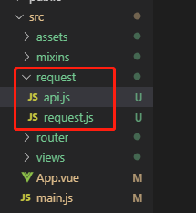

# 06

## 1. mixin

> 混入 (mixin) 提供了一种非常灵活的方式，来分发 Vue 组件中的可复用功能。一个混入对象可以包含任意组件选项。当组件使用混入对象时，所有混入对象的选项将被“混合”进入该组件本身的选项。

### 1. 全局混入

```js
// main.js
Vue.mixin({
    created() {
        console.log('全局created')；
    }
})
```

**注意：**

请谨慎使用全局混入，因为它会影响每个单独创建的 Vue 实例 (包括第三方组件)。大多数情况下，只应当应用于自定义选项，就像上面示例一样。推荐将其作为插件发布，以避免重复应用混入。


### 2. 选项合并

**src/mixin/test.js**

```js
export default {
  created() {
    console.log('123')
  },
  methods: {
    jumpDetail() {
      
    }
  }
}
```

**src/views/Home.vue**

```js
<template>
  <div>我的
    <div @click="jumpDetail">商品详情：123</div>
  </div>
  
</template>

<script>
import testMixin from "@/mixins/test.js";
export default {
  mixins: [testMixin],
  methods: {
    jumpDetail() {
      //
    }
  },
  created() {
    console.log('---------------')
  }
}
</script>

<style>

</style>
```

**注意：**

值为对象的选项，例如 `methods`、`components` 和 `directives`，将被合并为同一个对象。两个对象键名冲突时，取组件对象的键值对。


## 2. vue.config.js

### 1. 修改项目端口

> 脚手架启动默认端口是8080，如果需要修改那就通过`vue.config.js`来修改我们的项目

```js
// vue.config.js
module.exports = {
    devServer: {
        port: 5353 // 指定项目监听的端口
    }
}
```


### 2. 修改部署应用包时的基本 URL

> 默认情况下，Vue CLI 会假设你的应用是被部署在一个域名的根路径上，例如 `https://www.my-app.com/`。如果应用被部署在一个子路径上，你就需要用这个选项指定这个子路径。例如，如果你的应用被部署在 `https://www.my-app.com/my-app/`，则设置 `publicPath` 为 `/my-app/`

```js
module.exports = {
  publicPath: process.env.NODE_ENV === 'production'
    ? '/my-app/'
    : '/'
}
```


### 3. 代理API

> 如果你的前端应用和后端 API 服务器没有运行在同一个主机上，你需要在开发环境下将 API 请求代理到 API 服务器。这个问题可以通过 `vue.config.js` 中的 `devServer.proxy` 选项来配置。

```js
module.exports = {
  devServer: {
    proxy: {
      '/api': {
        target: 'http://www.xxx.com'
      },
      '/foo': {
        target: 'http://localhost:8081'
      }
    }
  }
}
```


## 3. 网络请求

### 1. axios

> Vue中发送网络请求，为什么选择axios呢？


### 2. 请求方式

> 支持多种请求方式：
>
> - axios(config)
> - axios.request(config)
> - axios.get(url[, config])
> - axios.delete(url[, config])
> - axios.head(url[, config])
> - axios.post(url[, data[, config]])
> - axios.put(url[, data[, config]])
> - axios.patch(url[, data[, config]])


### 3. 封装网络请求



> `api.js`放具体的请求的文件，而`request.js`封装axios请求（请求前拦截、返回结果后拦截）


**request.js**

```js
import axios from 'axios'

// 调用create方法创建实例
const instance = axios.create({
  timeout: 5000
})

// 请求前拦截
instance.interceptors.request.use(config => {
  return config
}, err => {
  return Promise.reject(err)
})

// 返回结果拦截
instance.interceptors.response.use(result => {
  return result
}, err => {
  return Promise.reject(err)
})

export default instance
```


**api.js**

```js
import request from './request'

export const getTopics = (params) => request.get('/api/v1/topics', {params:params})
```


**src/views/Home.vue**

```vue
<template>
  <div>我的
    <div @click="jumpDetail">商品详情：123</div>
  </div>
  
</template>

<script>
// 1.引入api中需要用到的请求
import { getTopics } from "@/request/api";

export default {
  methods: {
    jumpDetail() {
      
    }
  },
  created() {
    // 2.调用请求
    getTopics({
      page: 1,
      tab: 'job',
      limit: 10
    }).then(res => {

    })
  }
}
</script>

<style>

</style>
```

