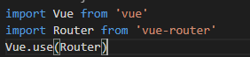

# Vue-router(路由)

## 1. 什么是路由？

说起路由你想起了什么？


路由器，那路由器是用来做什么的，你有没有想过？

- 路由时决定数据包从来源到目的地的路径；
- 将输入端的数据转移到合映射表适的输出端；
- 路由中最重要的概念就是路由表：**路由表的本质就是一个映射表，决定了数据包的指向**；


## 2. 后端路由

> 1. 早期的网站开发整个HTML页面是由服务器来渲染的。服务器将渲染好的对应的HTML页面返回给客户端进行展示；
> 2. 但是一个网站包含很多页面，那服务器是怎么处理的呢？
>    1. 每个页面都有对应的网址，也就是URL
>    2. URL会发送给到服务器，服务器会通过正则对该URL进行匹配，最后交给Controller进行处理
>    3. Controller进行处理，最终生成HTML或者数据，然后返回给前端。
>    4. 这其实就是服务器的一个IO操作，这其实就是对后端对路由的解析
> 3. 后端渲染的好处，相对于发送ajax请求拿数据，可以提高首屏渲染的性能，也有利于SEO的优化；
> 4. 后端路由的缺点：
>    1. 另一种情况是前端开发人员如果要开发页面, 需要通过PHP和Java等语言来编写页面代码
>    2. 而且通常情况下HTML代码和数据以及对应的逻辑会混在一起, 编写和维护都是非常糟糕的事情


## 3. 前端路由

> 前后端分离阶段：
>
> - 随着Ajax的出现，有了前后端分离的开发模式；
> - 后端只提供API来返回数据（json，xml），前端通过Ajax获取数据，并且可以通过JavaScript将数据渲染到页面中
> - 这样做最大的优点就是前后端责任的清晰, 后端专注于数据上, 前端专注于交互和可视化上
> - 并且当移动端(iOS/Android)出现后, 后端不需要进行任何处理, 依然使用之前的一套API即可
> - 目前很多的网站依然采用这种模式开发
>
> 单页面应用阶段：
>
> - 其实SPA最主要的特点就是在前后端分离的基础上加了一层前端路由
> - 也就是前端来维护一套路由规则
>
> 前端路由的核心是什么呢？
>
> - 改变URL，但是页面不进行整体的刷新


## 4. 前端路由规则

### 1. URL的hash

> URL的hash也就是锚点(#), 本质上是改变window.location的href属性
>
> 我们可以通过直接赋值location.hash来改变href, 但是页面不发生刷新


### 2. HTML5的history模式

> history接口时HTML5新增的，它有物种模式改变URL而不刷新页面


**history.pushState(data, title, url)**


**history.replaceState(data, title, url)**


**history.go(-1) **返回上一页

**history.back()** 等价于 history.go(-1)

**history.forward()** 等价于 history.go(1)


## 5 Vue-router基本使用

> 目前前端流行的三大框架，都有自己的路由实现：
>
> - Angular的ngRouter
> - React的ReactRouter
> - Vue的vue-router


### 1. 认识vue-router

vue-router是Vue的官方路由插件，它和Vue是深度集成的，适合用于构建单页面应用  <https://router.vuejs.org/zh/> 。

vue-router是基于路由和组件的,路由用于设定访问路径, 将路径和组件映射起来；在vue-router的单页面应用中, 页面的路径的改变就是组件的切换.


### 2. 安装和使用vue-router

因为前面已经学过vue-cli，后续的开发中我们都是结合vue-cli来进行开发；

**安装**

```js
// 方法1： 
npm i vue-router -S
// 方法2：vue-cli3提供下面的命令来引入vue-router
vue add router 
```

**使用**



> 1. 导入路由对象，并且调用Vue.use()
> 2. 创建路由实例，并且传入路由映射配置
> 3. 使用路由: 通过<router-link>和<router-view>


**创建router实例：**


**挂载到Vue实例中**


**创建路由组件：**

1. 分别创建Home.vue和About.vue组件


2. 新建`src/router/index.js`

```js
import Vue from 'vue'
import VueRouter from 'vue-router'
// 引入页面组件
import Home from '@/components/Home'
import About from '@/components/About'

Vue.use(VueRouter)
// 实例化router对象（配置项目路径映射）
const router = new VueRouter({
  routes: [
    {
      path: '/home',
      component: Home
    },
    {
      path: '/about',
      component: About
    },
  ]
})
// 导出路由对象
export default router
```

3. 在入口文件`main.js` 添加router配置

```js
import Vue from 'vue'
import App from './App.vue'
// 引入自定义的路由配置
import router from '@/router/'

Vue.config.productionTip = false

new Vue({
  router, // 添加进项目的Vue实例里
  render: h => h(App),
}).$mount('#app')

```

4. 页面中使用路由跳转

```vue
<template>
  <div id="app">
    
    <!-- router-link 相当于我们的a标签，用来做vue路由跳转 -->
    <div><router-link to="/home">首页</router-link></div>
    <router-link to="/about">关于</router-link>
    <!-- router-view 用来展示对应路由的组件 -->
    <router-view/>
  </div>
</template>

<script>

export default {
  name: 'app'
}
</script>

<style lang="less">

</style>

```

5. 路由的默认路径

```js
// src/router/index.js
...
const router = new VueRouter({
  routes: [
    {
      path: '/',
      redirect: 'home'
    },
    {
      path: '/home',
      component: Home
    },
    {
      path: '/about',
      component: About
    }
  ]
})
...
```

6. 修改成为history模式

```js
const router = new VueRouter({
  mode: 'history', // history模式
  routes: [
    {
      path: '/',
      redirect: 'home'
    },
    {
      path: '/home',
      component: Home
    },
    {
      path: '/about',
      component: About
    }
  ]
})
```


### 3. 路由跳转的方式

除了上面我们所说的使用router-link方式来跳转，我们在项目里面更多的是使用另外一种方式来跳转


可以通过点击事件来触发跳转，`this.$router.push`，其实跳转的方法除了push以外，还有replace、go、forward、back这几个


### 4. 动态路由

> 某些情况下，我们需要在路径上带上不确定的值，比如我们进入商品详情页面的时候，
>
> http://www.abc.com/item/123466
>
> http://www.abc.com/item/664399
>
> 

除了前面的/item以外还加上了商品的ID，这种path和Component的匹配关系，我们称之为动态路由(也是路由传递数据的一种方式)。


**App.vue**

```vue
<template>
  <div id="app">
    
    <div><button @click="jumpToHome">首页</button></div>
    <div><button @click="jumpToUser">个人页面</button></div>
    <button @click="jumpToAbout">关于</button>
    <router-view/>
  </div>
</template>

<script>

export default {
  name: 'app',
  methods: {
    jumpToHome() {
      this.$router.push('/home')
    },
    jumpToAbout() {
      this.$router.push('/about')
    },
    jumpToUser() {
      this.$router.push('/user/123')
    }
  }
}
</script>

<style lang="less">

</style>

```


**src/components/User.vue**

```vue
<template>
  <div>用户ID：{{userId}}</div>
</template>

<script>
export default {
  data() {
    return {
      userId: ''
    }
  },
  created() {
    this.userId = this.$route.params.userId
  }
}
</script>

<style>

</style>
```


**src/router/index.js**

```js
import Vue from 'vue'
import VueRouter from 'vue-router'
import Home from '@/components/Home'
import About from '@/components/About'
import User from '@/components/User'

Vue.use(VueRouter)

const router = new VueRouter({
  routes: [
    {
      path: '/',
      redirect: 'home'
    },
    {
      path: '/home',
      component: Home
    },
    {
      path: '/about',
      component: About
    },
    {
      path: '/user/:userId',
      component: User
    }
  ]
})

export default router
```


### 5. 路由的懒加载

> 官方给出了解释:
>
> - 当打包构建应用时，Javascript 包会变得非常大，影响页面加载。
> - 如果我们能把不同路由对应的组件分割成不同的代码块，然后当路由被访问的时候才加载对应组件，这样就更加高效了
>
> 官方在说什么呢?
>
> - 首先, 我们知道路由中通常会定义很多不同的页面.
> - 这个页面最后被打包在哪里呢? 一般情况下, 是放在一个js文件中.
> - 但是, 页面这么多放在一个js文件中, 必然会造成这个页面非常的大
> - 如果我们一次性从服务器请求下来这个页面, 可能需要花费一定的时间, 甚至用户的电脑上还出现了短暂空白的情况
> - 如何避免这种情况呢? 使用路由懒加载就可以了


路由懒加载做了什么？

- 路由懒加载的主要作用就是将路由对应的组件打包成一个个的js代码块
- 只有在这个路由被访问到的时候, 才加载对应的组件


普通的写法：


打包后的项目结构：


懒加载的写法：


打包后的项目结构：


是不是不知道打包后的文件对应的是哪一个文件呢，我们可以做点修改


**懒加载的方式**

```js
// 方式一: 结合Vue的异步组件和Webpack的代码分析
const Home = resolve => { require.ensure(['../components/Home.vue'], () => {resolve(require('../components/Home.vue')) })};

// 方式二: AMD写法
const About = resolve => require(['../components/About.vue'], resolve);

// 方式三: 在ES6中, 我们可以有更加简单的写法来组织Vue异步组件和Webpack的代码分割.
const Home = () => import('../components/Home.vue')
```


### 6. 嵌套路由(京东例子)

嵌套路由是一额很常见的功能， 我们用vue来实现京东例子的布局


**App.vue**

```vue
<template>
  <div id="app">
    <router-view/>
  </div>
</template>

<script>

export default {
  name: 'app',
  methods: {
  }
}
</script>

<style lang="less">
@import 'assets/style/base.less';
#app{
  width: 100%;
  height: 100%;
}
</style>

```

**Index.vue**

```vue
<template>
  <div class="jd-content">
    <router-view />
    <div class="jd-footer">
      <a href="javascript:;" :class="{'redColor': currentPath == '/home'}" @click="jumpTo('/home')">首页</a>
      <a href="javascript:;" :class="{'redColor': currentPath == '/category'}" @click="jumpTo('/category')">分类</a>
      <a href="javascript:;" :class="{'redColor': currentPath == '/cart'}" @click="jumpTo('/cart')">购物车</a>
      <a href="javascript:;" :class="{'redColor': currentPath == '/me'}" @click="jumpTo('/me')">我的</a>
    </div>
  </div>
</template>

<script>
export default {
  data() {
    return {
      currentPath: '/home'
    }
  },
  methods: {
    jumpTo(path) {
      this.currentPath = path;
      this.$router.replace(path);
    }
  }
};
</script>

<style lang="less" scoped>
.jd-footer {
  position: fixed;
  left: 0;
  right: 0;
  bottom: 0;
  display: flex;
  width: 100%;
  height: 60px;
  line-height: 60px;
  text-align: center;
  border-top: 1px solid #ccc;
  a {
    text-decoration: none;
    color: #000;
    flex: 1;
  }
  .redColor {
    color: red;
  }
}
</style>
```


**Home.vue**

```vue
<template>
  <div>我的
    <div @click="jumpDetail">商品详情：123</div>
  </div>
  
</template>

<script>
export default {
  methods: {
    jumpDetail() {
      this.$router.push({path: '/detail/123'})
    }
  }
}
</script>

<style>

</style>
```


**路由配置文件：src/router/index.js**

```js
import Vue from 'vue'
import VueRouter from 'vue-router'
const Index = () => import(/* webpackChunkName: "index" */'@/views/Index')
const Home = () => import(/* webpackChunkName: "home" */'@/views/Home')
const Category = () => import(/* webpackChunkName: "category" */'@/views/Category')
const Me = () => import(/* webpackChunkName: "me" */'@/views/Me')
const Cart = () => import(/* webpackChunkName: "cart" */'@/views/Cart')
const Detail = () => import(/* webpackChunkName: "detail" */'@/views/Detail')

Vue.use(VueRouter)

const router = new VueRouter({
  routes: [
    {
      path: '/',
      redirect: '/home'
    },
    {
      path: '/',
      component: Index,
      children: [
        {
          path: 'home',
          component: Home
        },
        {
          path: 'me',
          component: Me
        },
        {
          path: 'category',
          component: Category
        },
        {
          path: 'cart',
          component: Cart
        }
      ]
    },
    {
      path: '/detail/:pId',
      component: Detail
    }
  ]
})

export default router
```


**注意：**

1. $route和$router的区别：$router指的是整个项目的路由配置，所以里面就包含了跳转路由的方法（push、replace、go、back、forward）；而$route指的是当前活跃的路由对象，所以能够获取当前页面的path、query、params


### 7. 导航守卫

> 我们来考虑一个需求：在一个京东应用中，未登陆，不能进入订单确认页面
>
> 解决的方法：
>
> 1. 在跳转到订单确认页面前做判断，登陆成功则可以顺利跳转，否则就跳转到别的页面去，或者登陆页面；
> 2. 上面的这种方式是可行的，但是页面多起来的时候就不能每个页面都写，代码冗余不好维护
>
> 那有没有更好的方式呢？
>
> 1. 可以使用导航守卫
> 2. 什么是导航守卫？ vue-router提供的导航守卫主要用来监听路由的进入和离开的；vue-router提供了beforeEach和afterEach的钩子函数，它们会在路由即将改变前和改变后触发


**src/router/index.js**

> 导航钩子的三个参数解析：
>
> 1. to: 即将要进入的目标路由对象
> 2. from: 当前导航即将要离开的路由对象
> 3. next: 调用该方法后，才能进入下一个钩子函数

```js
router.beforeEach((to, from, next) => {
  next()
})
```


**补充：**

> 1. :如果是后置钩子, 也就是afterEach, 不需要主动调用next()函数
>
> 2. : 上面我们使用的导航守卫, 被称之为全局守卫
>    1. 路由独享的守卫
>    2. 组件内的守卫


### 8. keep-alive

> keep-alive 是 Vue 内置的一个组件，可以使被包含的组件保留状态，或避免重新渲染
>
> 1. 它们有两个非常重要的属性:
>    1. include - 字符串或正则表达，只有匹配的组件会被缓存
>    2. exclude - 字符串或正则表达式，任何匹配的组件都不会被缓存
> 2. router-view 也是一个组件，如果直接被包在 keep-alive 里面，所有路径匹配到的视图组件都会被缓存