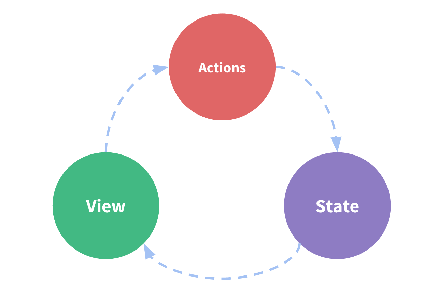
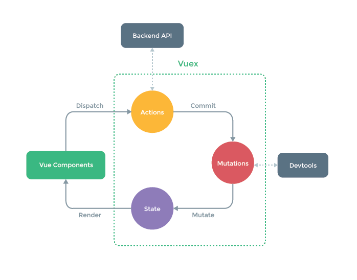
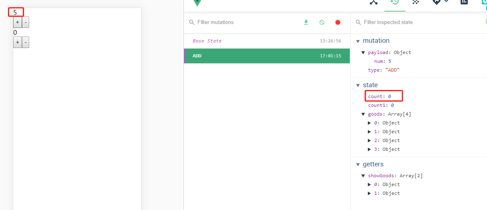
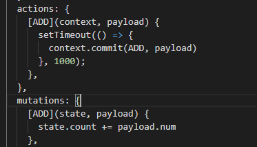
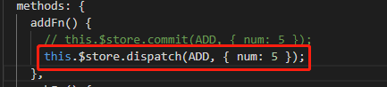
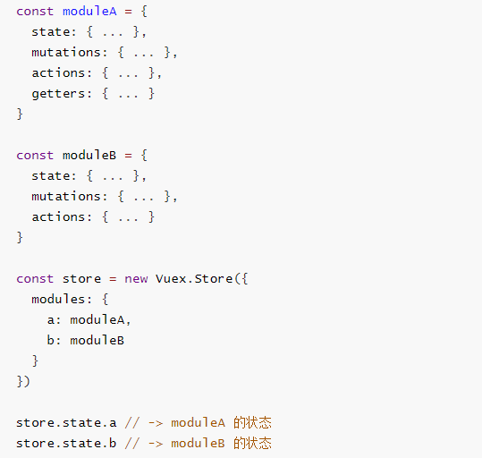
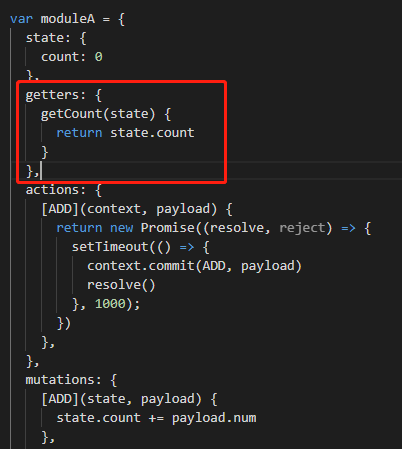
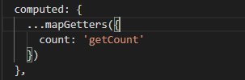

# vuex

## 1. Vuex是做什么的?

> 官方解释：`Vuex` 是一个专为 `Vue` 应用程序开发的状态管理模式。
>
> - 它采用 集中式存储管理 应用的所有组件的状态，并以相应的规则保证状态以一种可预测的方式发生变化
> - `Vuex` 也集成到 `Vue` 的官方调试工具 `devtools extension`，提供了诸如零配置的 `time-travel` 调试、状态快照导入导出等高级调试功能。
>
> 
>
> 状态管理到底是什么？
>
> - 状态管理模式、集中式存储管理这些名词听起来就非常高大上，让人捉摸不透。
> - 其实，你可以简单的将其看成把需要多个组件共享的变量全部存储在一个对象里面。
> - 然后，将这个对象放在顶层的Vue实例中，让其他组件可以使用。
> - 那么，多个组件是不是就可以共享这个对象中的所有变量属性了呢？
>
> 
>
> 等等，如果是这样的话，为什么官方还要专门出一个插件Vuex呢？难道我们不能自己封装一个对象来管理吗？
>
> - 当然可以，只是我们要先想想VueJS带给我们最大的便利是什么呢？没错，就是响应式。
> - 如果你自己封装实现一个对象能不能保证它里面所有的属性做到响应式呢？当然也可以，只是自己封装可能稍微麻烦一些。
> - 不用怀疑，Vuex就是为了提供这样一个在多个组件间共享状态的插件，用它就可以了。


## 2. 状态管理

> 有什么状态时需要我们在多个组件间共享的呢?
>
> - 大型项目开发，一定会遇到多个状态，在多个界面间的共享问题。
> - 比如用户的登录状态、用户名称、头像、地理位置信息等等。
> - 比如商品的收藏、购物车中的物品等等。
> - 这些状态信息，我们都可以放在统一的地方，对它进行保存和管理，而且它们还是响应式的（待会儿我们就可以看到代码了，莫着急）
>
> 


## 3. Vuex基本概念

### 1. 单界面的状态管理



> 这图片中的三种东西，怎么理解呢？
>
> - State：不用多说，就是我们的状态。（你姑且可以当做就是data中的属性）
> - View：视图层，可以针对State的变化，显示不同的信息。（这个好理解吧？）
> - Actions：这里的Actions主要是用户的各种操作：点击、输入等等，会导致状态的改变。


```vue
<template>
  <div>
    <div>{{count}}</div>
    <button @click="count++">+</button>
    <button @click="count--">-</button>
  </div>
</template>

<script>
export default {
  data() {
    return {
      count: 0
    }
  }
}
</script>

<style>
button {
  padding: 5px;
}
</style>
```


**解释：**

> - 在这个案例中，我们有木有状态需要管理呢？没错，就是个数count。
> - count需要某种方式被记录下来，也就是我们的State。
> - counter目前的值需要被显示在界面中，也就是我们的View部分。
> - 界面发生某些操作时（我们这里是用户的点击，也可以是用户的input），需要去更新状态，也就是我们的Actions


### 2. 多界面状态管理



> 1. Vue已经帮我们做好了单个界面的状态管理，但是如果是多个界面呢？
>    1. 多个试图都依赖同一个状态（一个状态改了，多个界面需要进行更新）
>    2. 不同界面的Actions都想修改同一个状态（Home.vue需要修改，Profile.vue也需要修改这个状态）
> 2. 也就是说对于某些状态(状态1/状态2/状态3)来说只属于我们某一个视图，但是也有一些状态(状态a/状态b/状态c)属于多个试图共同想要维护的
>    1. 状态1/状态2/状态3你放在自己的房间中，你自己管理自己用，没问题。
>    2. 但是状态a/状态b/状态c我们希望交给一个大管家来统一帮助我们管理！！！
>    3. 没错，Vuex就是为我们提供这个大管家的工具。
> 3. 全局单例模式（大管家）
>    1. 我们现在要做的就是将共享的状态抽取出来，交给我们的大管家，统一进行管理。
>    2. 之后，你们每个试图，按照我规定好的规定，进行访问和修改等操作。
>    3. 这就是Vuex背后的基本思想。


`Vuex`分成四个部分：

- State：单一状态树
- Getters：状态获取
- Mutations：触发同步事件
- Actions：提交mutation，可以包含异步操作

正如上图所示，Vuex的数据总是“单向流动”。

1. 用户访问页面并触发action
2. action提交mutation事件
3. mutation事件更改state状态
4. state状态改变后更新页面(vue comptents)


```js
import Vuex from 'vuex'
import Vue from 'vue'

Vue.use(Vuex)

const store = new Vuex.Store({
  state: {
    count: 0
  },
  mutations: {
    add(state) {
      state.count++
    },
    sub(state) {
      state.count--
    }
  }
})

export default store
```


**main.js**

```js
import Vue from 'vue'
import App from './App.vue'
import router from '@/router/'
import store from '@/store/'

Vue.config.productionTip = false
Vue.mixin({
  created() {
    console.log('Vue')
  }
})
new Vue({
  router,
  store,
  render: h => h(App),
}).$mount('#app')

```


```vue
<template>
  <div>
    <div>{{count}}</div>
    <button @click="addFn">+</button>
    <button @click="subFn">-</button>
  </div>
</template>

<script>
export default {
  data() {
    return {
      
    }
  },
  computed: {
    count() {
      return this.$store.state.count
    }
  },
  methods: {
    addFn() {
      this.$store.commit('add')
    },
    subFn() {
      this.$store.commit('sub')
    }
  }
}
</script>

<style>
button {
  padding: 5px;
}
</style>
```


**注意：**

> 1. 我们通过提交`mutation`的方式，而非直接改变`store.state.count`。
> 2. 这是因为`Vuex`可以更明确的追踪状态的变化，所以不要直接改变`store.state.count`的值。


## 4. 核心概念

> Vuex有几个比较核心的概念:
>
> - State
> - Getters
> - Mutation
> - Action
> - Module


### 1. State(单一状态树)

> 1. Vuex提出使用单一状态树, 什么是单一状态树呢？
>    1. 英文名称是Single Source of Truth，也可以翻译成单一数据源。
> 2. 但是，它是什么呢？我们来看一个生活中的例子。
>    1. 我们知道，在国内我们有很多的信息需要被记录，比如上学时的个人档案，工作后的社保记录，公积金记录，结婚后的婚姻信息，以及其他相关的户口、医疗、文凭、房产记录等等（还有很多信息）。
>    2. 这些信息被分散在很多地方进行管理，有一天你需要办某个业务时(比如入户某个城市)，你会发现你需要到各个对应的工作地点去打印、盖章各种资料信息，最后到一个地方提交证明你的信息无误。
>    3. 这种保存信息的方案，不仅仅低效，而且不方便管理，以及日后的维护也是一个庞大的工作(需要大量的各个部门的人力来维护，当然国家目前已经在完善我们的这个系统了)。
> 3. 这个和我们在应用开发中比较类似：
>    1. 如果你的状态信息是保存到多个Store对象中的，那么之后的管理和维护等等都会变得特别困难。
>    2. 所以Vuex也使用了单一状态树来管理应用层级的全部状态。
>    3. 单一状态树能够让我们最直接的方式找到某个状态的片段，而且在之后的维护和调试过程中，也可以非常方便的管理和维护。


在`Vuex 2`中新增了一个`mapState`辅助函数，当一个组件需要获取多个状态时，可以直接在函数中声明

```js
// 写法一：
computed: {
    // 映射 this.count 为 store.state.count
    ...mapState(['count', 'count1'])
  },
// 写法二：
computed:mapState(['count', 'count1'])
```


### 2. Getters基本使用

> 当`state`中的某些状态在各个组件中都被频繁使用，如果在每个组件中都声明一次，将会变得非常繁琐。因此便有了`getters`来帮助我们解决这个问题，你也可以把它看做`Vuex`的计算属性。`getters`接受两个参数，`state`与`getters`，我们可以在store中定义`getters`：


```js
import Vuex from 'vuex'
import Vue from 'vue'

Vue.use(Vuex)

const store = new Vuex.Store({
  state: {
    count: 0,
    count1: 0,
    goods: [
      {id: 1, name: '连衣裙', isShow: true},
      {id: 2, name: '裤子', isShow: false},
      {id: 3, name: '袜子', isShow: false},
      {id: 4, name: '鞋子', isShow: true},
    ]
  },
  getters: {
    showGoods(state) {
      return state.goods.filter(item => item.isShow)
    }
  },
  mutations: {
    add(state) {
      state.count++
    },
    sub(state) {
      state.count--
    },
    add1(state) {
      state.count1++
    },
    sub1(state) {
      state.count1--
    }
  }
})

export default store
```


**页面调用：**

```js
computed: {
    goodsList() {
      return this.$store.getters.showGoods
    },
    ...mapState(['count', 'count1'])
  },
```


在`Vuex 2`中提供了一个`mapGetters`辅助函数用于有多个状态需要获取的情况。

```js
computed: {
    // goodsList() {
    //   return this.$store.getters.showGoods
    // },
    ...mapGetters(['showGoods']), 
    ...mapState(['count', 'count1'])
  },
```


### 3. Mutations

#### 1. 基础语法

更改 `Vuex` 的 `store` 中的状态的**唯一**方法是提交 `mutation`。`mutation`不能直接调用，而要通过相应的 type 调用相应的`store.commit`方法

```js
this.$store.commit('add') 
```

`mutation`接受两个参数`state`和`payload`(载荷)。

通过执行回调函数修改`state`的状态，可以向`store.commit`传入额外的参数`payload`，`payload`可以是一个对象，这样可以包含多个字段并且记录的 mutation 会更易读。

```js
...
mutations: {
    add(state, payload) {
      state.count += payload.num 
    },
...
}
```


除了上面的提交风格外，还提供了另外一种风格

```js
this.$store.commit({
    type: 'add',
    num: 100
})
```


#### 2. 常量概念

> 1. 我们来考虑下面的问题:
>    1. 在mutation中, 我们定义了很多事件类型(也就是其中的方法名称).
>    2. 当我们的项目增大时, Vuex管理的状态越来越多, 需要更新状态的情况越来越多, 那么意味着Mutation中的方法越来越多.
>    3. 方法过多, 使用者需要花费大量的经历去记住这些方法, 甚至是多个文件间来回切换, 查看方法名称, 甚至如果不是复制的时候, 可能还会出现写错的情况.
> 2. 如何避免上述的问题呢?
>    1. 一种很常见的方案就是使用常量替代Mutation事件的类型.
>    2. 我们可以将这些常量放在一个单独的文件中, 方便管理以及让整个app所有的事件类型一目了然.
> 3. 具体怎么做呢?
>    1. 我们可以创建一个文件: mutation-types.js, 并且在其中定义我们的常量.
>    2. 定义常量时, 我们可以使用ES2015中的风格, 使用一个常量来作为函数的名称.


**mutation-types.js**

```js
export const ADD = 'ADD'
```


**store/index.js**

```
import {
  ADD
} from './mutation-types'
...
mutations: {
    [ADD](state, params) {
      state.count += params.num
    },
...   
}
...
```


```js
import { ADD } from "@/store/mutation-types";

...
// 调用mutation
this.$store.commit(ADD, { num: 5 });
...
```


#### 3. 同步函数

> 通常情况下, Vuex要求我们Mutation中的方法必须是同步方法.
>
> - 主要的原因是当我们使用devtools时, 可以devtools可以帮助我们捕捉mutation的快照
> - 但是如果是异步操作, 那么devtools将不能很好的追踪这个操作什么时候会被完成.


那么如果在mutations操作中，增加一个异步操作会发生什么情况

```
mutations: {
    [ADD](state, params) {
      setTimeout(() => {
        state.count += params.num
      }, 1000);
    }
}
```




### 4. Actions

#### 1. 基本定义

> 1. 我们强调, 不要再Mutation中进行异步操作.
>    1. 但是某些情况, 我们确实希望在Vuex中进行一些异步操作, 比如网络请求, 必然是异步的. 这个时候怎么处理呢?
>    2. Action类似于Mutation, 但是是用来代替Mutation进行异步操作的.
> 2. Action的基本使用代码如下:
> 3. context是什么?
>    context是和store对象具有相同方法和属性的对象.
>    也就是说, 我们可以通过context去进行commit相关的操作, 也可以获取context.state等.
>    但是注意, 这里它们并不是同一个对象, 为什么呢? 我们后面学习Modules的时候, 再具体说.
> 4. 这样的代码是否多此一举呢?
>    我们定义了actions, 然后又在actions中去进行commit, 这不是脱裤放屁吗?
>    事实上并不是这样, 如果在Vuex中有异步操作, 那么我们就可以在actions中完成了.


#### 2. 使用






### 5. Modules

#### 1. 基本定义

> 1. Module是模块的意思, 为什么在Vuex中我们要使用模块呢?
>    1. Vue使用单一状态树,那么也意味着很多状态都会交给Vuex来管理.
>    2. 当应用变得非常复杂时,store对象就有可能变得相当臃肿.
>    3. 为了解决这个问题, Vuex允许我们将store分割成模块(Module), 而每个模块拥有自己的state、mutations、actions、getters等




> 上面的代码中, 我们已经有了整体的组织结构, 下面我们来看看具体的局部模块中的代码如何书写.
>
> - 我们在moduleA中添加`state`、`mutations`、`getters`
> - `mutation`和`getters`接收的第一个参数是局部状态对象


#### 2. 局部状态





