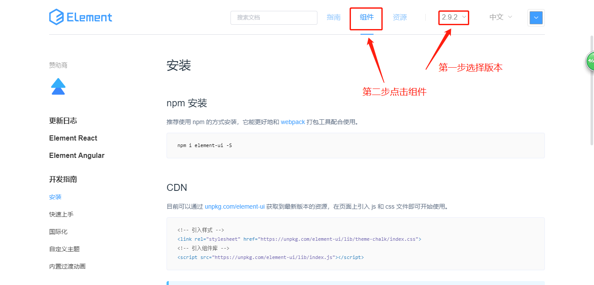

# 客户关系管理系统

## 1. 客户关系管理系统
  ### 背景

> 之前做的项目都属于面向普通用户的互联网项目，而我们工作时还会和另外一种类型项目打交道，那就是我们的企业管理系统。企业管理系统一般是面向内部员工和企业客户的，功能上主要是对数据的增删改查等业务。

- 面向企业内部用户的管理系统项目，（账号：admin，密码：1）

### 简介

简称CRM(Customer Relationship Mangement) ,是一个为企业提供销售渠道、服务客户、管理客户的一个管理系统。主要功能包含系统管理、数据管理、客户管理、客户历史、报表统计模块。

  - 登录页面
  - 系统管理
    - **部门管理**
    - 权限管理
    - **角色管理**
    - 员工管理
  - 数据管理
    - **字典目录**
    - **字典明细**
  - 客户管理
    - 客户列表
    - **潜在客户**
    - 客户池
    - 失败客户
  - 客户历史
    - **跟进历史**
  - 表报统计
    - 潜在客户报表

## 2. restful风格接口简介

restful是目前比较流行的API设计规范，用于Web数据接口的设计，是前后端分离最好的实践。服务器支持get、post、put、delete、dispatch的请求方式，对应资源的增删改查，可实现见名知其义。
项目接口文档：<http://www.docway.net/project/2gae36rdpT/share/1RRfyGDmlMW>   （密码：2）

## 3. element-ui

### 1. 项目引入element-ui

> `vue add element`  ，把element-ui加入到项目中来。

由饿了么UED（User experience Design）设计、饿了么前端团队开发的，基于Vue2.0的桌面组件库，旨在快速开发桌面应用。官网地址：[https://element.eleme.cn/2.0/#/zh-CN](https://element.eleme.cn/2.0/#/zh-CN) 。

### 2. element-ui优点

- 文档清晰
- 组件库丰富
- 简洁的设计风格
- 良好的用户体验

### 3. element-ui注意点

- 全局引用和部分引用（按需加载）
	- 全局引用会把全部的组件都加载到项目里面，最后打包出来会很大。
	- 部分引用只会加载引入的组件，没有加载的组件不会被打包到js包内。

## 4. 登录界面实现

具体的实现请看《[登录界面实现](./reference/登录页面.md)》

## 5. 部门管理

具体实现请看《[部门管理](./reference/部门管理.md)》

## 6. 员工管理

具体实现请看《[员工管理](./reference/员工管理.md)》

## 7. 字典目录

具体实现请看《[字典目录](./reference/字典目录.md)》

## 8. 字典明细

具体实现请看《[字典明细](./reference/字典明细.md)》

## 9. 客户列表

具体实现请看《[客户列表](./reference/客户列表.md)》

## 10. 潜在客户

具体实现请看《[潜在客户](./reference/潜在客户.md)》

## 11. 跟进历史

具体实现请看《[客户历史](./reference/客户历史.md)》

