## 小程序进阶一

## 1. 自定义组件

https://developers.weixin.qq.com/miniprogram/dev/framework/custom-component/

开发者可以将**页面内的功能模块**抽象成自定义组件，以便在不同的页面中重复使用；

也可以将**复杂的页面拆分成多个低耦合的模块**，有助于代码维护。

**自定义组件**在使用时与**基础组件**非常相似。


### 1. 自定义组件的示例

#### 1. 创建自定义组件

类似于页面，一个自定义组件由 `json` `wxml` `wxss` `js` 4个文件组成。要编写一个自定义组件，首先需要在 `json` 文件中进行自定义组件声明（将 `component` 字段设为 `true` 可这一组文件设为自定义组件）：

```json
{
  "component": true
}
```

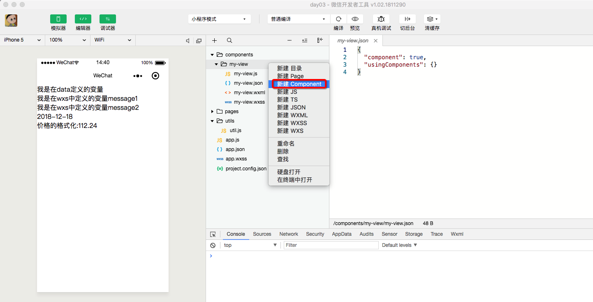


#### 2. 使用自定义组件

使用已注册的自定义组件前，首先要在**使用该组件页面的 `json` 文件中进行引用声明**。此时需要提供每个自定义组件的**标签名**和对应的自定义组件**文件路径**：

```json
{
    "usingComponents": {
      "my-view": "../../components/my-view/my-view"
    }
}
```


这样，在页面的 `wxml` 中就可以像使用基础组件一样使用自定义组件。节点名即自定义组件的标签名，节点属性即传递给组件的属性值。

> 开发者工具 1.02.1810190 及以上版本支持在 app.json 中声明 usingComponents 字段，在此处声明的自定义组件视为全局自定义组件，在小程序内的页面或自定义组件中可以直接使用而无需再声明。


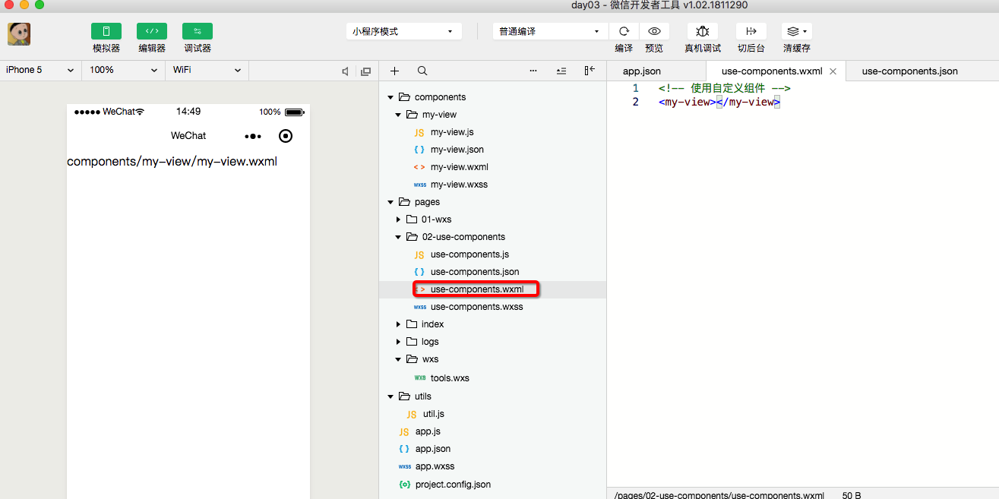


#### 3. 自定义组件的插槽

在组件的wxml中可以包含 `slot` 节点，用于承载组件使用者提供的wxml结构。

默认情况下，一个组件的wxml中只能有一个slot。需要使用多slot时，可以在组件js中声明启用。

##### 1. 默认一个插槽

定义插槽 slot

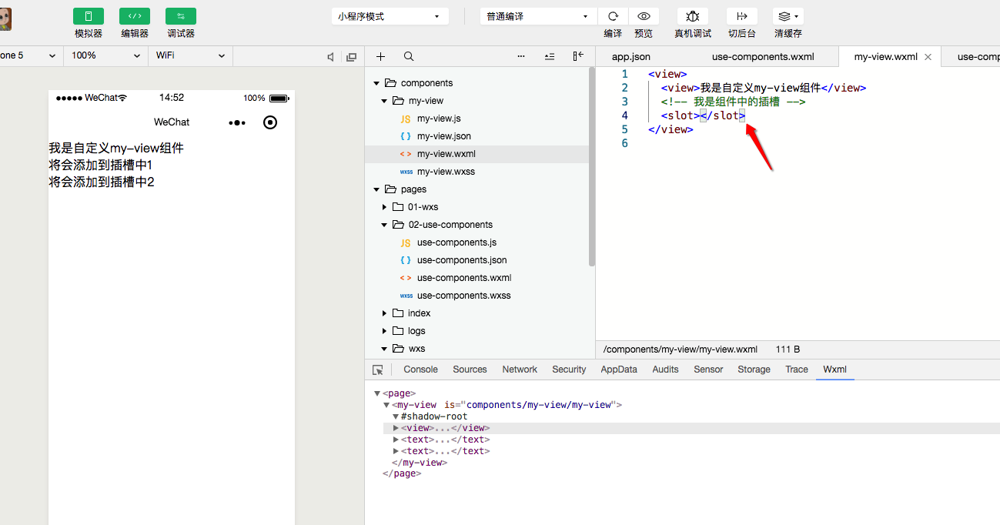

使用插槽

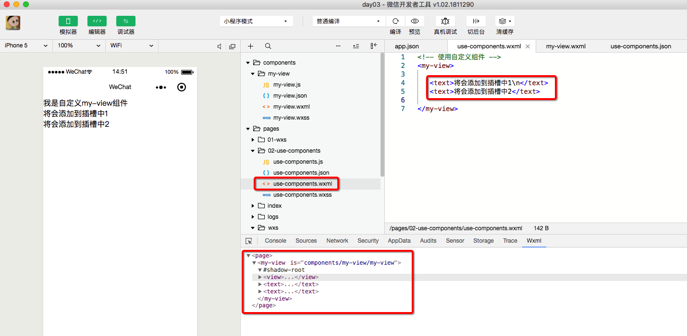


##### 2. 允许多个插槽

同时存在多个插槽的时候要给插槽起名称

1.定义多个插槽

```html
<view>
  <view>我是自定义my-view组件</view>
  <!-- 我是组件中的插槽 -->
  <slot name="content"></slot>
  <slot name="footer"></slot>

</view>
```

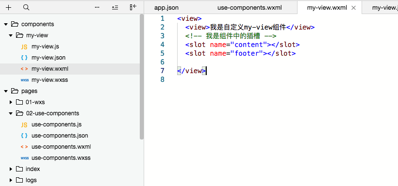


2.声明启用多个插槽

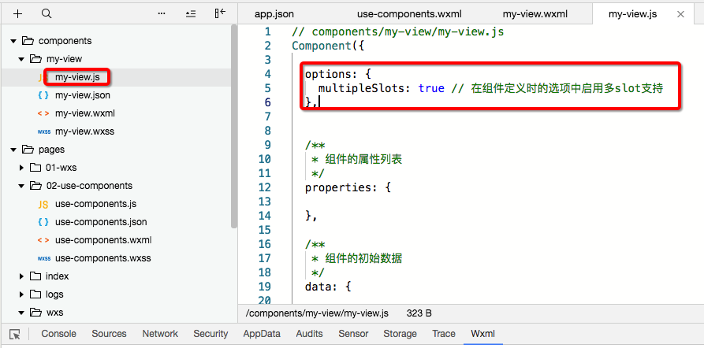

```js
options: {
    multipleSlots: true // 在组件定义时的选项中启用多slot支持
},
```


3.插槽的使用


#### 4. 组件接收外部数据

https://developers.weixin.qq.com/miniprogram/dev/framework/custom-component/component.html

##### 1. 组件接收外部传的数据

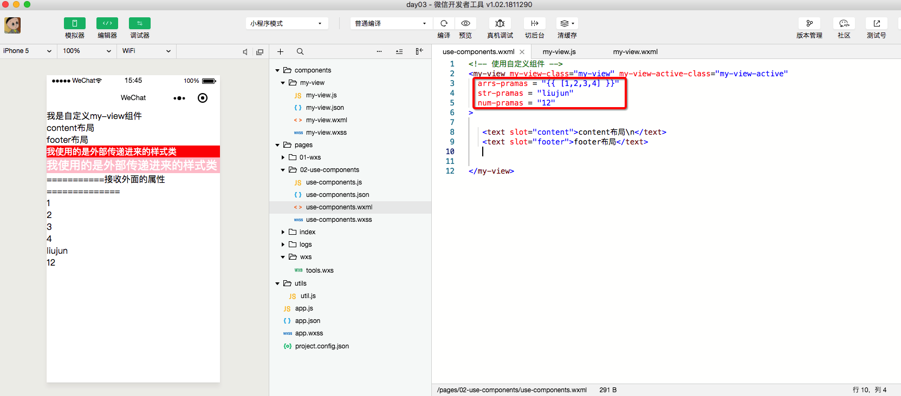

```html
<!-- 使用自定义组件 -->
<my-view my-view-class="my-view" my-view-active-class="my-view-active"
  arrs-pramas = "{{ [1,2,3,4] }}"
  str-pramas = "terry"
  num-pramas = "12"
>
   
   <text slot="content">content布局\n</text>
   <text slot="footer">footer布局</text>
   

</my-view>
```


##### 2. 组件定义接收外部数据

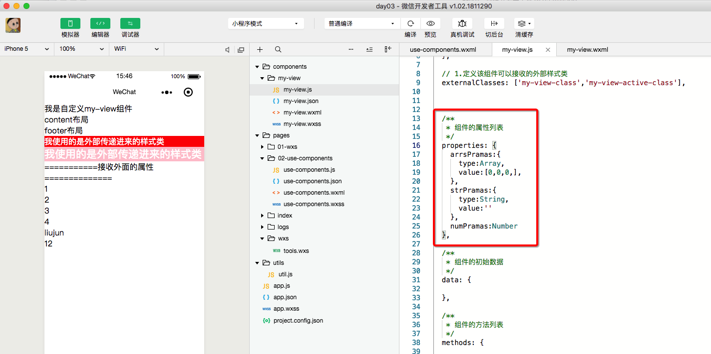

```js
Component({ 
  
  /**
   * 组件的属性列表
   */
  properties: {
    
    arrsPramas:{
      type: Array, // 类型（必填），目前接受的类型包括：String, Number, Boolean, Object, Array, null（表示任意类型）
      value: [0,0,0,0], // 属性初始值（可选），如果未指定则会根据类型选择一个
    }
    
    strPramas: { // 属性名
      type: String, // 类型（必填），目前接受的类型包括：String, Number, Boolean, Object, Array, null（表示任意类型）
      value: '', // 属性初始值（可选），如果未指定则会根据类型选择一个
    },
    
    numPramas: Number // 简化的定义方式
    //...
  },
  
  
})
```


##### 3. 组件使用接收到的数据

> properties 中定义的属性直接在模版中使用（ 不能通过this.data.xxx获取传进过来的数据 ）

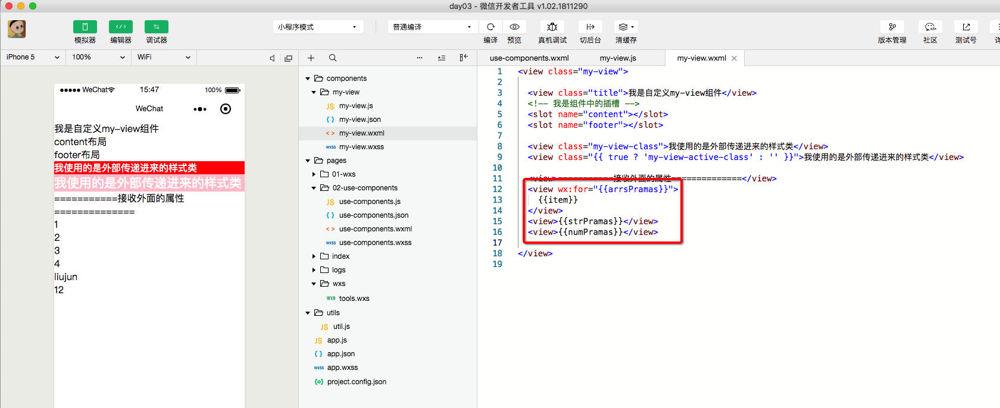

```html
<view class="my-view">
  .....
  .....
  <view>===========接收外面的属性==============</view>
  
  <view wx:for="{{arrsPramas}}">
    {{item}}
  </view>
  <view>{{strPramas}}</view>
  <view>{{numPramas}}</view>

</view>
```


### 2. 组件的事件-通讯

组件间的基本通信方式有以下几种。

- WXML 数据绑定( **传递参数** )：用于**父组件向子组件**的指定属性设置数据，仅能设置 JSON 兼容数据（自基础库版本 [2.0.9](https://developers.weixin.qq.com/miniprogram/dev/framework/compatibility.html) 开始，还可以在数据中包含函数）。具体在 [组件模板和样式](https://developers.weixin.qq.com/miniprogram/dev/framework/custom-component/wxml-wxss.html) 章节中介绍。
- 事件：用于**子组件向父组件**传递数据，可以传递任意数据。
- 如果以上两种方式不足以满足需要，**父组件还可以通过 `this.selectComponent` 方法获取子组件实例对象**，这样就可以直接访问组件的任意数据和方法。


#### 1. 组件内部触发事件

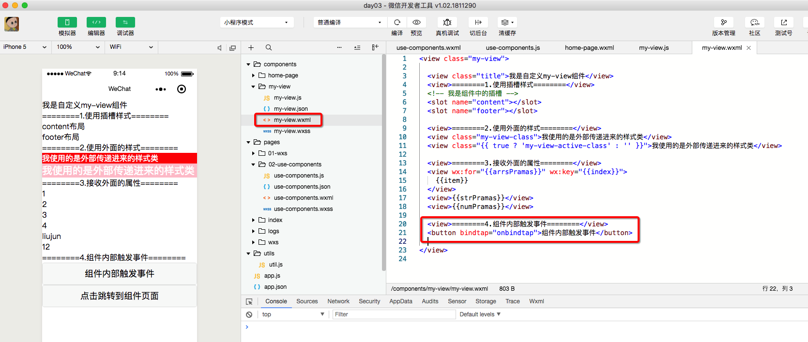

my-view.wxml

```html
<view class="my-view">

  ....
  ....

  <view>========4.组件内部触发事件========</view>
  <button bindtap="onbindtap">组件内部触发事件</button>
  
</view>

```


组件内部触发事件

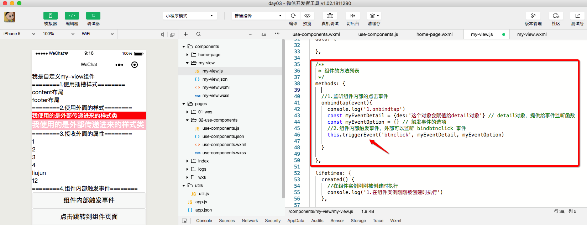

my-view.js

```js
  /**
   * 组件的方法列表
   */
  methods: {
    
    //1.监听组件内部的点击事件
    onbindtap(event){
      console.log('1.onbindtap')
      const myEventDetail = {des:'这个对象会赋值给detail对象'} // detail对象，提供给事件监听函数
      const myEventOption = {} // 触发事件的选项
      //2.组件内部触发事件，外部可以监听 bindbtnclick 事件
      this.triggerEvent('btnclick', myEventDetail, myEventOption)

    }

  },
```


#### 2. 监听组件内部触发的事件

> 使用组件的地方 监听组件内部触发的事件

事件系统是组件间通信的主要方式之一。自定义组件可以触发任意的事件，引用组件的页面可以监听这些事件。关于事件的基本概念和用法，参见 [事件](https://developers.weixin.qq.com/miniprogram/dev/framework/view/wxml/event.html) 。

监听自定义组件事件的方法与监听基础组件事件的方法完全一致：

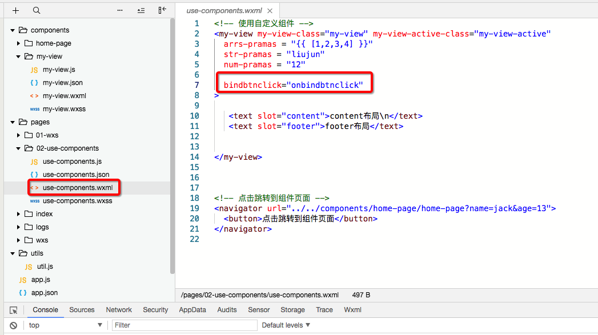


使用组件的地方监听组件内部触发的事件

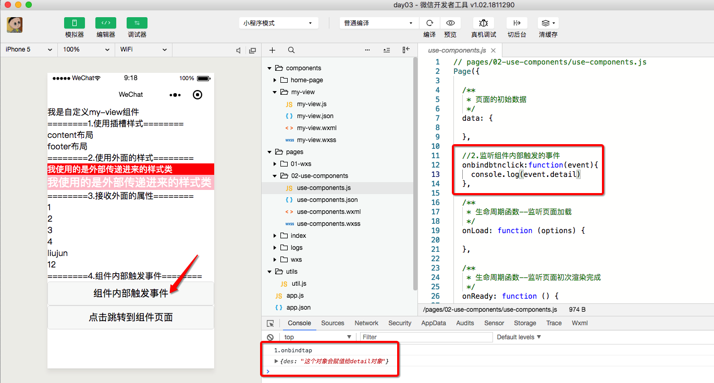


#### 3. 调用组件内部的方法

> 使用组件的地方  调用组件内部的方法

1.定义内部的方法

触发事件的选项myEventOption包括：

```js
  /**
   * 组件的方法列表
   */
  methods: {
    
    //1.监听组件内部的点击事件
    onbindtap(event){
      console.log('1.onbindtap')
      const myEventDetail = {des:'这个对象会赋值给detail对象'} // detail对象，提供给事件监听函数
      const myEventOption = {} // 触发事件的选项
      //2.组件内部触发事件，外部可以监听 bindbtnclick 事件
      this.triggerEvent('btnclick', myEventDetail, myEventOption)
      
	  //3.调用内部方法语法：this.showText('haha'); 
    },

    //2.在组件内部定义一个内部的方法共外部调用（ 只能在methods方法中定义 ）
    showText(value){
      console.log('value='+value)
    }

  },
```


2.外部调用组件内部定义的方法

**父组件还可以通过 `this.selectComponent` 方法获取子组件实例对象**，这样就可以直接访问组件的任意数据和方法。

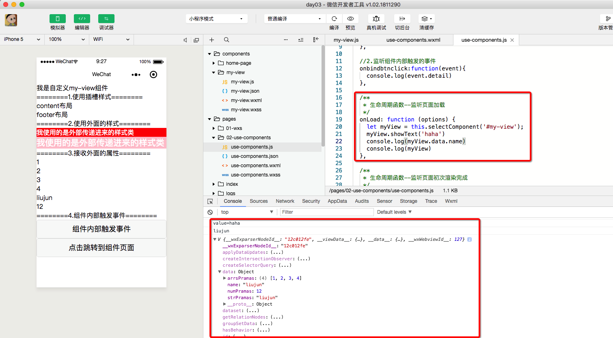

```js
  /**
   * 生命周期函数--监听页面加载
   */
  onLoad: function (options) {
    // 1.获取组件对象(只能获取自定义组件的对象)
    let myView = this.selectComponent('#my-view'); // myView 等于组件的 this
    myView.showText('haha')
    
    console.log(myView.data.name)
    console.log(myView)
  },
```


## 2. 自定义xmg-alert对话框


```html
<xmg-alert
  id="xmg-alert"
  xmg-title="授权提示"
  xmg-content="亲，你还有授权哦!"
  xmg-clear-text="取消"
  xmg-commit-text="确认"
           
  xmg-text-active-class="text-active"
           
  bindclear="onbindclear"
  bindcommit="onbindcommit"
>
</xmg-alert>
```


### 1. 创建xmg-alert自定义组件

1.新建xmg-alert自定义组件

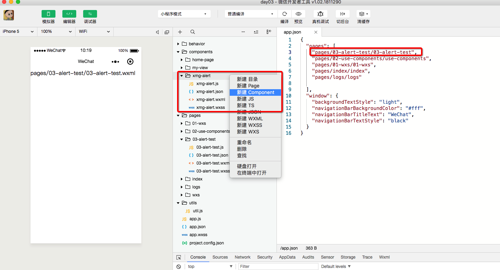


2.使用xmg-alert自定义组件

03-alert-test.json

```json
{
  "usingComponents": {
    "xmg-alert": "../../components/xmg-alert/xmg-alert"
  }
}
```


03-alert-test.wxml

```html
<!-- 1.在json文件中声明导入后，直接使用自定义组件 -->
<xmg-alert>

</xmg-alert>
```


### 2. 编写对话框布局

#### 1. 编写主体布局-500-350-20

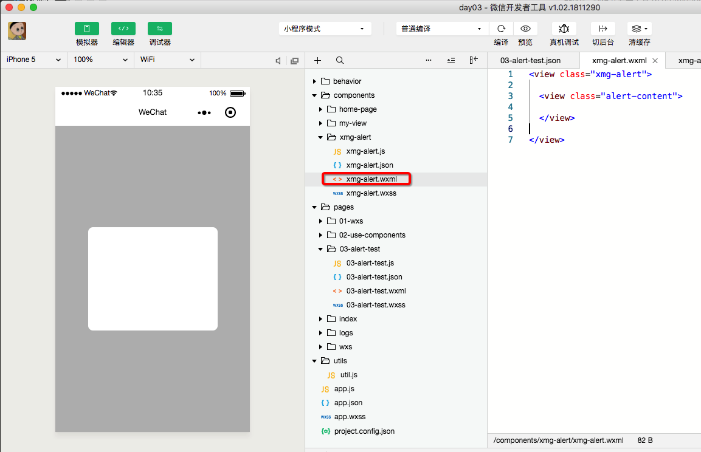

xmg-alert.wxml

```html
<view class="xmg-alert">

  <view class="alert-content">
      
  </view>

</view>
```


xmg-alert.wxss

```css
page{
  height: 100%;
}

.xmg-alert{
  width: 100%;
  height: 100%;
  background: rgba(0, 0, 0, 0.3);/** 0.3 */

  position: fixed;
  top: 0;
  left: 0;
  
  display: flex;
  justify-content: center;
  align-items: center;
}

.alert-content{
  width: 500rpx;
  height: 350rpx;
  background: white;
  border-radius: 20rpx;
}
```


#### 2. 编写内容布局-2:3:2

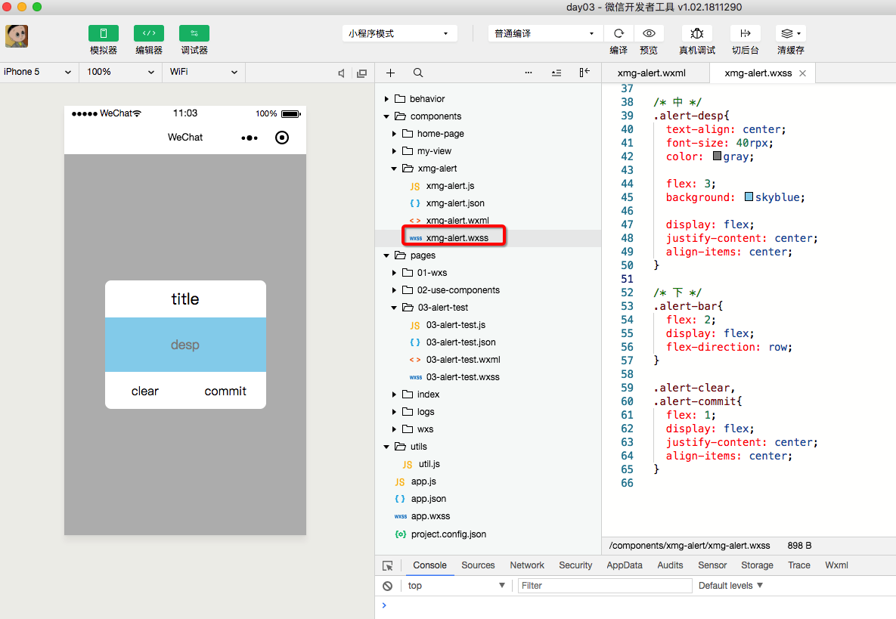

xmg-alert.wxml

```html
<view class="xmg-alert">

  <view class="alert-content">

      <view class="alert-title">title</view>  
      <view class="alert-desp">desp</view>

      <view class="alert-bar">
        <view class="alert-clear">clear</view>
        <view class="alert-commit">commit</view>
      </view>

  </view>

</view>
```


xmg-alert.wxss

```css
/* components/xmg-alert/xmg-alert.wxss */
page{
  height: 100%;
}

.xmg-alert{
  width: 100%;
  height: 100%;
  background: rgba(0, 0, 0, 0.3);

  display: flex;
  justify-content: center;
  align-items: center;
}

/* 内容布局 */
.alert-content{
  width: 500rpx;
  height: 350rpx;
  background: white;
  border-radius: 20rpx;

  display: flex;
  flex-direction: column;
}

/* 上 */
.alert-title{
  text-align: center;
  font-size: 45rpx;
  flex: 2;
  
  display: flex;
  justify-content: center;
  align-items: center;
}

/* 中 */
.alert-desp{
  text-align: center;
  font-size: 40rpx;
  color: gray;

  flex: 3;
  background: skyblue;

  display: flex;
  justify-content: center;
  align-items: center;
}

/* 下 */
.alert-bar{
  flex: 2;
  display: flex;
  flex-direction: row;
}

.alert-clear,
.alert-commit{
  flex: 1;
  display: flex;
  justify-content: center;
  align-items: center;
}

```


### 3. 修改文本

#### 1. 传递数据给xmg-alert

03-alert-text.wxml

```html
<!-- 1.在json文件中声明导入后，直接使用自定义组件 -->
<xmg-alert
  id="xmg-alert"
  xmg-title="授权提示"
  xmg-content="亲，你还有授权哦!"
  xmg-clear-text="取消"
  xmg-commit-text="确认"
>

</xmg-alert>
```


#### 2. xmg-alert接收数据

xmg-alert.js

```js
// components/xmg-alert/xmg-alert.js
Component({
  /**
   * 组件的属性列表
   */
  properties: {

    xmgTitle:{
      type:String,
      value:'标题'
    },
    xmgContent: {
      type: String,
      value: '内容描述'
    },
    xmgClearText: {
      type: String,
      value: 'clear'
    },
    xmgCommitText: {
      type: String,
      value: 'ok'
    },
    
  },

  /**
   * 组件的初始数据
   */
  data: {

  },

  /**
   * 组件的方法列表
   */
  methods: {

  }
})

```


#### 3. 展示接收的数据

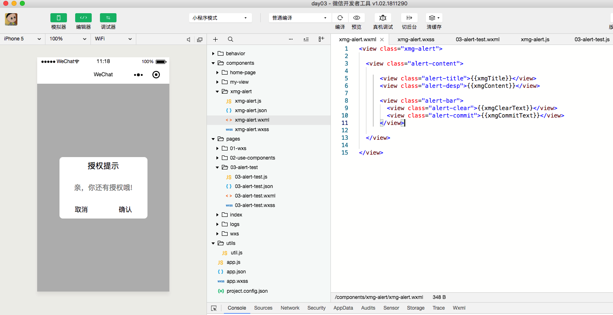

xmg-alert.wxml

```html
<view class="xmg-alert">

  <view class="alert-content">

      <view class="alert-title">{{xmgTitle}}</view>  
      <view class="alert-desp">{{xmgContent}}</view>

      <view class="alert-bar">
        <view class="alert-clear">{{xmgClearText}}</view>
        <view class="alert-commit">{{xmgCommitText}}</view>
      </view>

  </view>

</view>
```


### 4. 默认选中确认

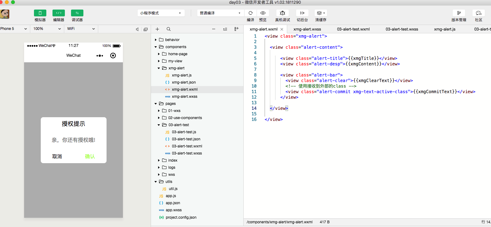

1.传递外部的class给组件

03-alert-text.wxml

```html
<!-- 1.在json文件中声明导入后，直接使用自定义组件 -->
<xmg-alert
  id="xmg-alert"
  xmg-title="授权提示"
  xmg-content="亲，你还有授权哦!"
  xmg-clear-text="取消"
  xmg-commit-text="确认"

  xmg-text-active-class="text-active"
>

</xmg-alert>
```


2.组件内部接收外部的class

xmg-alert.js

```js
// components/xmg-alert/xmg-alert.js
Component({

  // 1.定义该组件可以接收的外部样式类
  externalClasses: ['xmg-text-active-class'],

  /**
   * 组件的属性列表
   */
  properties: {

    .....

  },

  /**
   * 组件的初始数据
   */
  data: {

  },

  /**
   * 组件的方法列表
   */
  methods: {

  }
})

```


3.使用接收到的class样式

```html
<view class="xmg-alert">

  <view class="alert-content">

      <view class="alert-title">{{xmgTitle}}</view>  
      <view class="alert-desp">{{xmgContent}}</view>

      <view class="alert-bar">
        <view class="alert-clear">{{xmgClearText}}</view>
        <!-- 使用接收到外部的class -->
        <view class="alert-commit xmg-text-active-class">{{xmgCommitText}}</view>
      </view>

  </view>

</view>
```


### 5. 处理点击事件

#### 1. 监听xmg-alert点击事件

xmg-alert.wxml

```html
<view class="xmg-alert">

  <view class="alert-content">

      <view class="alert-title">{{xmgTitle}}</view>  
      <view class="alert-desp">{{xmgContent}}</view>

      <view class="alert-bar">
         <!-- 监听点击事件 -->
        <view bindtap="oncleartap" class="alert-clear">{{xmgClearText}}</view>
   
        <view bindtap="oncommittap" class="alert-commit xmg-text-active-class">{{xmgCommitText}}</view>
      </view>

  </view>

</view>
```


xmg-alert.js

```js
// components/xmg-alert/xmg-alert.js
Component({
  ...
  ...

  /**
   * 组件的方法列表
   */
  methods: {
    //1.取消
    oncleartap(){
      console.log('xmg-alert oncleartap')  
    },
    //确认
    oncommittap(){
      console.log('xmg-alert oncommittap')  
    }
  }
  
})
```


#### 2. 触发点击事件

xmg-alert.js

> 注意函数都写在 methods 中

```js
// components/xmg-alert/xmg-alert.js
Component({

  ....
  ....

  /**
   * 组件的方法列表
   */
  methods: {
  
    //1.取消
    oncleartap(){
      console.log('xmg-alert oncleartap')  
      //2.触发点击事件
      this.dispatchTap('clear');

    },
    //确认
    oncommittap(){
      console.log('xmg-alert oncommittap')  
      //2.触发点击事件
      this.dispatchTap('commit');

    },
    
	//触发点击事件
    dispatchTap(value){
      const myEventDetail = { value: value } // detail对象，提供给事件监听函数
      const myEventOption = {} // 触发事件的选项
      //3.组件内部触发事件，外部可以监听 bindxxxx 事件
      this.triggerEvent(value, myEventDetail, myEventOption)
    }

  }
})

```


#### 3. 外部监听点击事件

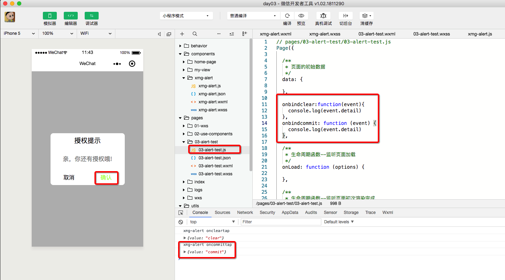

03-alert-test.wxml

```html
<!-- 1.在json文件中声明导入后，直接使用自定义组件 -->
<xmg-alert
  id="xmg-alert"
  xmg-title="授权提示"
  xmg-content="亲，你还有授权哦!"
  xmg-clear-text="取消"
  xmg-commit-text="确认"

  xmg-text-active-class="text-active"
  
  bindclear="onbindclear"
  bindcommit="onbindcommit"
>

</xmg-alert>
```


03-alert-test.js

```js
// pages/03-alert-test/03-alert-test.js
Page({

  /**
   * 页面的初始数据
   */
  data: {

  },

  onbindclear:function(event){
    console.log(event.detail)
  },
  
  onbindcommit: function (event) {
    console.log(event.detail)
  },

 
})
```

### 6. 控制显示和隐藏

xmg-alert.js

```js
// components/xmg-alert/xmg-alert.js
Component({

  ....
  ....

  /**
   * 1.组件的初始数据
   */
  data: {
    isShow:true,
  },

  /**
   * 组件的方法列表
   */
  methods: {
    ...
    ...

    //触发点击事件
    dispatchTap(value){
      const myEventDetail = { value: value } // detail对象，提供给事件监听函数
      const myEventOption = {} // 触发事件的选项
      //3.组件内部触发事件，外部可以监听 bindxxxx 事件
      this.triggerEvent(value, myEventDetail, myEventOption);
      
      
      //3.隐藏对话框
      this.hidden();
    },

    //2.显示对话框
    show(){
       this.setData({
         isShow:true,
       }) 
    },
    //2.隐藏对话框
    hidden(){
      this.setData({
        isShow: false,
      }) 
    }


  }
})

```

xmg-alert.wxml

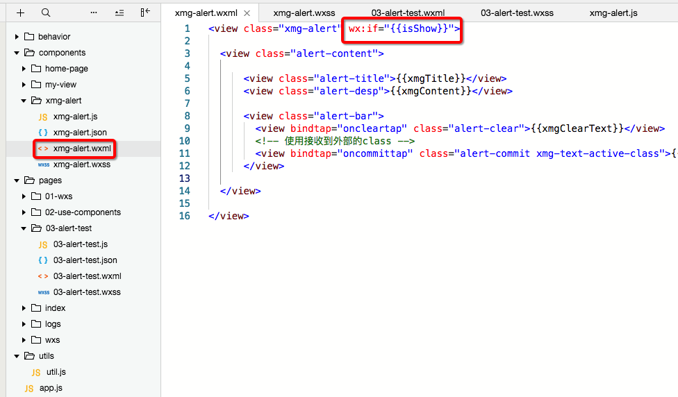


