## 小程序进阶二

## 1. 数据缓存

https://developers.weixin.qq.com/miniprogram/dev/api/storage/wx.setStorageSync.html

> 本地数据存储的大小限制为 10MB

### 1. 保存数据到本地

**wx.setStorage(OBJECT)**

将数据存储在本地缓存中指定的 key 中，会覆盖掉原来该 key 对应的内容，这是一个异步接口。

1.新建一个项目

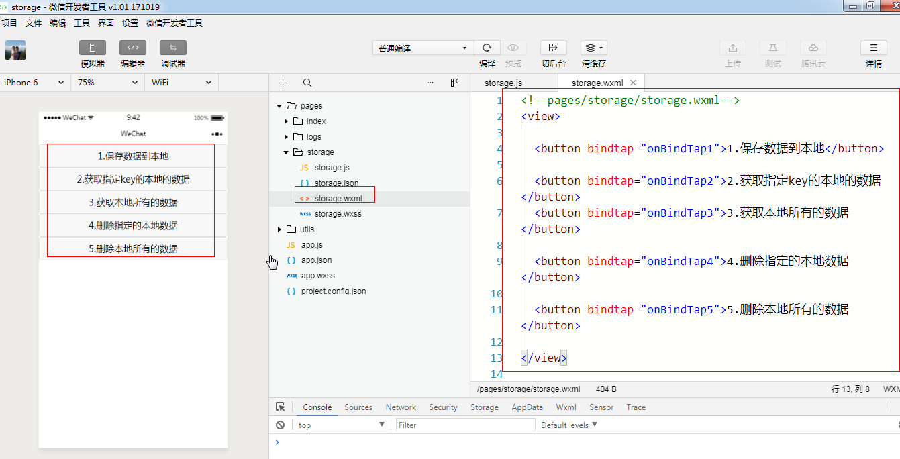

2.将数据保存在本地

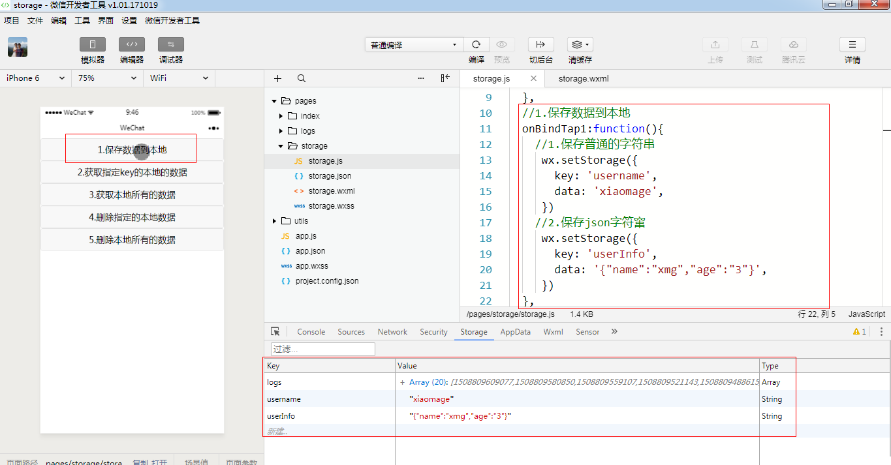

```js
  //1.保存数据到本地
  onBindTap1:function(){
    //1.保存普通的字符串
     wx.setStorage({
       key: 'username',
       data: 'xiaomage',
     }) 
    //2.保存json字符窜
     wx.setStorage({
       key: 'userInfo',
       data: '{"name":"xmg","age":"3"}',
     }) 
     //3.保存一个json对象
     var objs={
       name:'lulu',
       sex:'男'
     }
     wx.setStorage({
       key: 'userObj',
       data: objs,
     }) 
  },
```


### 2.获取本地数据

#### 1.获取指定key的数据

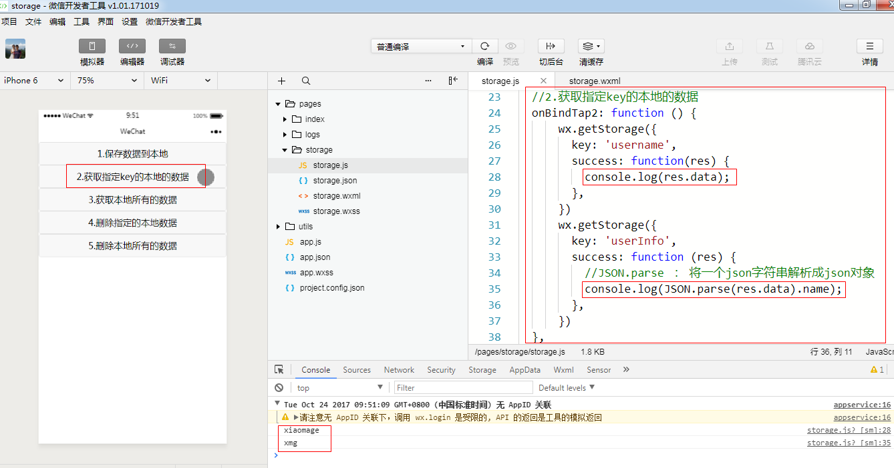

```js
  //2.获取指定key的本地的数据
  onBindTap2: function () { 
     //1.获取普通字符串
      wx.getStorage({
        key: 'username',
        success: function(res) {
          console.log(res.data);
        },
      })
      //2.获取json字符串
      wx.getStorage({
        key: 'userInfo',
        success: function (res) {
          //JSON.parse ： 将一个json字符串解析成json对象
          console.log(JSON.parse(res.data).name);
        },
      })
      //3.获取json对象
      wx.getStorage({
        key: 'userObj',
        success: function (res) {
          console.log(res.data.sex);
        },
      })
  },
```

#### 2.获取所有的数据

wx.getStorageInfo(OBJECT)    //获取所有的keys


### 3.删除本地数据

#### 1.删除指定key的数据

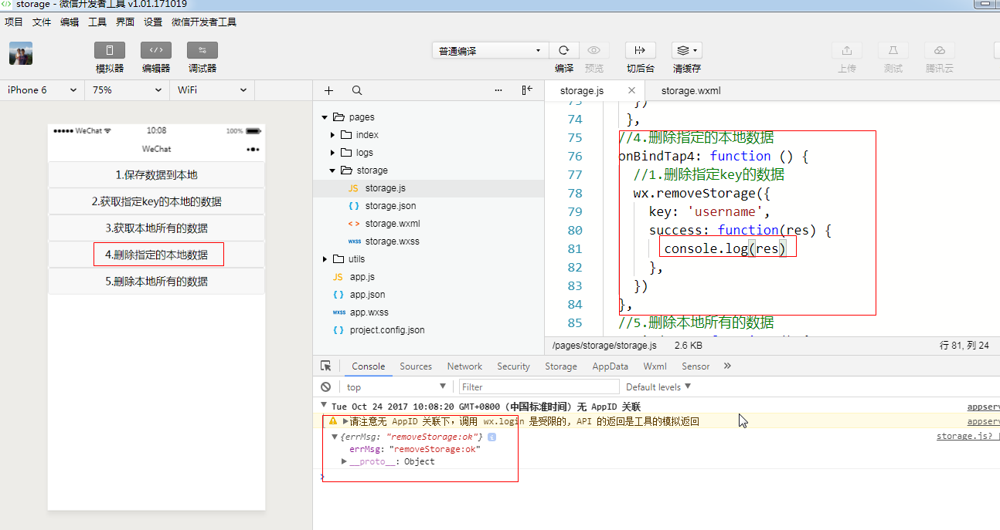

#### 2.删除所有的数据

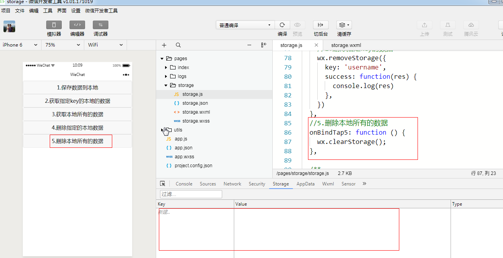


## 2. 导航栏API

### 1.NavigationBar

这些api仅仅对调用的那个页面起作用，不会作用于其它页面

setNavigationBarTitle   setNavigationBarColor   showNavigationBarLoading

```js
  /**
   * 生命周期函数--监听页面加载
   */
  onLoad: function (options) {
    //1.修改导航栏的标题
    wx.setNavigationBarTitle({
      title: "导航栏",
    })
    
    //2.修改导航栏的背景颜色( 仅支持 #ffffff 和 #000000 )
    wx.setNavigationBarColor({
      frontColor: '#ffffff',
      backgroundColor: '#FF6802',
    })
    
    //3.显示加载的进度
    wx.showNavigationBarLoading();
  },
```


## 3. 操作反馈小工具

界面-交互反馈工具：Toast 吐司    、Modal弹窗 、   ActionSheet操作菜单

https://developers.weixin.qq.com/miniprogram/dev/api/ui/interaction/wx.showToast.html

### 1.Toast

#### 1.显示Toast

1.显示加载中图标

> icon :  success  loading

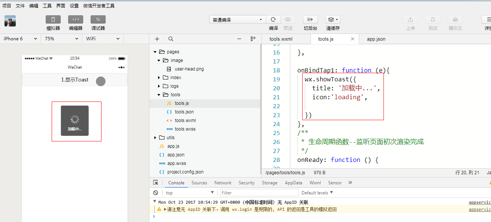

2.显示自定图标

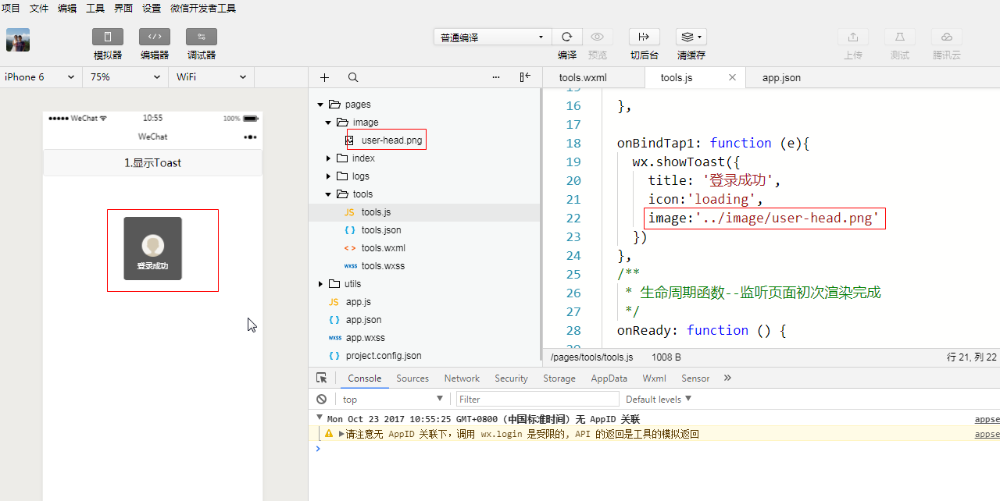

#### 2.隐藏Toast

> mask 属性是给布局添加了透明的蒙层


### 2.Modal

#### 1.显示Modal

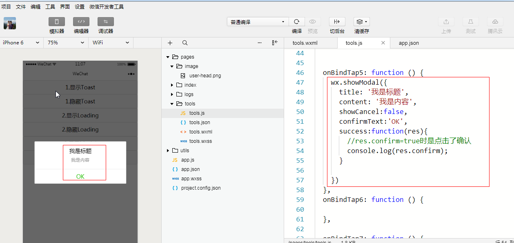

### 3.ActionSheet

#### 1.显示ActionSheet

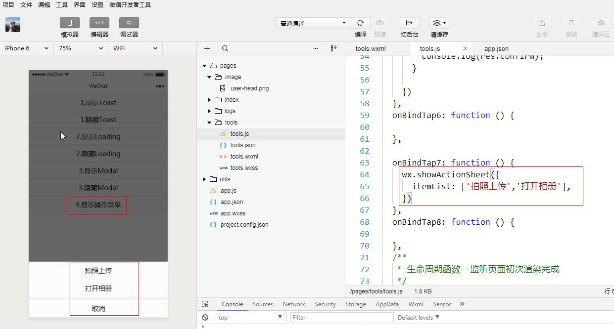

#### 2.监听点击的item

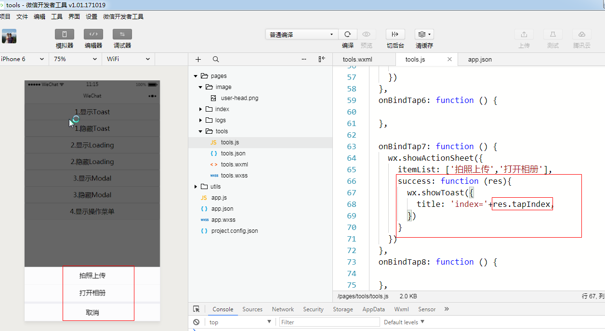

或者如下：

items 是在data中定义的变量

```js
  onBindTap7: function () {
   var  _this=this;
    wx.showActionSheet({
      itemList: this.data.items,
      success: function (res){
        wx.showToast({
          title: _this.data.items[0],
        })
      }
    })
  },
```


## 4. 需要授权的API

https://developers.weixin.qq.com/miniprogram/dev/framework/open-ability/authorize.html

**部分接口需要经过用户授权同意才能调用**。

我们把这些接口按使用范围分成多个 `scope` ，用户选择对 `scope` 来进行授权，当授权给一个 `scope` 之后，其对应的所有接口都可以直接使用。

authorize

**scope 列表**

### 1.使用button授权

```html
<button open-type='getUserInfo'>授权</button>
```

### 2.打开设置界管理授权

```js
wx.openSetting(); // 好处，例如当取消授权后, 还可以重新进入这个页面授权等（  可以管理授权  ）
```


### 3.授权接口调用案例

> 1.获取用户信息  2.获取送货地址  3.获取微信步数

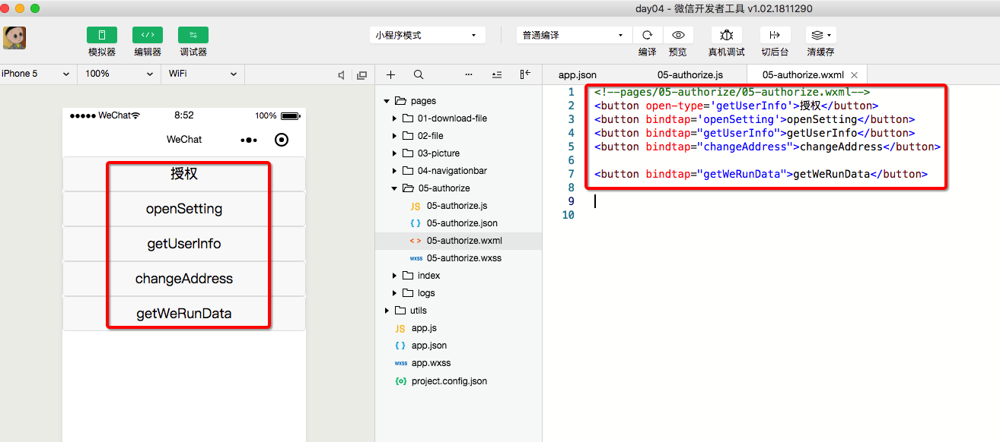

```js
// pages/05-authorize/05-authorize.js
Page({

  /**
   * 1.需要授权后才能调用（ 不会弹出授权窗口 ）
   */
  getUserInfo:function(event){
    wx.getUserInfo({
      success:function(res){
        console.log(res)
      }
    })
  },

  /**2.打开授权页面（ 可以管理授权信息  ） */
  openSetting:function(event){
    wx.openSetting();
  },

  /**3.如果没有授权 会自定弹出授权窗口，如果授权过了就不会弹出授权窗口（ 仅授权该接口 ） */
  changeAddress:function(event){
    wx.chooseAddress({
      success:function(result){
        console.log(result)
      }
    })
  },

  /**
   * 4.需要授权后才能调用（ 会弹出授权窗口, 仅授权该接口 ）
   */
  getWeRunData:function(event){
    wx.getWeRunData({
      success:function(res){
        console.log(res)
      }
    })  
  },


})
```


## 5. 小程序登陆

小程序可以通过**微信官方提供的登录能力**方便地获取微信提供的用户身份标识，快速建立小程序内的用户体系。

### 1.登录流程时序

> **1.wx.login()   2.拿到返回的code  3.把code提交给后端 (  不是微信后端  )**  
>
> 4.后端程序猿拿着code等信息请求微信后台  5.拿到微信返回的openid等信息，然后返回 token 给前端
>
> **6.前端拿到token后记录用户的登录状态 ，实现登陆成功**


## 6. 转发分享小程序

监听用户点击页面内转发按钮 （  button 组件的`open-type="share"` ）或右上角菜单“转发”按钮的行为，并自定义转发内容。

**转发回调函数：onShareAppMessage(Object)  ； Object 接收的参数说明：**


此 onShareAppMessage(Object) 函数需要 **return 一个 Object**，用于自定义转发内容，返回内容如下：

**自定义转发内容**

### 1.点击菜单转发

1.点右上角菜单转发

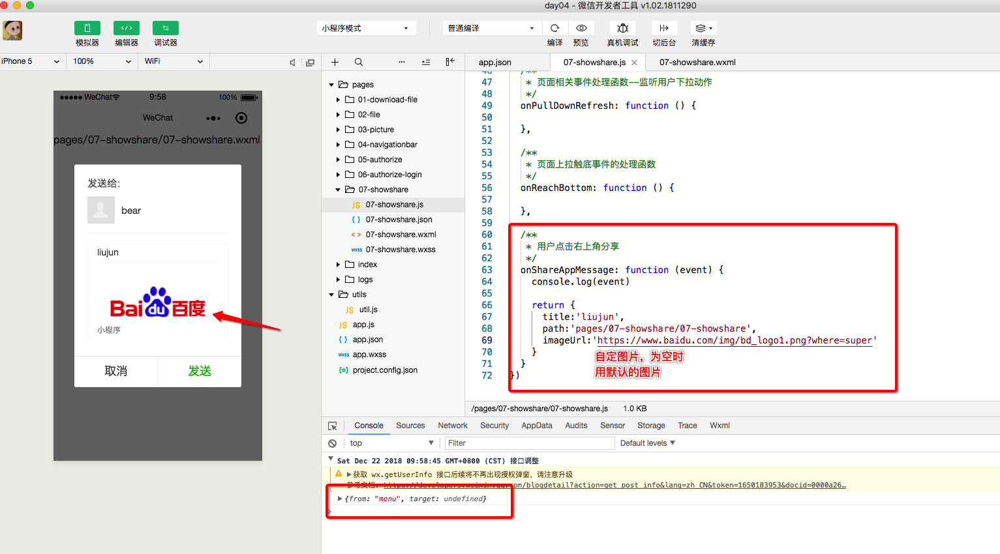

```js
  /**
   * 用户点击右上角分享
   */
  onShareAppMessage: function (event) {
    console.log(event)

    return {
      title:'liujun',
      path:'pages/07-showshare/07-showshare',
      imageUrl:'https://www.baidu.com/img/bd_logo1.png?where=super'
    }
  }
```


### 2.点击按钮转发

> 如果同时给了button 添加了点击事件，那么 onShareAppMessage 和 按钮的监听事件都会触发

布局

```html
<button open-type="share" type="primary" size="mini" id="btn">转发</button>
```

js代码：

```js
  /**
   * 用户点击右上角分享
   */
  onShareAppMessage: function (event) {
    console.log(event)

    return {
      title:'liujun',
      path:'pages/07-showshare/07-showshare',
      imageUrl:'https://www.baidu.com/img/bd_logo1.png?where=super'
    }
  }
```

控制台输出：

```json
{  
   from: "button" , 
   target: { id: "btn", dataset: {…}, offsetTop: 0, offsetLeft: 0}
}   
```

