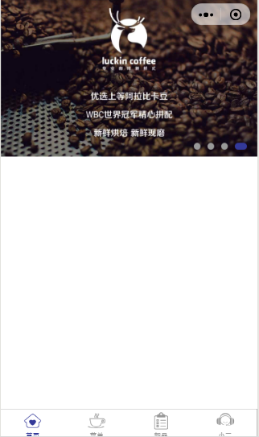
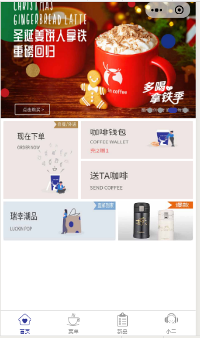
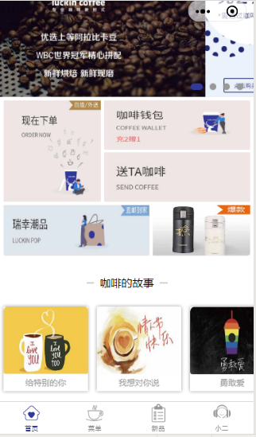
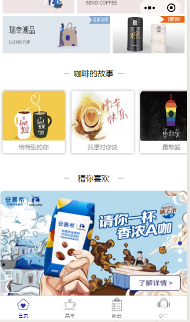
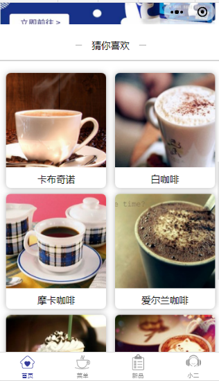
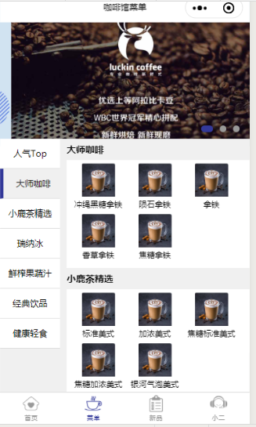

## 配置项目


> app.json

```json
{
  "pages": [
    "pages/home/home",
    "pages/menu/menu",
    "pages/order/order",
    "pages/contact/contact"
  ],
  "window": {
    "backgroundTextStyle": "light",
    "navigationBarBackgroundColor": "#fff",
    "navigationBarTextStyle": "black"
  },
  "tabBar": {
    "color": "#999999",
    "selectedColor": "#333999",
    "list": [{
        "pagePath": "pages/home/home",
        "text": "首页",
        "iconPath": "/images/bar/bar1_1.png",
        "selectedIconPath": "/images/bar/bar1.png"
      },
      {
        "pagePath": "pages/menu/menu",
        "text": "菜单",
        "iconPath": "/images/bar/bar2_2.png",
        "selectedIconPath": "/images/bar/bar2.png"
      },
      {
        "pagePath": "pages/order/order",
        "text": "新品",
        "iconPath": "/images/bar/bar3_3.png",
        "selectedIconPath": "/images/bar/bar3.png"
      },
      {
        "pagePath": "pages/contact/contact",
        "text": "小二",
        "iconPath": "/images/bar/bar4_4.png",
        "selectedIconPath": "/images/bar/bar4.png"
      }
    ]
  },
  "sitemapLocation": "sitemap.json",
  "style": "v2"
}
```

## 实现头部导航栏(500)

> 20-36-333999-999



### 1. 新建组件

> 新建组件：components/myswiper/myswiper

**myswiper.wxml**

```html
<view class="myswiper-content">
  <swiper class="myswiper" autoplay="{{true}}" interval="{{2000}}" circular="{{true}}" bindchange="swiperChange">
    <swiper-item class="myswiper-item" wx:for="{{banners}}" wx:key="index">
      <image class="myswiper-img" src="{{item}}"></image>
    </swiper-item>
  </swiper>
  <view class="swiper-dots">
    <view wx:for="{{banners}}" wx:key="index" class="dots {{swiperidx == index ? 'active' : ''}}"></view>
  </view>
</view>
```

**myswiper.wxss**

```css
.myswiper-content {
  position: relative;
}

.myswiper,
.myswiper-item,
.myswiper-img {
  width: 100%;
  height: 500rpx;
}

.swiper-dots {
  position: absolute;
  bottom: 20rpx;
  right: 20rpx;
}

.dots {
  float: left;
  width: 20rpx;
  height: 20rpx;
  background-color: #999;
  border-radius: 20rpx;
  margin: 0 10rpx;
}

.active {
  background-color: #333999;
  width: 36rpx;
}
```

**myswiper.js**

```js
// components/myswiper/myswiper.js
Component({
  /**
   * 组件的属性列表
   */
  properties: {

  },

  /**
   * 组件的初始数据
   */
  data: {
    banners: [
      "/images/banner/baner1.jpg",
      "/images/banner/baner2.jpg",
      "/images/banner/baner3.jpg",
      "/images/banner/baner4.jpg",
    ],
    swiperidx: 0
  },

  /**
   * 组件的方法列表
   */
  methods: {
    swiperChange(e) {
      this.setData({
        swiperidx: e.detail.current
      })
    }
  }
})
```

### 2. 页面引入自定义轮播图

**home.wxml**

```html
<view class="container">
  <my-swiper></my-swiper>
</view>
```

**home.json**

```json
{
  "usingComponents": {
    "my-swiper": "../../components/myswiper/myswiper"
  },
  "navigationStyle": "custom"
}
```

## 实现中间展示区(300-150)

> 4:6



> 新建组件：components/proshow/proshow


**proshow.wxml**

```html
<view class="proshow-wrapper">
  <view class="proshow-box">
    <image class="proshow-box1" src="/images/home/pro1.jpg"></image>
    <view class="proshow-box2">
      <image class="proshow-box2-img" src="/images/home/pro2.jpg"></image>
      <image class="proshow-box2-img" src="/images/home/pro3.jpg"></image>
    </view>
  </view>
  <view class="proshow-box3">
    <image class="proshow-box3-img" src="/images/home/pro4.jpg"></image>
    <image class="proshow-box3-img" src="/images/home/pro5.jpg"></image>
  </view>
</view>
```

**proshow.wxss**

```css
.proshow-wrapper {
  padding: 10rpx;
}

.proshow-box {
  display: flex;
  height: 300rpx;
  margin-bottom: 10rpx;
}

.proshow-box1 {
  flex: 4;
  height: 300rpx;
  width: 100rpx;
  margin-right: 10rpx;
}

.proshow-box2 {
  display: flex;
  flex-direction: column;
  flex: 6;
  height: 300rpx;
}

.proshow-box2-img {
  width: 100%;
}

.proshow-box2-img:nth-of-type(1) {
  margin-bottom: 5rpx;
}

.proshow-box2-img:nth-of-type(2) {
  margin-top: 5rpx;
}

.proshow-box3 {
  display: flex;
}
.proshow-box3-img {
  flex: 6;
  height: 150rpx;
}

.proshow-box3-img:nth-of-type(2) {
  margin-left: 10rpx;
  flex: 4;
}
```

## 咖啡故事

> top 100rpx; w32% w26%；width:250rpx; margin: 20rpx 16rpx 10rpx 10rpx;



> 新建 components/coffeestory/coffeestory

**coffeestory.wxml**

```html
<view class="card-wrapper">
  <view class="card-top">
    <view class="line absolute"></view>
    <view class="card-txt absolute">咖啡的故事</view>
  </view>
  <scroll-view class="card-view" scroll-x="{{true}}" enable-flex="{{true}}">
    <view class="card-item" wx:for="{{boxlists}}" wx:key="index">
      <image class="card-img" src="{{item.src}}"></image>
      <view class="card-view-txt">{{item.text}}</view>
    </view>
  </scroll-view>
</view>
```

**coffeestory.wxss**

```css
.card-wrapper {
  margin-top: 20rpx;
}

.card-top {
  position: relative;
  height: 100rpx;
  line-height: 100rpx;
}
.absolute {
  position: absolute;
  top: 0;
  left: 0;
  right: 0;
  bottom: 0;
  margin: auto;
}
.line{
  width: 32%;
  height: 4rpx;
  background-color: #ccc;
}

.card-txt {
  width: 26%;
  text-align: center;
  background-color: #fff;
}

.card-view {
  display: flex;
  width: 100%;
  height: 300rpx;
}

.card-item {
  flex-shrink: 0;
  width: 250rpx;
  height: 250rpx;
  margin: 20rpx 16rpx 10rpx 10rpx;
  border-radius: 5rpx 5rpx 0 0;
  box-shadow: 0 0 5px rgba(0, 0, 0, .4);
  background-color: #fff;
  overflow: hidden;
}

.card-img {
  width: 100%;
  height: 200rpx;
}

.card-view-txt {
  width: 100%;
  height: 50rpx;
  font-size: 24rpx;
  color: #999;
  text-align: center;
}
```

**coffeestory.js**

```js
// components/coffeestory/coffeestory.js
Component({
  /**
   * 组件的属性列表
   */
  properties: {

  },

  /**
   * 组件的初始数据
   */
  data: {
    boxlists: {
      items0: {
        src: "/images/home/card01.jpg",
        text: '给特别的你'
      },
      items1: {
        src: "/images/home/card02.jpg",
        text: '我想对你说'
      },
      items2: {
        src: "/images/home/card03.jpg",
        text: '勇敢爱'
      },
      items3: {
        src: "/images/home/card04.jpg",
        text: '一个人的精彩'
      },
      items4: {
        src: "/images/home/card05.jpg",
        text: '萌萌哒'
      },
      items5: {
        src: "/images/home/card06.jpg",
        text: '友谊万岁'
      },
      items6: {
        src: "/images/home/card07.jpg",
        text: '恋人未满'
      },
      items7: {
        src: "/images/home/card08.jpg",
        text: '生日快乐'
      }
    },
  },

  /**
   * 组件的方法列表
   */
  methods: {

  }
})
```


## 猜你喜欢(420)



### 创建组件

> 新建组件：components/like1/like1

**like1.wxml**

```html
<view class="card-wrapper">
  <view class="card-top">
    <view class="line absolute"></view>
    <view class="card-txt absolute">猜你喜欢</view>
  </view>
  <my-swiper swiper-data="{{arry3}}" swiper-height="{{swiperHeight}}" vertical="{{vertical}}" custom-dots="{{customDots}}"></my-swiper>
</view>
```

**like1.wxss**

```css
.card-wrapper {
  margin-top: 20rpx;
}

.card-top {
  position: relative;
  height: 100rpx;
  line-height: 100rpx;
}
.absolute {
  position: absolute;
  top: 0;
  left: 0;
  right: 0;
  bottom: 0;
  margin: auto;
}
.line{
  width: 32%;
  height: 4rpx;
  background-color: #ccc;
}

.card-txt {
  width: 26%;
  text-align: center;
  background-color: #fff;
}
```

**like1.json**

```json
{
  "component": true,
  "usingComponents": {
    "my-swiper": "../myswiper/myswiper"
  }
}
```

**like1.js**

```js
// components/like1/like1.js
Component({
  /**
   * 组件的属性列表
   */
  properties: {

  },

  /**
   * 组件的初始数据
   */
  data: {
    swiperHeight: 420,
    vertical: true,
    customDots: false,
    arry3: [
      "/images/banner/ban1.jpg",
      "/images/banner/ban2.jpg",
      "/images/banner/ban3.jpg",
      "/images/banner/ban4.jpg",
      "/images/banner/ban5.jpg",
    ],
  },

  /**
   * 组件的方法列表
   */
  methods: {
  }
})
```

### 修改轮播图组件

**myswiper.wxml**

```html
<view class="myswiper-content">
  <swiper class="myswiper" autoplay="{{true}}" vertical="{{vertical}}" interval="{{2000}}" circular="{{true}}" bindchange="swiperChange" style="height: {{swiperHeight}}rpx;" indicator-dots="{{!customDots}}" indicator-active-color="#333999" indicator-color="#fff">
    <swiper-item class="myswiper-item" wx:for="{{swiperData}}" wx:key="index">
      <image class="myswiper-img" src="{{item}}" style="height: {{swiperHeight}}rpx;"></image>
    </swiper-item>
  </swiper>
  <view class="swiper-dots" wx:if="{{customDots}}">
    <view wx:for="{{swiperData}}" wx:key="index" class="dots {{swiperidx == index ? 'active' : ''}}"></view>
  </view>
</view>
```

**myswiper.js**

```js
// components/myswiper/myswiper.js
Component({
  /**
   * 组件的属性列表
   */
  properties: {
    swiperHeight: {
      type: Number,
      value: 500
    },
    vertical: {
      type: Boolean,
      value: false
    },
    customDots: {
      type: Boolean,
      value: true
    },
    swiperData: {
      type: Array,
      value: []
    }
  },

  /**
   * 组件的初始数据
   */
  data: {
    
    swiperidx: 0
  },

  /**
   * 组件的方法列表
   */
  methods: {
    swiperChange(e) {
      // console.log(e)
      this.setData({
        swiperidx: e.detail.current
      })
    }
  }
})
```

### 首页修改

**home.wxml**

```html
<view class="container">
  <!-- 头部轮播图 -->
  <my-swiper swiper-data="{{banners}}"></my-swiper>
  <!-- 展示区1 -->
  <pro-show></pro-show>
  <!-- 咖啡的故事 -->
  <coffee-story></coffee-story>
  <!-- 猜你喜欢 -->
  <like1></like1>
</view>
```

**home.js**

```js
// miniprogram/pages/home/home.js
Page({

  /**
   * 页面的初始数据
   */
  data: {
    banners: [
      "/images/banner/baner1.jpg",
      "/images/banner/baner2.jpg",
      "/images/banner/baner3.jpg",
      "/images/banner/baner4.jpg",
    ],
  },
});
```


## 猜你喜欢列表



> 新建组件 components/like2/like2

**like2.wxml**

```html
<view class="card-wrapper">
  <view class="card-top">
    <view class="line absolute"></view>
    <view class="card-txt absolute">猜你喜欢</view>
  </view>
  <view class="like-list">
    <view class="like-item" wx:for="{{arry4}}">
      <image class="like-img" src="{{item.src}}"></image>
      <view class="like-txt">{{item.text}}</view>
    </view>
  </view>
</view>
```

**like2.wxss**

```css
.card-wrapper {
  margin-top: 20rpx;
}

.card-top {
  position: relative;
  height: 100rpx;
  line-height: 100rpx;
}

.absolute {
  position: absolute;
  top: 0;
  left: 0;
  right: 0;
  bottom: 0;
  margin: auto;
}

.line {
  width: 32%;
  height: 4rpx;
  background-color: #ccc;
}

.card-txt {
  width: 26%;
  text-align: center;
  background-color: #fff;
}

.like-list {
  display: flex;
  flex-wrap: wrap;
  padding: 20rpx;
  border-top: 4rpx solid #ccc;
  justify-content: space-between;
}

.like-item {
  width: 48%;
  margin-top: 20rpx;
  border-radius: 8px;
  box-shadow: 0 0 10px rgba(0, 0, 0, 0.3);
  overflow: hidden;
}

.like-txt {
  padding: 10rpx 0;
  text-align: center;
}

.like-img {
  width: 100%;
  height: 320rpx;
}
```


**like2.js**

```js
// components/like2/like2.js
Component({
  /**
   * 组件的属性列表
   */
  properties: {

  },

  /**
   * 组件的初始数据
   */
  data: {
    arry4: {
      items1: {
        src: "/images/home/newPro1.jpg",
        text: '卡布奇诺'
      },
      items2: {
        src: "/images/home/newPro2.jpg",
        text: '白咖啡'
      },
      items3: {
        src: "/images/home/newPro3.jpg",
        text: '摩卡咖啡'
      },
      items4: {
        src: "/images/home/newPro4.jpg",
        text: '爱尔兰咖啡'
      },
      items5: {
        src: "/images/home/newPro5.jpg",
        text: '甜品咖啡'
      },
      items6: {
        src: "/images/home/newPro6.jpg",
        text: '意大利咖啡'
      },
      items7: {
        src: "/images/home/newPro7.jpg",
        text: '拿铁咖啡'
      },
      items8: {
        src: "/images/home/newPro8.jpg",
        text: '中式咖啡'
      }
    },
  },

  /**
   * 组件的方法列表
   */
  methods: {

  }
})
```

## 菜单页面



> <https://developers.weixin.qq.com/miniprogram/dev/api/wxml/wx.createSelectorQuery.html>

**menu.wxml**

```html
<my-swiper swiper-data="{{array}}" swiper-height="{{350}}"></my-swiper>
<view class="menu">
  <scroll-view class="menu-left" scroll-y="{{true}}" scroll-into-view="lmenu{{leftid}}">
    <view class="menu-left-item{{leftid == index ? ' active' : ''}}" wx:for="{{navList}}" wx:key="index" id="lmenu{{index}}" data-id="{{index}}" bindtap="leftMenuTap">{{item.c_name}}</view>
  </scroll-view>
  <scroll-view class="menu-right" scroll-y="{{true}} "scroll-into-view="rmenu{{rightid}}" scroll-with-animation bindscroll="rightMenuScroll">
    <view class="menu-right-view" wx:for="{{navList}}" wx:key="index" id="rmenu{{index}}">
      <view class="menu-right-title">{{item.c_name}}</view>
      <view class="menu-right-container">
        <view class="menu-right-lists" wx:for="{{item.list}}" wx:key="index" wx:for-item="ritem">
          <image class="menu-right-img" src="{{ritem.url}}"></image>
          <view class="menu-right-txt">{{ritem.goodsName}}</view>
        </view>
      </view>
    </view>
  </scroll-view>
</view>
```

**menu.wxss**

```css
.menu {
  height: calc(100% - 350rpx);
  display: flex;
  background-color: #f0f0f0;
}
.menu-left {
  width: 180rpx;
  height: 100%;
}

.menu-right {
  flex: 1;
  height: 100%;
  margin-left: 20rpx;
  /* background-color: skyblue; */
}

.menu-left-item {
  width: 100%;
  height: 88rpx;
  font-size: 26rpx;
  line-height: 88rpx;
  border-bottom: 1px solid #dfdfdf;
  background-color: #fff;
  text-align: center;
}

.active {
  background-color: #f0f0f0;
  border-left: 10rpx solid #333999;
}

.menu-right-view {

}

.menu-right-title {
  height: 65rpx;
  line-height: 65rpx;
  font-size: 28rpx;
  font-weight: 700;
}

.menu-right-container {
  font-size: 24rpx;
  background-color: #fff;
  padding: 10rpx;
}

.menu-right-lists {
  width: 170rpx;
  display: inline-block;
  text-align: center;
}
.menu-right-img{
  width: 100rpx;
  height: 100rpx;
}

.menu-right-txt {
  width: 100%;
  height: 40rpx;
  white-space: nowrap;
  overflow: hidden;
  text-overflow: ellipsis;
}
```

**menu.json**

```json
{
  "usingComponents": {
    "my-swiper": "../../components/myswiper/myswiper"
  },
  "navigationBarTitleText": "咖啡馆菜单"
}
```

**menu.js**

```js
// pages/menu/menu.js
Page({

  /**
   * 页面的初始数据
   */
  data: {
    array: [
      "/images/banner/menubanner1.jpg",
      "/images/banner/menubanner2.jpg",
      "/images/banner/menubanner3.jpg"
    ],
    navList: [{
        id: "0",
        c_name: '人气Top',
        list: [{
            id: 1,
            url: '/images/menu/1-1.jpg',
            goodsName: '拿铁',
          },
          {
            id: 2,
            url: '/images/menu/1-1.jpg',
            goodsName: '桃桃芝士红宝石茶',
          },
          {
            id: 3,
            url: '/images/menu/1-1.jpg',
            goodsName: '咖啡风味安慕希',
          },
          {
            id: 4,
            url: '/images/menu/1-1.jpg',
            goodsName: '陨石拿铁',
          },
          {
            id: 5,
            url: '/images/menu/1-1.jpg',
            goodsName: '冲绳拿铁',
          }
        ]
      },
      {
        id: "1",
        c_name: '大师咖啡',
        list: [{
            id: 1,
            url: '/images/menu/1-1.jpg',
            goodsName: '冲绳黑糖拿铁',
          },
          {
            id: 2,
            url: '/images/menu/1-1.jpg',
            goodsName: '陨石拿铁',
          },
          {
            id: 3,
            url: '/images/menu/1-1.jpg',
            goodsName: '拿铁',
          },
          {
            id: 4,
            url: '/images/menu/1-1.jpg',
            goodsName: '香草拿铁',
          },
          {
            id: 5,
            url: '/images/menu/1-1.jpg',
            goodsName: '焦糖拿铁',
          },
        ]
      },
      {
        id: "2",
        c_name: '小鹿茶精选',
        list: [{
            id: 1,
            url: '/images/menu/1-1.jpg',
            goodsName: '标准美式',
          },
          {
            id: 2,
            url: '/images/menu/1-1.jpg',
            goodsName: '加浓美式',
          },
          {
            id: 3,
            url: '/images/menu/1-1.jpg',
            goodsName: '焦糖标准美式',
          },
          {
            id: 4,
            url: '/images/menu/1-1.jpg',
            goodsName: '焦糖加浓美式',
          },
          {
            id: 5,
            url: '/images/menu/1-1.jpg',
            goodsName: '银河气泡美式',
          },
        ]
      },
      {
        id: "3",
        c_name: '瑞纳冰',
        list: [{
            id: 1,
            url: '/images/menu/1-1.jpg',
            goodsName: '楽岛桃桃冰',
          },
          {
            id: 2,
            url: '/images/menu/1-1.jpg',
            goodsName: '巧克力瑞纳冰',
          },
          {
            id: 3,
            url: '/images/menu/1-1.jpg',
            goodsName: '抹茶瑞纳冰',
          },
          {
            id: 4,
            url: '/images/menu/1-1.jpg',
            goodsName: '卡布奇诺瑞纳冰',
          },
          {
            id: 5,
            url: '/images/menu/1-1.jpg',
            goodsName: '咖啡瑞纳冰',
          },
        ]
      },
      {
        id: "4",
        c_name: '鲜榨果蔬汁',
        list: [{
            id: 1,
            url: '/images/menu/1-1.jpg',
            goodsName: 'NFC鲜榨橙汁',
          },
          {
            id: 2,
            url: '/images/menu/1-1.jpg',
            goodsName: 'NFC鲜榨西柚汁',
          },
          {
            id: 3,
            url: '/images/menu/1-1.jpg',
            goodsName: '猕猴桃复合果汁',
          },
          {
            id: 4,
            url: '/images/menu/1-1.jpg',
            goodsName: 'NFC鲜榨蓝莓草莓混合果汁',
          },
          {
            id: 5,
            url: '/images/menu/1-1.jpg',
            goodsName: 'NFC鲜榨芒果汁',
          },
        ]
      },
      {
        id: "5",
        c_name: '经典饮品',
        list: [{
            id: 1,
            url: '/images/menu/1-1.jpg',
            goodsName: '巧克力',
          },
          {
            id: 2,
            url: '/images/menu/1-1.jpg',
            goodsName: '纯牛奶',
          },
          {
            id: 3,
            url: '/images/menu/1-1.jpg',
            goodsName: '巴黎水330ml',
          },
          {
            id: 4,
            url: '/images/menu/1-1.jpg',
            goodsName: '小红莓苏打水',
          },
          {
            id: 5,
            url: '/images/menu/1-1.jpg',
            goodsName: '苏打水',
          },
        ]
      },
      {
        id: "6",
        c_name: '健康轻食',
        list: [{
            id: 1,
            url: '/images/menu/1-1.jpg',
            goodsName: '京味烤鸭鲜蔬卷',
          },
          {
            id: 2,
            url: '/images/menu/1-1.jpg',
            goodsName: '夏威夷菠萝火腿卷',
          },
          {
            id: 3,
            url: '/images/menu/1-1.jpg',
            goodsName: '火腿芝士羊角',
          },
          {
            id: 4,
            url: '/images/menu/1-1.jpg',
            goodsName: '鸡肉卷',
          },
          {
            id: 5,
            url: '/images/menu/1-1.jpg',
            goodsName: '老北京鸡肉卷',
          },
        ]
      }
    ],
    leftid: 0,
    rightid: 0,
    areaHeight: [0],
  },
  // 左侧菜单点击设置右侧联动
  leftMenuTap(e) {
    const dataset = e.target.dataset;
    this.setData({
      leftid: dataset.id,
      rightid: dataset.id
    })
  },
  // 右侧菜单滚动
  rightMenuScroll(e) {
    console.log(e);
    const scrollTop = e.detail.scrollTop; // 滚动的高度
    for (var i = 1; i < this.data.areaHeight.length; i++) {
      if (scrollTop < this.data.areaHeight[i]) {
        this.setData({
          leftid: i - 1
        })
        return;
      }

    }
  },
  /**
   * 生命周期函数--监听页面加载
   */
  onLoad: function (options) {

  },

  /**
   * 生命周期函数--监听页面初次渲染完成
   */
  onReady: function () {
    const query = wx.createSelectorQuery()
    const lists = this.data.navList
    const _this = this;
    for (let i = 0; i < lists.length; i++) {

      query.select('#rmenu' + i).boundingClientRect()
      query.selectViewport().scrollOffset()
      query.exec(res => {
        console.log(res)
        _this.data.areaHeight.push(_this.data.areaHeight[i] + res[0].height);
      })
    }
  },

  /**
   * 生命周期函数--监听页面显示
   */
  onShow: function () {

  },

  /**
   * 生命周期函数--监听页面隐藏
   */
  onHide: function () {

  },

  /**
   * 生命周期函数--监听页面卸载
   */
  onUnload: function () {

  },

  /**
   * 页面相关事件处理函数--监听用户下拉动作
   */
  onPullDownRefresh: function () {

  },

  /**
   * 页面上拉触底事件的处理函数
   */
  onReachBottom: function () {

  },

  /**
   * 用户点击右上角分享
   */
  onShareAppMessage: function () {

  }
})
```

